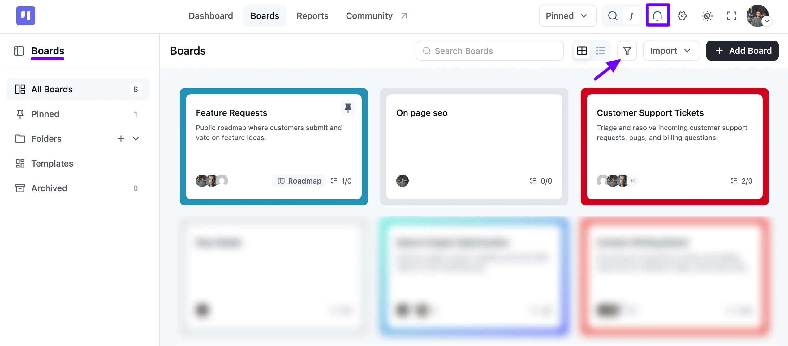

# Board Overview

The **Boards** page is the central hub where you can view, manage, and organize all of your project boards. From here, you can navigate through your projects, search for specific boards, and customize your workspace layout.

## Boards Overview

Below is a detailed breakdown of the main components available on this page.

- **A. My Boards Sidebar** This sidebar is your primary navigation panel. It lists **All Boards**, your **Pinned** boards, any **Folders** you've created, saved **Templates**, and your **Archived** boards. Click the **Folder** icon here to create a new folder.
- **B. Boards Title** This is the main content area where your boards are displayed. The title reflects your current view, showing the name of the Folder you've selected (e.g., "Dev," "Marketing") or simply "Boards" when you are viewing all boards.
- **C. Search Boards** Use the Search Boards bar to quickly find a specific board by typing its name. The view will instantly filter the boards in the main area to show only those that match your search query.
- **D. View Switcher** Click these two icons to switch between Card View and List View. Card View provides a visual, at-a-glance overview of your boards, while List View offers a more compact, text-based layout.
- **E. Filter & Sort** Click the Filter icon to open options for filtering and sorting your boards. In the pop-up menu, you can:

**Filter** boards by their status (e.g., **Active**).
- **Sort By** either **Created Date** or **Title**.
- Set the sort order to **Ascending** or **Descending**.

Click the **Apply** button to update your view with the selected options.

- **F. Import Boards** Click the **Import** dropdown to migrate your existing projects from other services like Trello and Asana, or import boards from a CSV file or another FluentBoards export.
- **G. Add Board Button** Click the **+ Add Board** button to create a new board. This opens the **Create Board** pop-up, where you can set its title, description, Stages, Labels, Members, and Background.
- **H. Notifications** Click the **bell icon** to open the notifications panel, where you can see recent updates and mentions related to your tasks and boards. Use the **Assigned** and **Mentioned** filters here to separate tasks assigned to you from comments where you've been mentioned.
- **I. Board Cards** Each card shows the Board's name, description, a color-coded border, member avatars, and a task count (e.g., "2/2"). Boards created from a template, like a **Roadmap**, display a matching tag, and any board you've pinned shows a pin icon in its corner.

That covers all the features and options available to you in the **Boards** section.