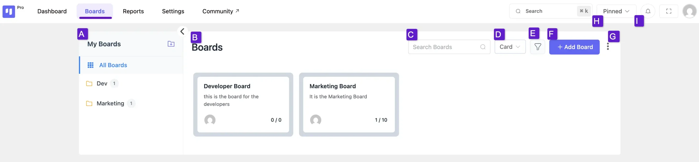

# Board Overview

The **Boards** page is the central hub where you can view, manage, and organize all of your project boards. From here, you can navigate through your projects, search for specific boards, and customize your workspace layout.

## Boards Overview

Below is a detailed breakdown of the main components available on this page.

- **A. My Boards Sidebar** This sidebar is your primary navigation panel for all boards and folders. It displays a list of any Folders you have created and includes a link to view All Boards at once. You can also click the folder icon to create a new folder.
- **B. Boards Title** This is the main content area where your boards are displayed. The title reflects your current view, showing the name of the folder you have selected (e.g., "Dev," "Marketing") or simply "Boards" when you are viewing all boards.
- **C. Search Boards** Use the Search Boards bar to quickly find a specific board by typing its name. The view will instantly filter the boards in the main area to show only those that match your search query.
- **D. View Switcher** This dropdown menu allows you to switch between Card View and List View. Card View provides a visual, at-a-glance overview of your boards, while List View offers a more compact, text-based layout.
- **E. Filter & Sort** Click the Filter icon to open options for filtering and sorting your boards. In the pop-up menu, you can:

**Filter** boards by their status (e.g., **Active**).
- **Sort By** either **Created Date** or **Title**.
- Set the sort order to **Ascending** or **Descending**.

Click the **Apply** button to update your view with the selected options.

- **F. Add Board Button** Click the + Add Board button to create a new board. This will open a setup window where you can define the new board's name, description, and other settings.
- **G. Import Boards** Clicking the three-dot menu reveals several options for importing boards. This allows you to easily migrate your existing projects from other services like Trello and Asana, or import boards from a CSV file or another FluentBoards export.
- **H. Pinned Boards** Click the Pinned button to instantly filter your view to show only the boards that you have pinned for quick and easy access.
- **I. Notifications** Click the **bell icon** to open the notifications panel, where you can see recent updates and mentions related to your tasks and boards.

That covers all the features and options available to you in the **Boards** section.