# Board Settings

FluentBorads has a **Menu** option for your Boards. This **Menu** option allows you to make some changes to your Board as you want. In this guideline, we will show you how you can set these settings.

First, go to the FluentBoards **Dashboard** and select the **Boards** from the navbar. Now you have to open your specific **Board** to access the **Board Menu**.

## Board Menu

In the top right corner of your Board you will see a **Three Dot** button click on it to get the **Board Menu**.

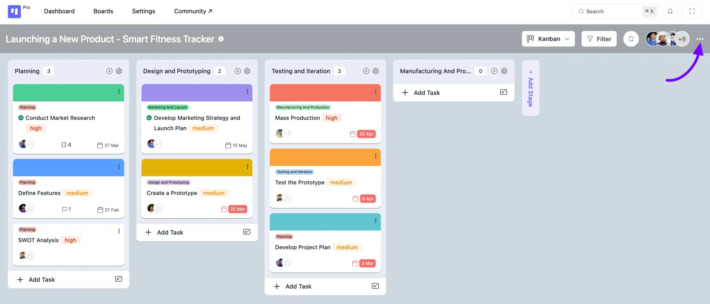

A popup will come up with some options for your Board. We have discussed the options individually below.

> The board menu is now fully customizable. If you are a developer, you can add, remove, or reorder items in the board menu by using a filter hook. For detailed instructions and code examples, please refer to our developer documentation:
>
>
>
> [Board Menu Customization Guide](https://developers.fluentboards.com/hooks/filters/#fluent_boards_board_menu_items){:target="_blank"}

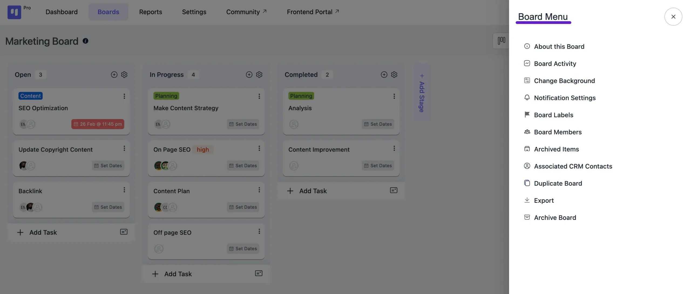

### About this Board

Here, you can view details about the board, such as the board Name, Description, Creator, and Creation date. You also have the option to edit **Name** and **Description** details right from here.

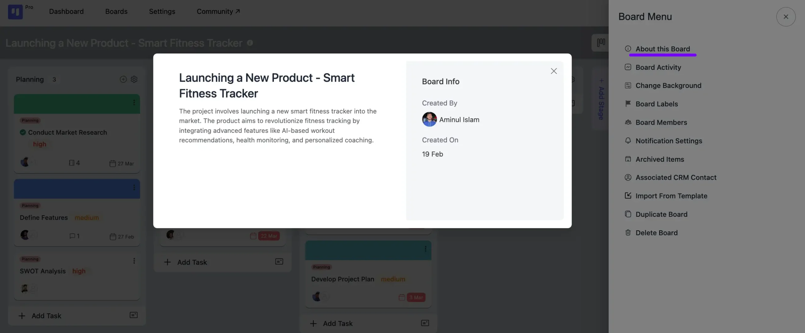

### Board Activity

In the **Board Activity**, you will see all the activities of the Board.

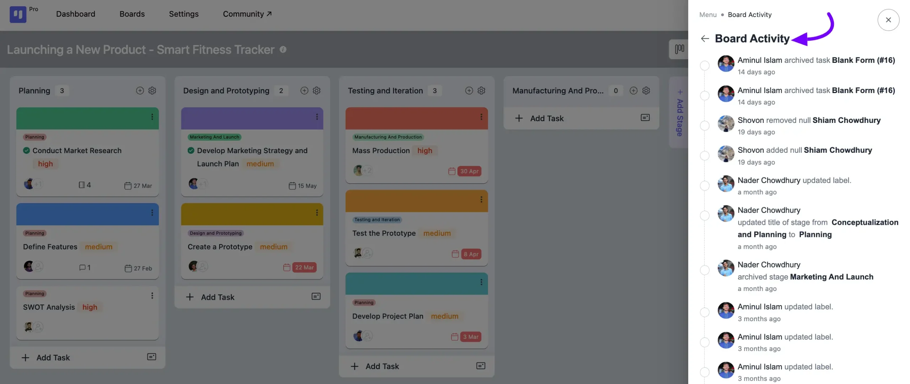

### Change Background

The **Change Background** option allows you to change the background of the Board. You will find some images available for your board, and you also have the option to upload your own images. Simply click on the **Plus** icon button to do so.

You can also add **Gradient** and **Solid** colors to the board.

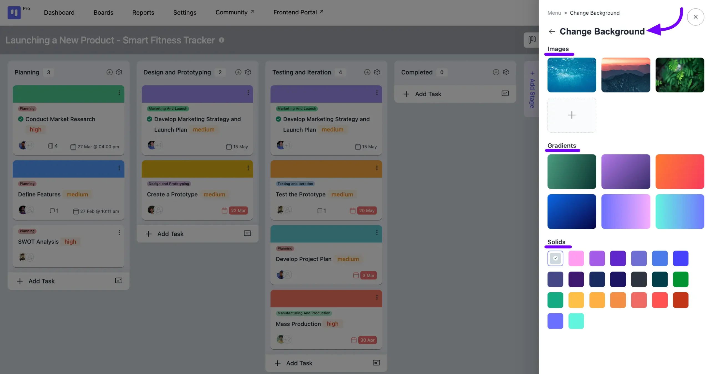

### Custom Fields

In FluentBoards, you can use **Custom Fields** to add extra data fields to your tasks. This feature helps you capture specific information relevant to your workflow directly within a task card.

#### **Creating a New Custom Field**

First, navigate to the board you want to add a custom field to. Click on the **Menu** from the top right corner of the board and select the **Custom Fields** option.

1. You will now see the Custom Fields panel. Click on the **Create New Custom Field** button to get started.
2. A pop-up window will appear. Here you will need to fill in two options:

**Title:** This will be the display title for your custom field.
3. **Type:** Choose the data type form the dropdown field, such as Number, Text, or Date.
4. After filling in the required information, click the **Create** button.

#### **Managing Custom Fields**

Once created, your custom fields will be visible in all tasks on that board. You can also reorder them to better suit your needs.

To change the sequence of your custom fields, simply go to the **Custom Fields** settings panel. From there, you can **drag and drop** the fields into your desired order. The new order will be saved automatically.

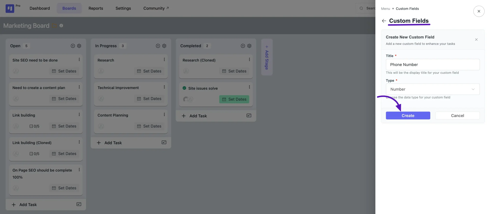

### Board Labels

Click on the **Boards Label**, and you will see all the existing labels listed here. To add a new label for your board, click on the **Add New Label** button.

If you want to edit an existing label, click on the **Pencil** Icon button next to the label name. Also choose a **color** for your label from the default options or select a **custom color**. Once done, click on the **Save** button. If you want to remove a label, simply click on the **Delete** button.

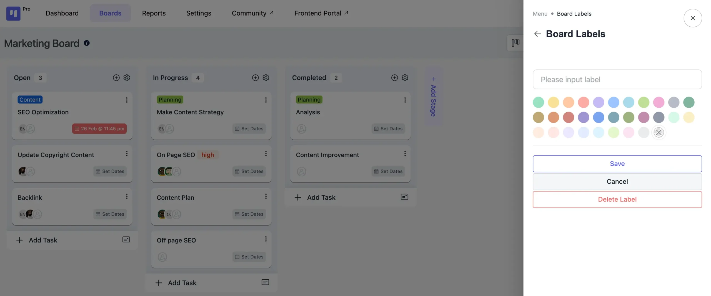

### Board Members

#### Add New Member

You can manage your Board members from here you can add any WordPress user as a **Member** of your Board. Also, you can edit the existing members of the Board like if you want to remove them or make them the Admin of the Board.

In the search field simply search for your new member with **Name** or **Email,** then select them and click on **Add Member** button.

If you want to change the role of existing Members or want to Remove them then click on the **Dropdown** button beside the board members and you will get two options here **Promote to Manager** or **Leave Board** select your choice here. From the Admins you can make anyone a Board Member by clicking on the plus icon button.

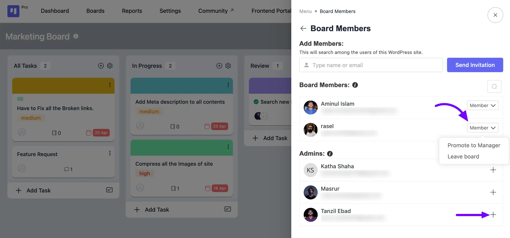

#### Invite Member

You can send an Invitation to join the Board. Give the Email address of that WordPress user whom you want to add to your Board and click on the **Send Invitation** button.

Down here you will also be able to see the *Pending Invitations*.

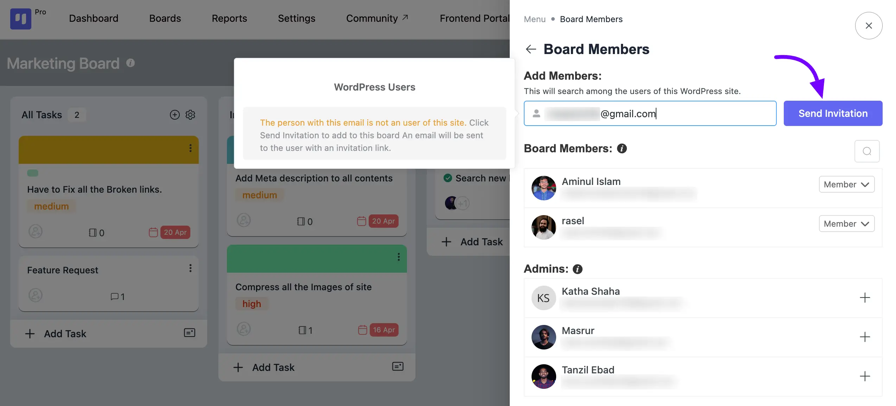

### Notification Settings

From the **Notification Settings**, you can select which **Notification Emails** you want. Here you will get options for Notification. Toggle to enable the Notifications you want and click on the **Save** button.

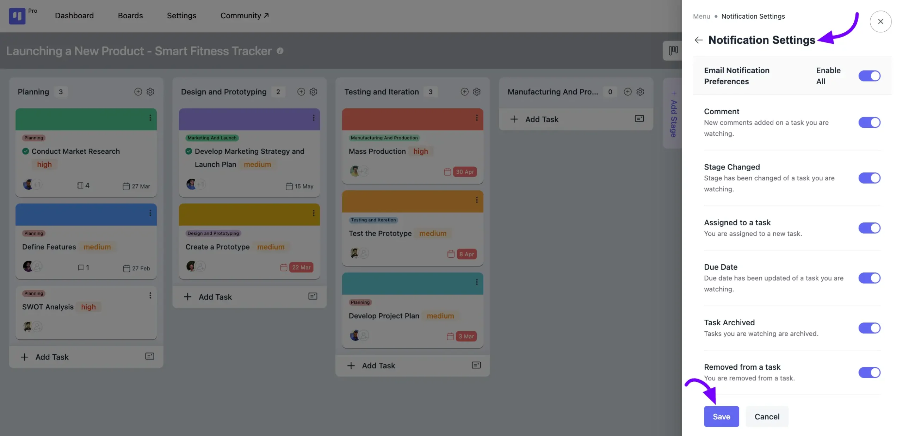

### Archived Items

This Archived Items tab lists all the individual tasks you have archived. Tasks can be archived individually from the task options or in groups using the **Bulk Actions** dropdown menu from the Table view. From here, you can remove them permanently or restore them to your Boards.

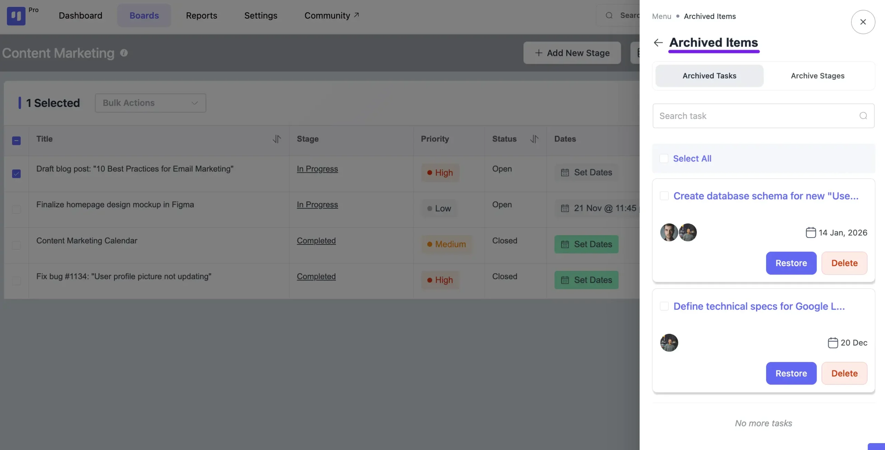

### Archived Stages

Here you will see the removed **Stages** from the board. You can Restore them from here by clicking on the **Restore** button or delete them permanently by selecting the **Delete** button.

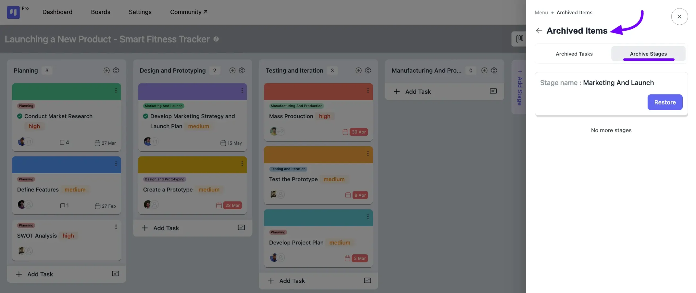

### Associated CRM Contacts

The **Associated CRM Contacts** option in your board menu displays the *CRM contacts* linked to your tasks on that specific board.

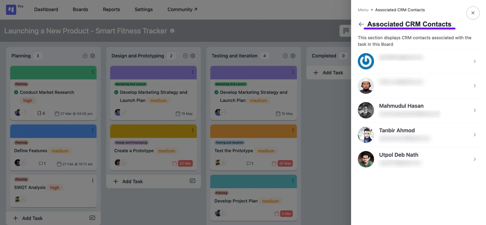

Clicking on the **Arrow** icon button will reveal the tasks associated with those CRM contacts.

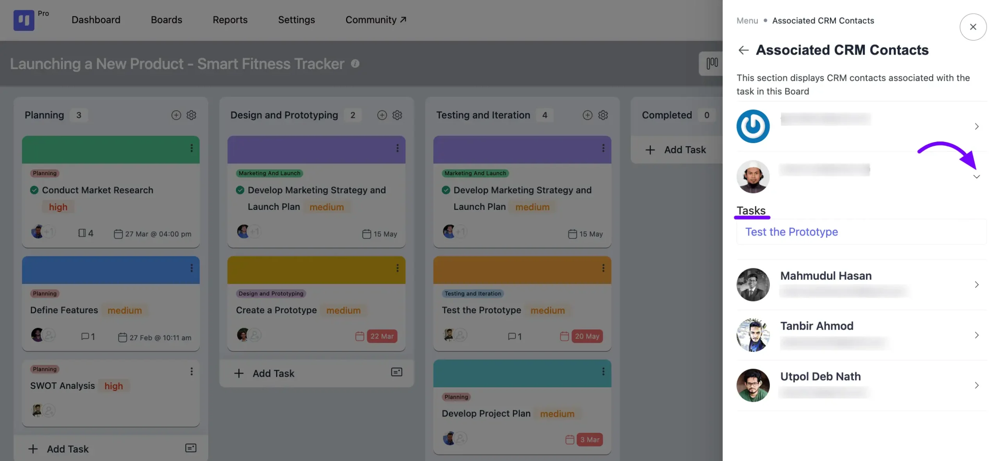

### Import From Template

To import your created template **Stages** into your boards, choose the template from the dropdown list and then click on the **Import** button.

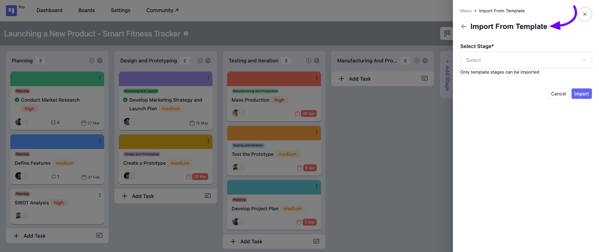

### Duplicate Board

If you wish to duplicate the board, simply select the Duplicate Board option. Then, provide a title for your duplicate board and choose from the checkbox options which information you'd like to copy along with it.

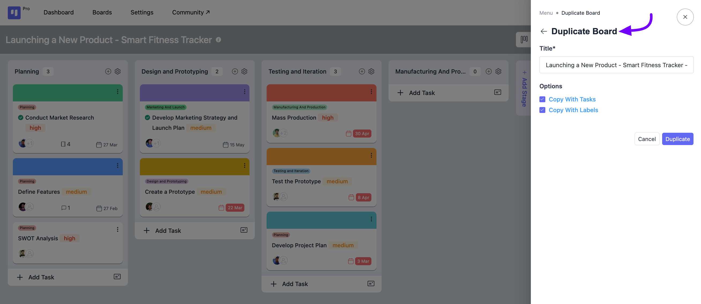

## Export

You can export your whole board as a **JSON** or **CSV** file in FluentBoards. The export will include all task details, but keep in mind that **assignee information won’t be included**.

To export, go to the board you want to export and click on the **board menu** button in the **top-right corner**. A pop-up will appear with the **Export** option. Click on it, and you’ll see two formats: **JSON** and **CSV**. Select your preferred format, and your board will be exported.

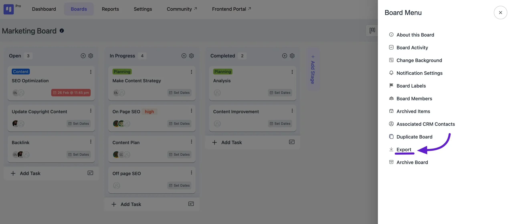

Here, the **JSON** is for exporting your board in JSON format, and the **CSV** button is exporting your Board in CSV format.

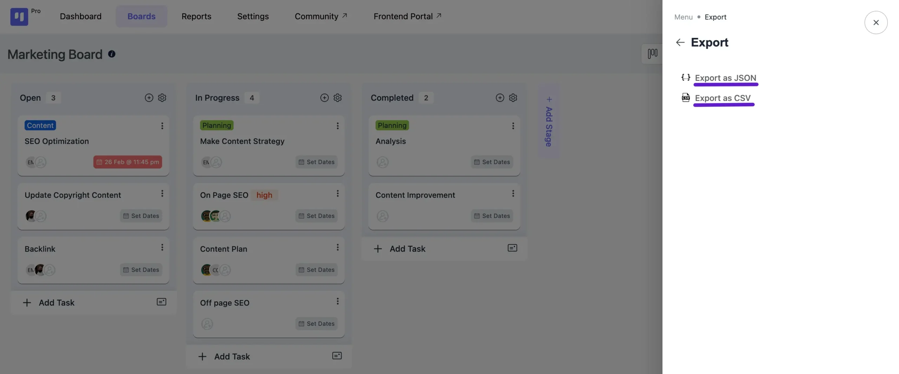

### Delete Board

If you want to delete your Board then select the **Delete Board** option. A notification popup will come to you for confirmation that you want to delete the board.

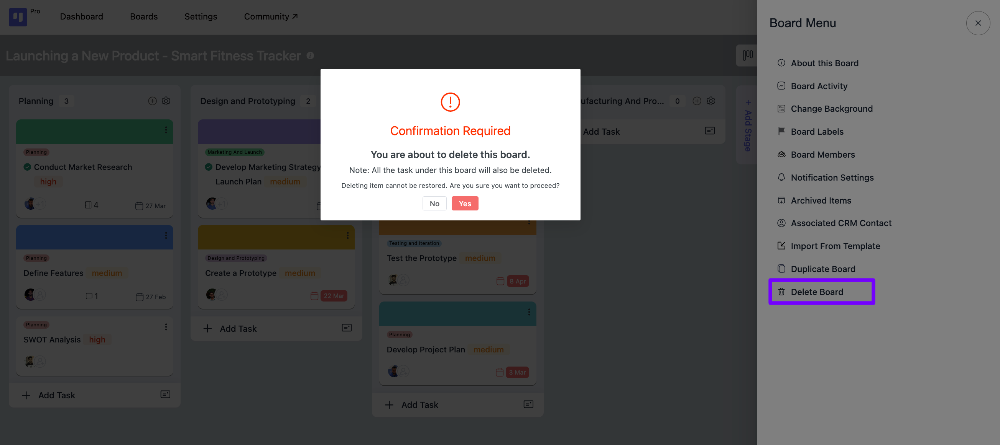

### Bulk Restore and Delete for Archived Tasks

The Archived Items section allows bulk actions for managing archived data. You can select multiple archived tasks or stages and restore or permanently delete them in a single step. This approach replaces the previous one-by-one method, making large cleanups faster and giving users better control over their archived data.

Go to the **Archived Tasks** tab within the **Archived Items** panel. Select the tasks you wish to modify by checking the boxes next to them. A counter will show the number of tasks currently selected (e.g., "2 selected").

Check the **Select All** button to reveal the bulk options.

After that, select one of the following options from the dropdown **Actions** option.

- **Restore Selected:** Choose this option to immediately restore all chosen tasks back to your live board.
- **Delete Selected:** Choose this option to permanently delete all chosen tasks from the archive.

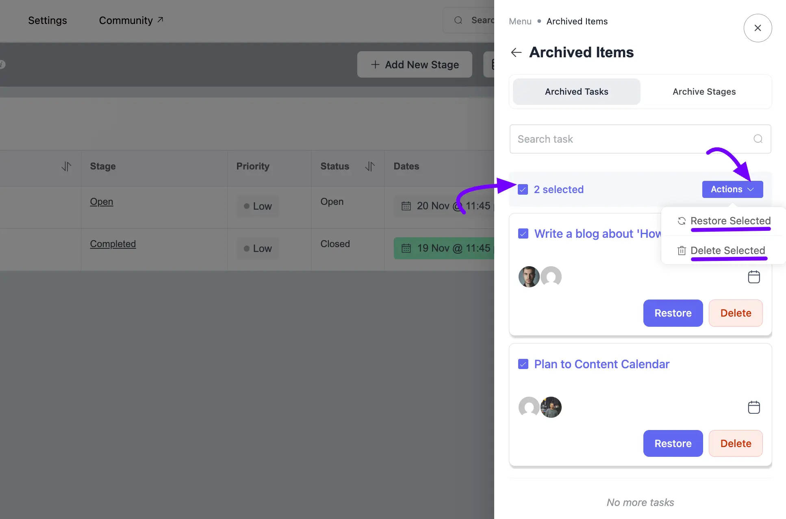

If you have any further questions, concerns, or suggestions, please do not hesitate to contact our [support team](https://wpmanageninja.com/support-tickets/?utm_source=wpmn&utm_medium=home&utm_campaign=site#/){:target="_blank"}.