# Board Settings

FluentBoards has a **Menu** option for your Boards. This **Menu** option allows you to make some changes to your Board as you want. In this guideline, we will show you how you can set these settings.

First, go to the FluentBoards **Dashboard** and select the **Boards** from the navbar. Now you have to open your specific **Board** to access the **Board Menu**.

## Board Menu

In the top right corner of your Board you will see a **Three Dot** button click on it to get the **Board Menu**.

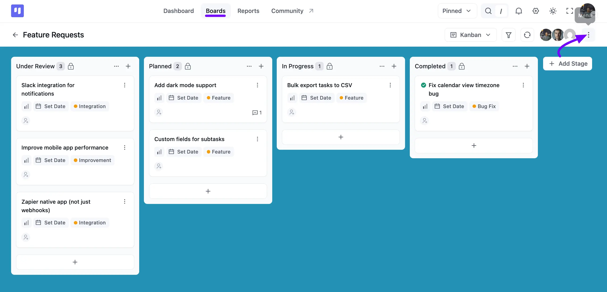

A popup will come up with some options for your Board. We have discussed the options individually below.

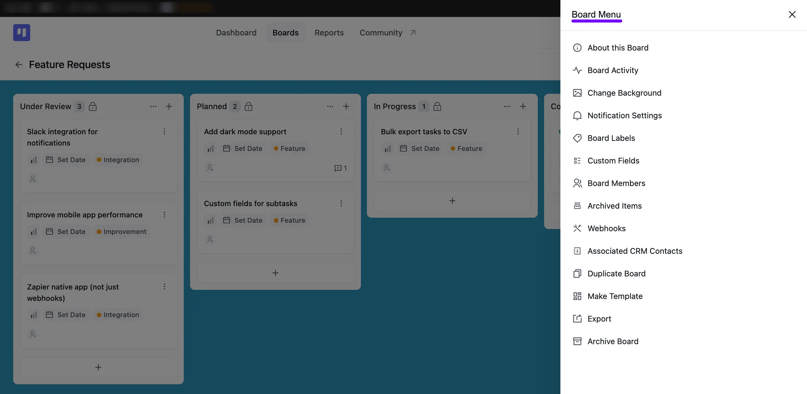

> [!Note]
> The board menu is now fully customizable. If you are a developer, you can add, remove, or reorder items in the board menu by using a filter hook. For detailed instructions and code examples, please refer to our developer documentation:
>
>
>
> [Board Menu Customization Guide](https://developers.fluentboards.com/hooks/filters/#fluent_boards_board_menu_items){:target="_blank"}

### About this Board

Here, you can view details about the board, such as its Name, Description, Creator, and Creation date. Click the **Pencil** icon to edit the **Name** or **Description**.

Under **Board Details**, you'll see quick counts for Tasks, Stages, Labels, and Members. Copy the **Shortcode** shown here to embed this board anywhere else on your website.

If your board is a Roadmap-type board, you'll also see a **Roadmap Shortcode**, a **Public Access** toggle to let anyone with the link view it, and a **View Roadmap Report** link. Down at the bottom, you'll also see which **Folder** the board belongs to.

> [!Note]
> Learn more about Roadmap-type boards in our [Roadmap Overview](/fluentboards-roadmap-overview) guide.

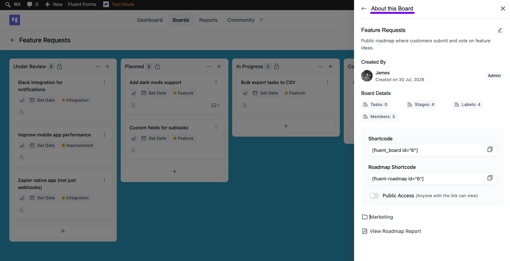

### Board Activity

In the **Board Activity** tab, you'll see a running log of key changes made to the board, such as adding a member, promoting someone to Manager, or changing the background. Each entry shows who made the change and how long ago.

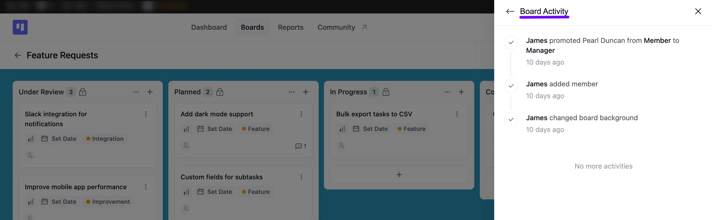

### Change Background

The **Change Background** option allows you to change the background of the Board.

- Click the thumbnail under **Image** to upload your own picture, or click the **Plus** icon to add a new one.
- Choose from the ready-made **Gradients** or **Color** swatches, or click the **Plus** icon next to either row to add a custom option.

The **Preview** section shows how your chosen background looks in **Light** and **Dark** mode. Click **Reset To Default** if you'd like to go back to the original background.

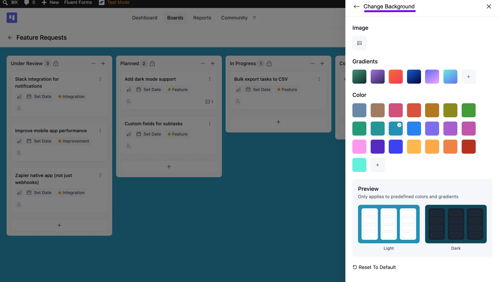

### Notification Settings

From **Notification Settings**, you can control which email notifications you get for this specific board. Toggle **Same as Global Settings** on if you'd rather follow your account-wide preferences, or click **Go to Settings** to manage those directly.

Turn on **Enable All** to receive every notification, or toggle individual options like **Watch created tasks**, **Watch on commenting**, **Watch on assigning**, **Comment**, **Stage Changed**, **Assigned to a task**, **Dates**, **Task Archived**, and **Removed from a task**. Once you're done, click the **Save** button.

> [!Note]
> For your account-wide email notification preferences, see the [Notification Settings](/notification-settings) guide.

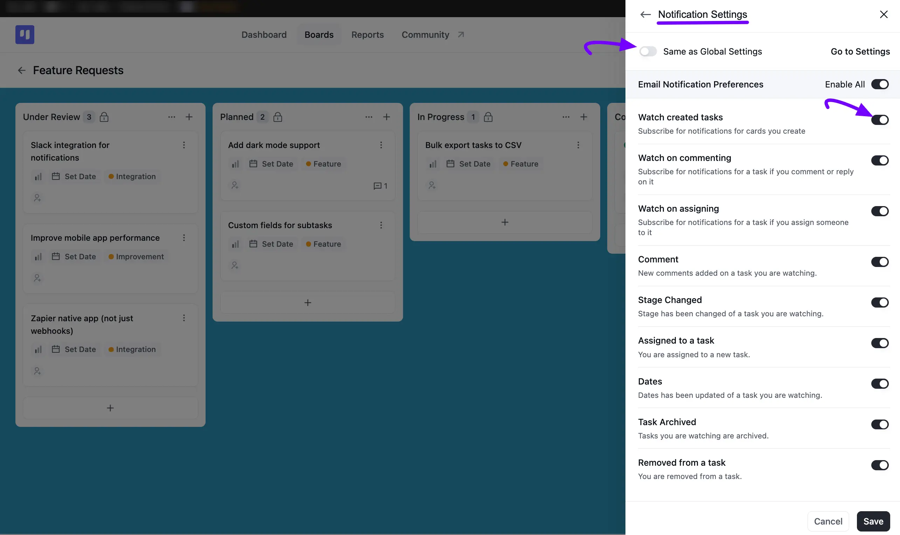

### Board Labels

Click on **Board Labels**, and you will see all the existing labels listed here. To add a new label for your board, click on the **Add Label** button.

If you want to edit an existing label, click on the **Pencil** Icon button next to the label name. Also choose a **color** for your label from the default options or select a **custom color**. Once done, click on the **Save** button. If you want to remove a label, simply click on the **Delete** button.

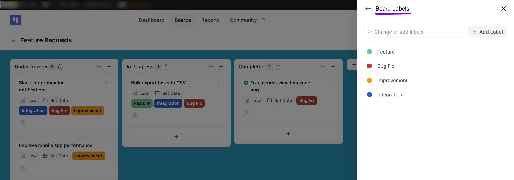

### Custom Fields

In FluentBoards, you can use **Custom Fields** to add extra data fields to your tasks. This feature helps you capture specific information relevant to your workflow directly within a task card.

#### Creating a New Custom Field

First, navigate to the board you want to add a custom field to. Click on the **Menu** from the top right corner of the board and select the **Custom Fields** option.

1. You will now see the Custom Fields panel. Click on the **Create Custom Field** button to get started.
2. A pop-up window will appear. Here you will need to fill in two options:

 * **Title:** This will be the display title for your custom field.

3. **Type:** Choose the data type from the dropdown field, such as Number, Text, or Date.
4. After filling in the required information, click the **Create** button.

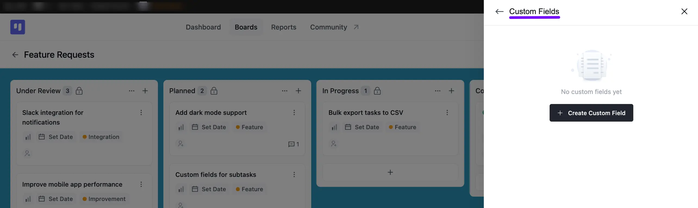

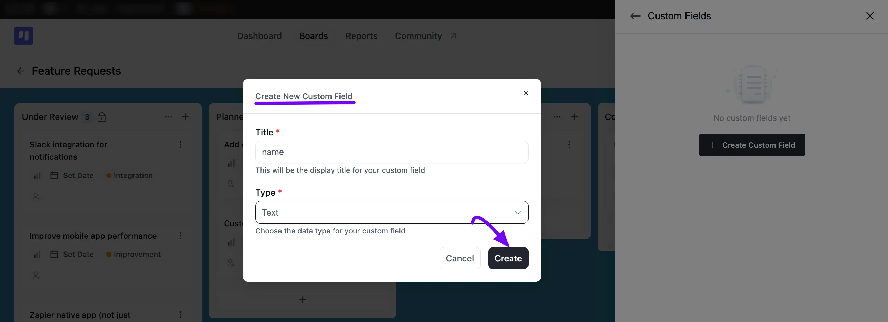

#### Managing Custom Fields

Once created, your custom fields will be visible in all tasks on that board. You can also reorder them to better suit your needs.

To change the sequence of your custom fields, simply go to the **Custom Fields** settings panel. From there, you can **drag and drop** the fields into your desired order. The new order will be saved automatically.

> [!Note]
> To see how these fields show up and get filled in on an individual task, check out the [Custom Fields](/custom-fields-for-task) guide.

### Board Members

#### Add New Member

You can manage your board's members from here. In the **Board Members** search field, search for an existing WordPress user by **Name** or **Email**, then select them and click the **Add Member** button.

Existing members are listed under **Members**, each with a dropdown so you can change their role to **Manager** or **Member**. Anyone with WordPress Admin access to your site is listed under **Also Has Access**, since Admins can view every board automatically.

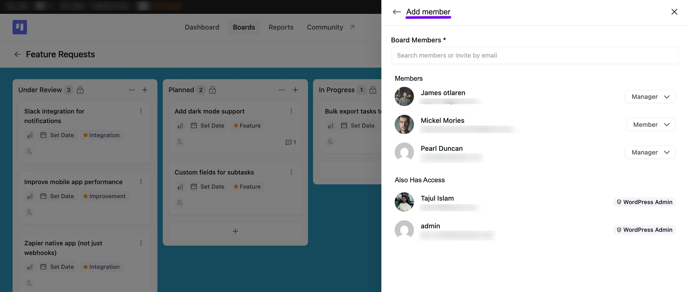

#### Invite Member

If the person you want to add isn't a WordPress user yet, type their email address in the same field to switch to invite mode. Choose their role from the dropdown, then click the **Invite** button to send them an invitation to join the Board.

Down here you will also be able to see the *Pending Invitations*.

> [!Note]
> For more on member roles and permissions, see the [Member Roles](/member-roles) guide.

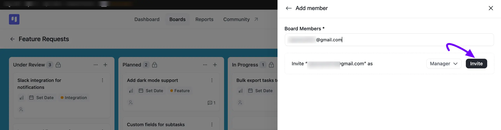

### Archived Items

The **Archived Items** panel has two tabs: **Archived Tasks** and **Archived Stages**.

Under **Archived Tasks**, you'll see every task you've archived, along with who archived it and when. Check the box next to a task, or click **Select All**, and use the **Restore** or **Delete** icon to bring it back or remove it for good. Once you've checked one or more boxes, a counter shows how many are selected, and you can use the **Actions** dropdown to **Restore Selected** or **Delete Selected** tasks all at once.

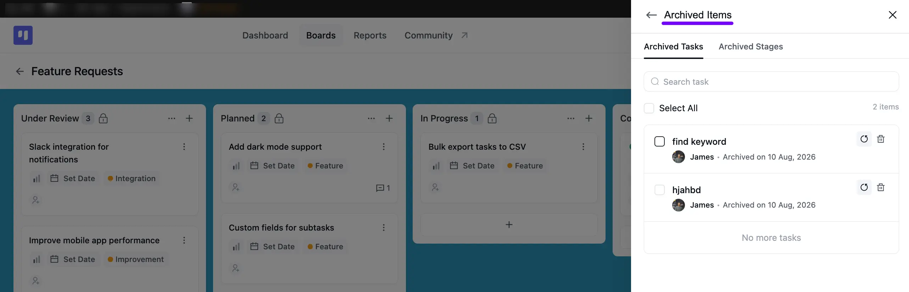

Switch to the **Archived Stages** tab to see any Stages you've removed from the board. Click the **Restore** icon next to a Stage to bring it back, or the **Delete** icon to remove it permanently.

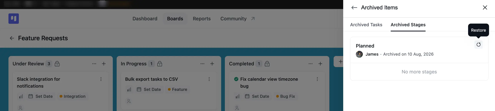

### Webhooks

Click **Webhooks** to set up an **Outgoing Webhook** for this board. FluentBoards sends a POST request to your chosen URL whenever a specific event happens on the board, such as a task being created or moved.

> [!Note]
> For full setup steps and the list of supported events, see the [Outgoing Webhooks](/outgoing-webhooks) guide. If you'd rather create tasks from an external source instead, check out [Incoming Webhooks](/incoming-webhook).

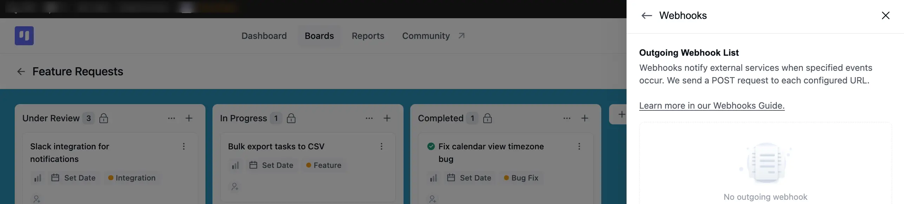

### Associated CRM Contacts

The **Associated CRM Contacts** option in your board menu displays the *CRM contacts* linked to your tasks and to the board itself.

Under **Board Contact**, you'll see the single contact linked to the board, along with their **Tags** and **Lists**. Clicking on the **Task Contacts** count will reveal the tasks associated with those CRM contacts.

> [!Note]
> Learn more about connecting CRM contacts to your boards and tasks in the [FluentCRM integration](/fluentboards-integration-with-fluentcrm) guide.

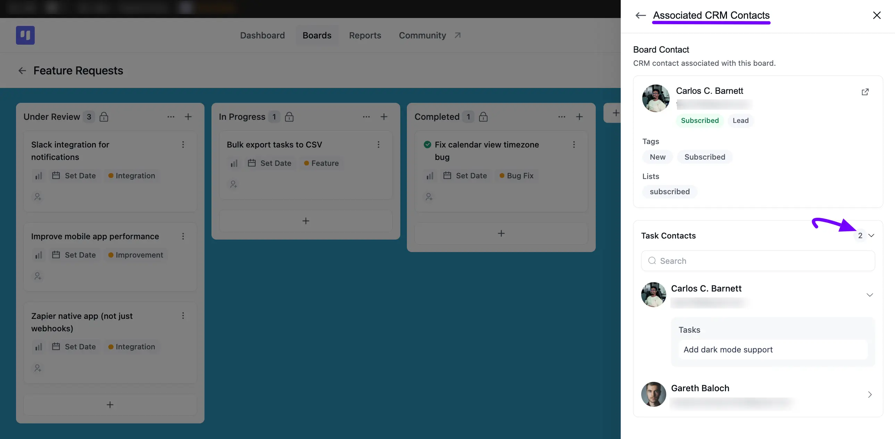

### Duplicate Board

If you wish to duplicate the board, simply select the **Duplicate Board** option. Then, provide a title for your duplicate board and choose from the **Keep Tasks**, **Keep Labels**, and **Keep Templates** checkboxes which information you'd like to copy along with it. Once you're done, click the **Duplicate** button.

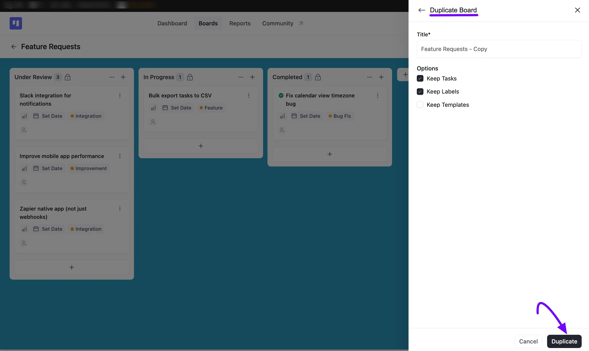

### Make a Template

If you wish to convert this board into a reusable template, select **Make Template**. Add an optional description in the **Template Descriptions** field, then choose a **Category**, such as **Project Management**, **Development**, or **Marketing**, from the dropdown. Once you're done, click the **Make Template** button.

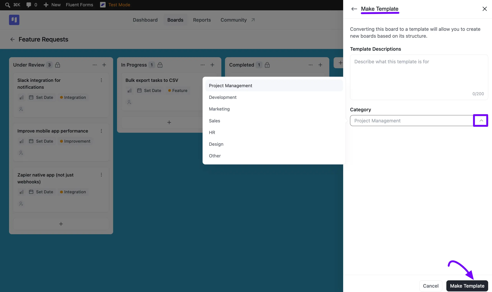

### Export

You can export your whole board as a **JSON** or **CSV** file in FluentBoards. The export will include all task details, but keep in mind that **assignee information won’t be included**.

To export, go to the board you want to export and click on the **board menu** button in the **top-right corner**.

A pop-up will appear with the **Export** option. Click on it, and you’ll see two formats: **JSON** and **CSV**. Select your preferred format, and your board will be exported.

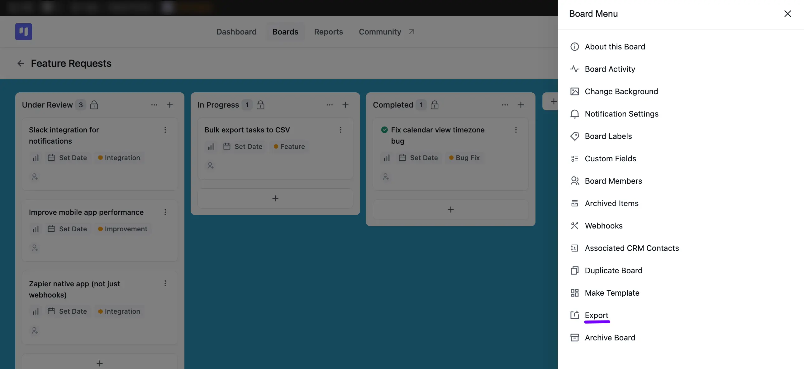

Here, the **JSON** is for exporting your board in JSON format, and the **CSV** button is exporting your Board in CSV format.

> [!Note]
> Once you have your exported file, see the [Import Your Boards](/import-boards-into-fluentboards#import-from-fluentboards) guide to learn how to bring a **JSON** export back into FluentBoards, or the [Import CSV File](/import-boards-into-fluentboards#import-csv-file) section for your **CSV** export.

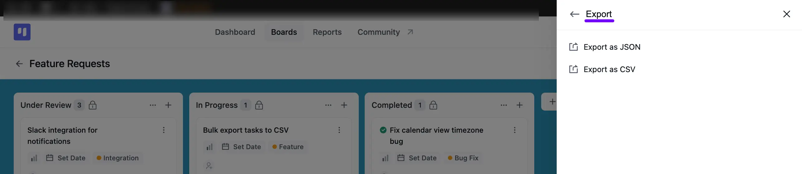

### Archive Board

If you no longer need a board in your active list, select **Archive Board**. A confirmation pop-up reminds you that archived boards can be restored at any time, but they won't appear in your active boards list until then. Click **Archive This Board** to confirm, or **Cancel** to back out.

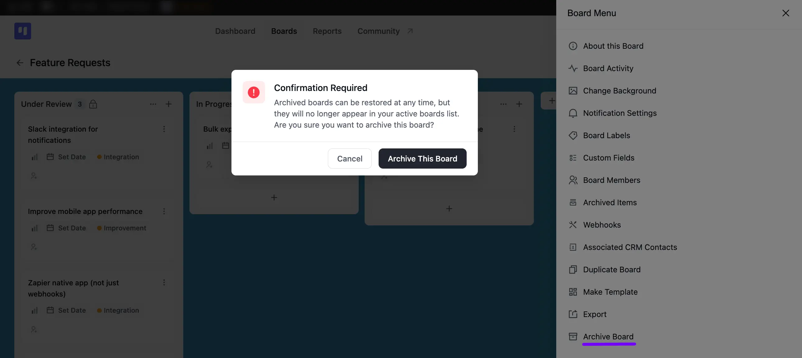
