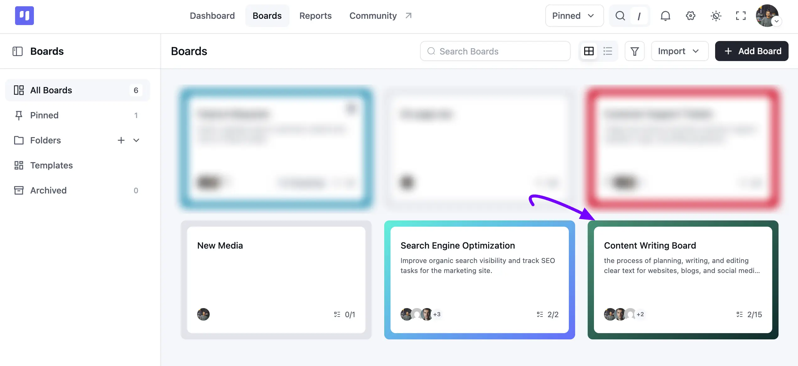
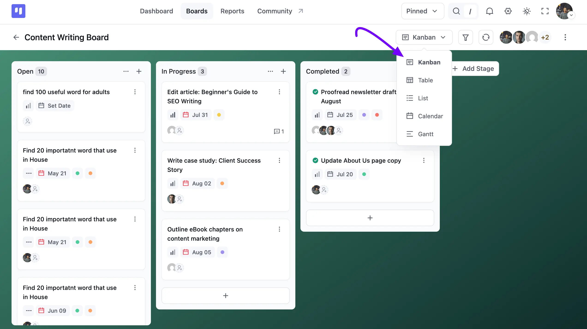
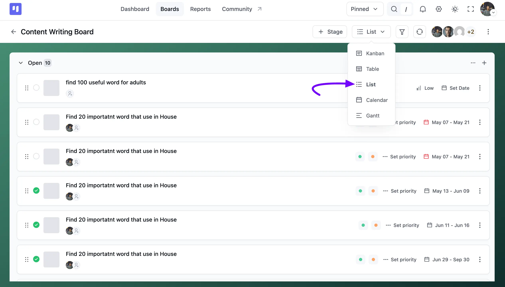
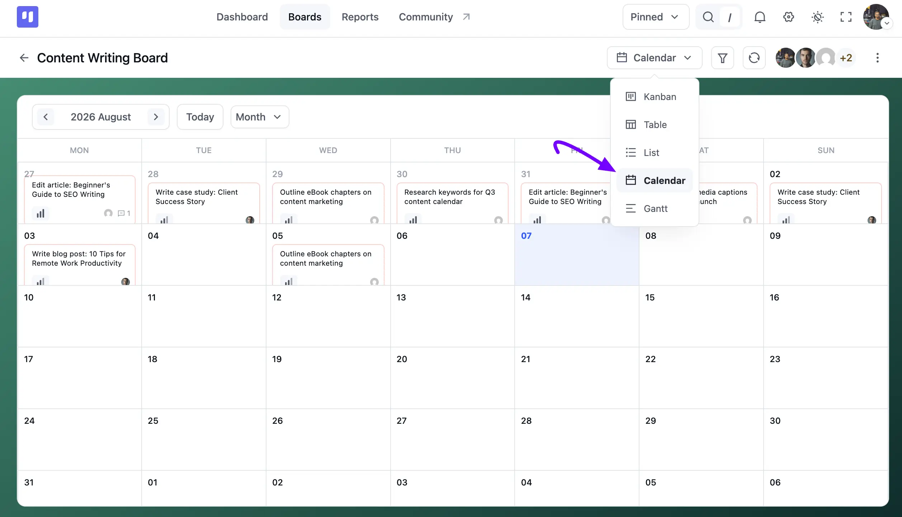
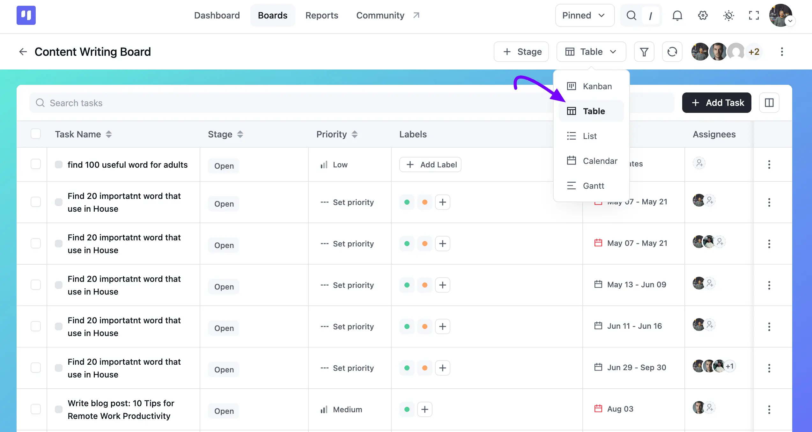
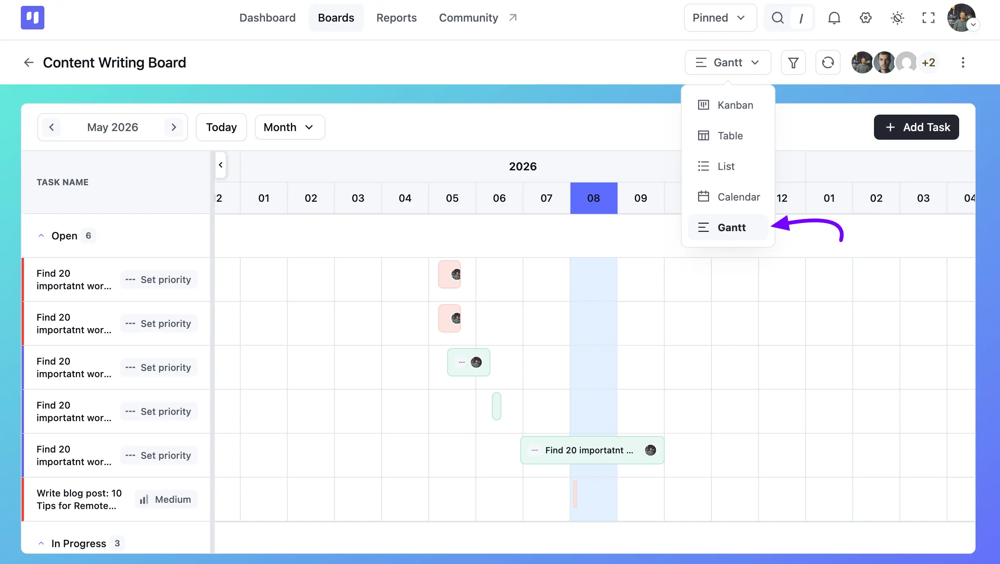

# Board Views

The FluentBoards plugin offers three impressive board views. These views allow you to visualize your board's information in different ways, helping you analyze and display reports on your board data more effectively.

There are three types of board view, and you can select any of them. Those are:

- Kanban View
- List View
- Calendar View
- Table View
- Gantt Chart View

Below are details about FluentBoards view.

## Boards View

Go to your FluentBoards **Boards** section from the top navbar, then click on the specific Board you want to change the view for.

Once you're inside a Board, click the view switcher at the top right, which shows the name of your current view (e.g., **Kanban**). A dropdown appears where you can pick **Kanban**, **Table**, **List**, **Calendar**, or **Gantt**.

## Kanban view

By default, your Boards open in **Kanban** view. This card-based view organizes your tasks by **Stage**, so you can quickly see what's **Open**, **In Progress**, or **Completed**. Each card shows the task's **Priority**, due date, **Labels**, assignees, and comment count.

## List view

A list view is a user interface design that displays a collection of items in a vertical or horizontal list, allowing for easy navigation and interaction with each item.

The board's **List** view shows the same tasks stage by stage, but as compact rows instead of cards, with each task's **Priority**, **Labels**, date range, and assignees lined up in columns. Drag the handle on the left of a row to reorder tasks.

## Calendar view

A calendar view visually represents calendar data, offering various layouts to display events and appointments.

FluentBoards **Calendar** view places each task on its due date, along with its Priority and assignee. Use the arrows or the **Today** button to move around, and the **Month** dropdown to change how much time you see at once.

## Table View

A table view displays your tasks in a spreadsheet-like grid. This compact layout allows you to see many tasks at once and quickly scan details in columns.

The board's **Table view** shows your tasks in rows, with columns for **Task Name**, **Stage**, **Priority**, **Labels**, **Dates**, and **Assignees**. Use the **Search tasks** bar to quickly find a task, or click the **+ Add Task** button to create a new one.

### Bulk Actions

While in Table view, you can perform actions on multiple tasks at once by using the Bulk Action feature.

Use the **checkboxes** in the first column to select the tasks you want to perform any bulk action on.

Once tasks are selected, a **Bulk Actions** dropdown menu will appear at the top of the table. Click the dropdown to choose an action.

Available bulk actions include:

- **Move to Stage:** Move all selected tasks to a different stage.
- **Archive Tasks:** Archive all selected tasks.
- **Change Priority:** Change the priority level (e.g., High, Medium, Low) for all selected tasks.
- **Assign Members:** Add or replace assignees for all selected tasks.
- **Add Labels:** Apply one or more labels to all selected tasks.

## Gantt Chart View

The Gantt Chart View lists your tasks by **Stage** on the left, next to a timeline you can page through with the arrows or the **Today** and **Month** controls. 

Colored bars mark each task's due date on the timeline, so you can spot overlaps and get a bird's-eye view of how your entire project is progressing, all in one place.

So, here is the whole overview of the FluentBoards View section.
