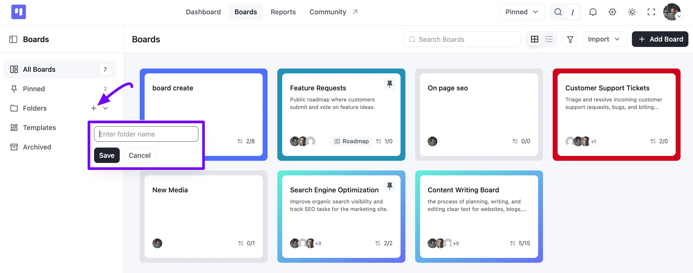
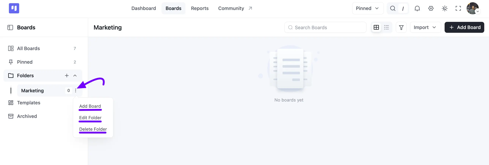
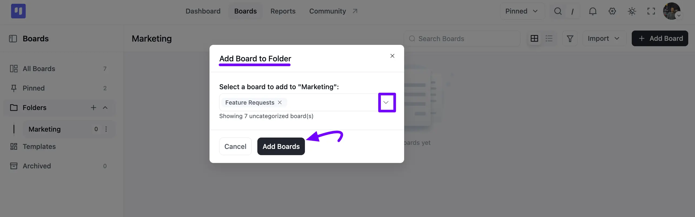
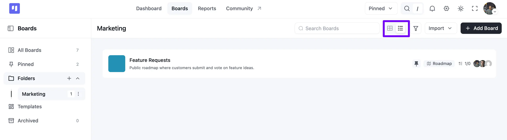

# Organizing with Folders

To keep your workspace organized, you can group related boards into folders. This guide will walk you through creating folders, adding boards to them, and customizing your view.

## How to Create a Folder

1. Begin on the **Boards** page. In the left sidebar, click the **+ icon** next to **Folders**.
2. An input field will appear. Enter a name for your folder and click the **Save** button to create it.

### How to Add Boards to a Folder

You can add boards to a folder in two ways: by creating a new board directly inside it, or by adding an existing board.

**A. Create a New Board in a Folder**

1. Select the folder from the sidebar where you want to add the new board.
2. Click the main **+ Add Board** button at the top right of the page.
3. Fill out the board details. The new board will automatically be placed in the folder you selected.

**B. Add an Existing Board to a Folder**

1. In the sidebar, click the **three-dot** icon next to the folder where you want to add a board.
2. Select **Add Board** from the menu.

3. In the **Add Board to Folder** pop-up, click the **dropdown** and select the board(s) you wish to add.
4. Click the **Add Boards** button to confirm.

### How to Edit or Delete a Folder

Click the **three-dot** icon next to any folder's name to find the **Edit Folder** and **Delete Folder** options, so you can rename or remove a folder whenever you need to.

#### How to Change the Folder View

You can switch between a visual card layout and a compact list layout for the boards within a folder.

1. Select a folder from the sidebar.
2. Locate the two view icons next to the **Search Boards** bar.
3. Click either icon to switch between **Card** and **List** layouts.

