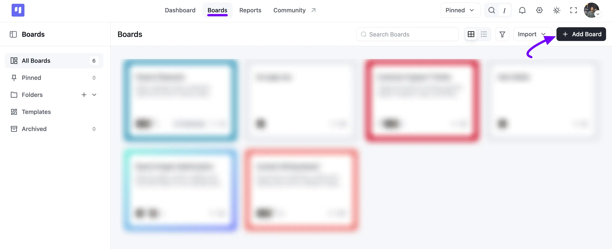
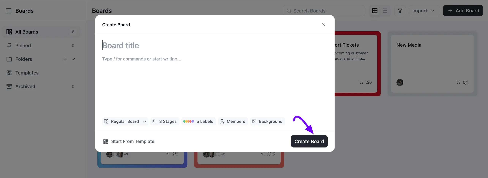
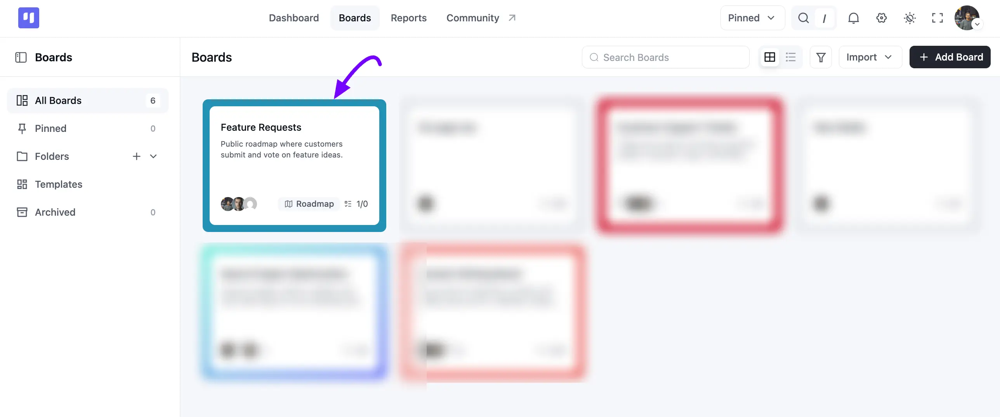

# Creating a New Board

Creating a new board in FluentBoards is quick and straightforward. You can set up your board with a title, description, stages, labels, members, and background, or start with a ready-made template. This guide walks you through the steps to create and set up a new board for managing your projects.

## Creating New Board

Go to your FluentBoards **Boards** section and click on the **+ Add Board** button in the top right corner.

A **Create Board** pop-up will appear. Enter a title in the **Board title** field, then add an optional description below it.

Use the row of options underneath to set up your board. Click **Regular Board** if you'd like to choose a different Board type, such as a **Roadmap Board**, instead. You can also set the number of **Stages**, add **Labels**, invite **Members**, or pick a **Background**. If you'd rather start with a ready-made structure, click **Start From Template**.

Once you're done, click the **Create Board** button.

And just like that, your board is ready to go! You can now begin adding stages and tasks to your newly created board.

If you have any further questions or concerns please do not hesitate to contact our [support team](https://wpmanageninja.com/support-tickets/?utm_source=wpmn&utm_medium=home&utm_campaign=site#/){:target="_blank"}.