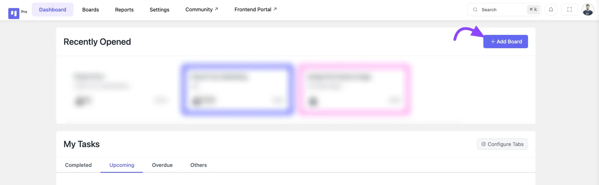
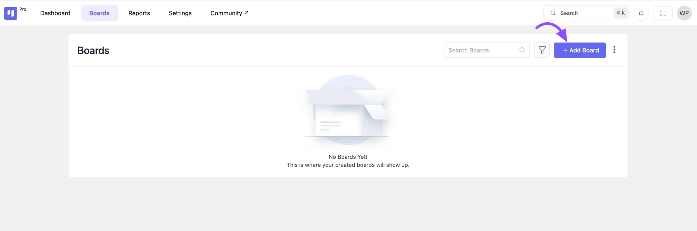
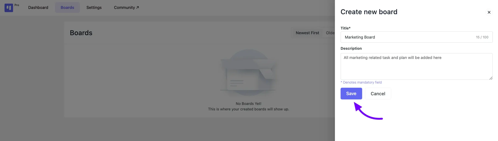
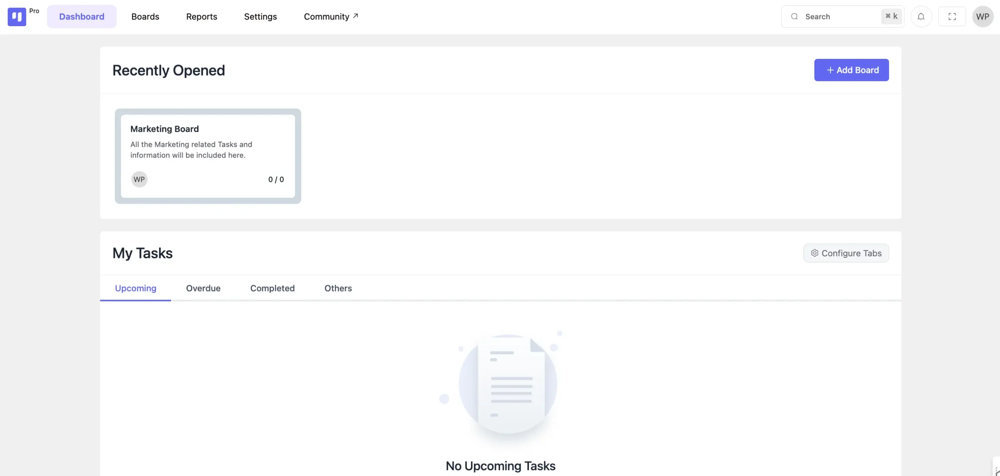

# Creating a New Board

FluentBoards is a handy plugin that makes managing your projects in WordPress a breeze. Now, let's see how easy it is to create a new board to manage your projects.

## Creating New Board

Go to the Fluent Board from your WordPress and you will find an **+ Add Board** button in the FluentBoards **Dashboard**. Click on the button.

You'll also find the **+Add Board** option conveniently located within your **Boards** section.

Next, a pop-up will appear from the right side of the board interface. Here, provide a title and description for your board, then click the **Save** button.

And just like that, your board is ready to go! You can now begin adding stages and tasks to your newly created board.

If you have any further questions or concerns please do not hesitate to contact our [@support team](https://wpmanageninja.com/support-tickets/?utm_source=wpmn&utm_medium=home&utm_campaign=site#/){:target="_blank"}.