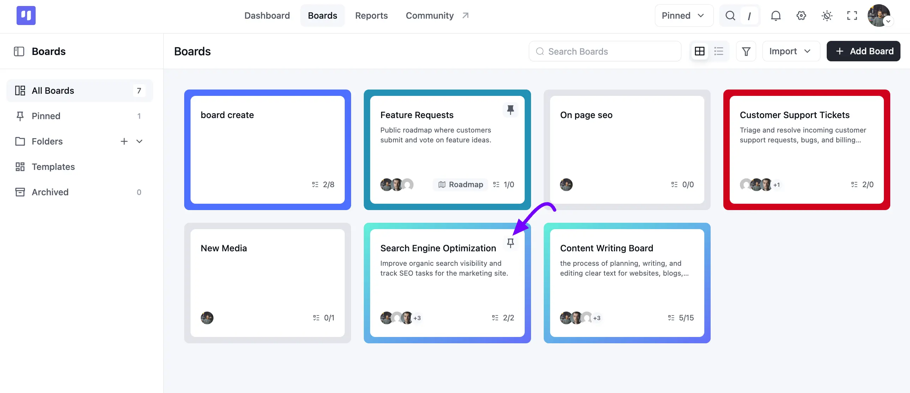
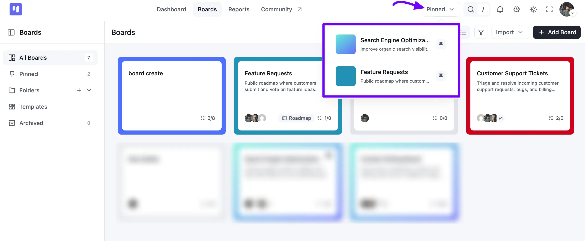
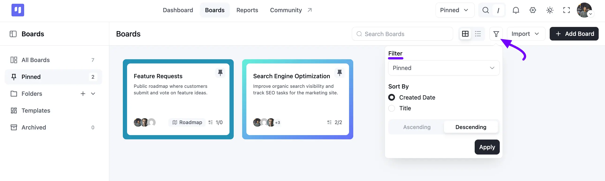

# Pinned Boards

The **Pinned Boards** feature allows users to mark specific project boards as pinned, enabling quick access to their most important or frequently used boards. This feature enhances user productivity by prioritizing key boards in the interface.

## Pin/Unpin a Board

To pin a board, go to your FluentBoards **Boards** section and hover over the Board you want to pin. A pin icon appears in its top right corner. Click the pin icon to mark the board as pinned. Clicking the pin icon again will unpin the board.

 

You can also pin or unpin a board from the dashboard page by doing the same.

## Pinned Boards Display

Pinned boards can be viewed by clicking the **Pinned** dropdown in the top navbar, which reveals a list of all your pinned boards. The list displays each pinned board's color, name, and a brief description (if available), along with its pin icon.

You can also click **Pinned** in the left sidebar of the Boards page to see the same boards as full cards, with a count showing how many you've pinned.

Each pinned board in the list is clickable, redirecting you to the selected board's page. The pin icon lets you unpin the board directly from the list.

## Filter Pinned Boards

On the Boards page, click the **Filter** icon, then choose **Pinned** from the **Filter** dropdown. You can also choose to **Sort By** **Created Date** or **Title**, and set the order to **Ascending** or **Descending**. Click the **Apply** button to update your view.

If you have any further questions or concerns please do not hesitate to contact our [support team](https://wpmanageninja.com/support-tickets/?utm_source=wpmn&utm_medium=home&utm_campaign=site#/){:target="_blank"}.