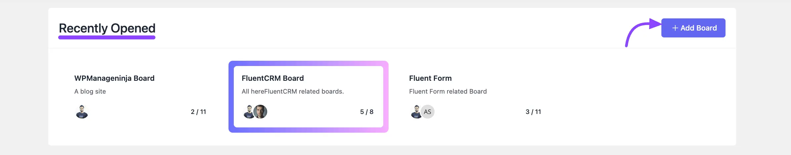
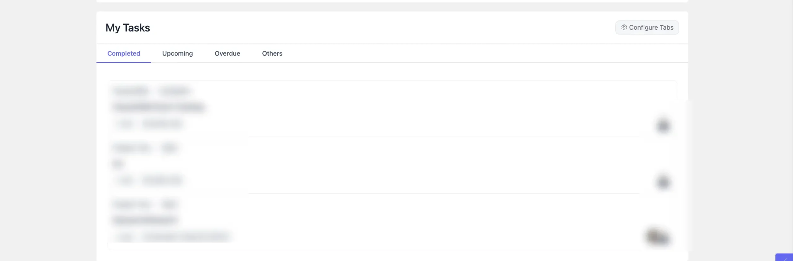
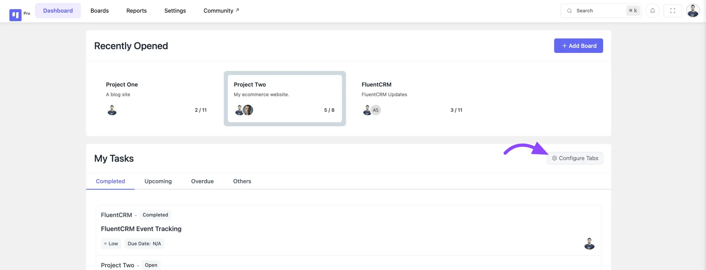
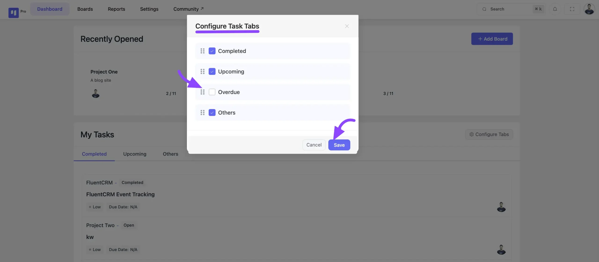

# Dashboard Overview

Welcome to the FluentBoards Dashboard, designed to streamline your work experience and enhance accessibility. Within your FluentBoards Dashboard, you'll find a range of features to simplify task management and boost productivity.

## Recently Opened

In the Recently Opened section of your dashboard, you'll find quick access to the boards you've recently interacted with. Simply click on any of the listed boards to navigate directly to them.

Additionally, the option to create a new board is conveniently available with the **+Add Board** button.

## My Tasks

The My Tasks section is structured to optimize your user experience, categorized into three segments:

**Upcoming Boards:** Stay ahead of your tasks with a clear view of upcoming deadlines. Tasks are organized based on their scheduled dates, presenting essential details such as Board Name, Stage, Task Title, Priority, Date, and Time.

**Overdue:** Address overdue tasks efficiently by accessing them directly from this section. Task cards display vital information including Board Name, Stage, Task Title, Priority, Date, and Time, ensuring prompt action to complete pending tasks.

**Completed**: This is where all tasks marked as completed will be displayed for your review.

**Others**: This section displays tasks that have no status updates and have passed their deadlines. These overdue or unaddressed tasks will be shown here.

## Configure Tab in My Dashboard

FluentBoards allows you to control what task types are visible in your **My Task Dashboard**, helping you focus on the tasks that matter most to you.

### Access the Configure Tab

To get started, navigate to your **My Task Dashboard**. Click on the **Configure Tab** button located at the top of the dashboard.

### **Show or Hide Task Types**

A pop-up will display all available task types. Use the **Checkboxes** to choose which task types you want to **display** or **hide** from your dashboard.Now, click the **Save** button to apply your changes.

This concludes the overview of your FluentBoards Dashboard. For any further inquiries or assistance, feel free to reach out to our [support](https://wpmanageninja.com/support-tickets/?utm_source=wpmn&utm_medium=home&utm_campaign=site#/){:target="_blank"}.