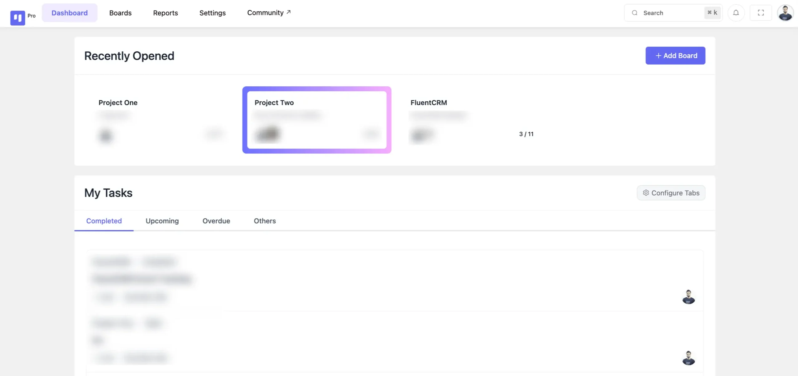
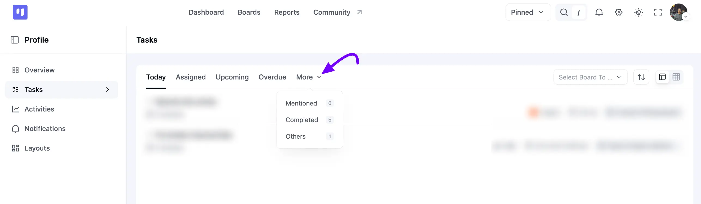
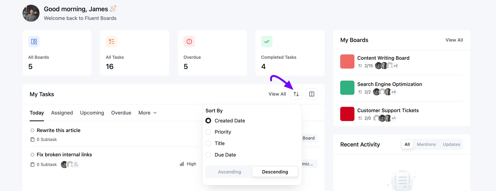
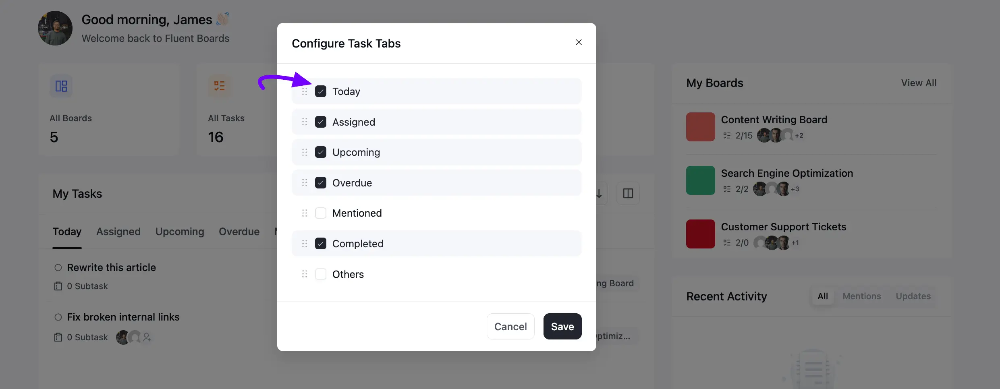

# Dashboard Overview

Welcome to the FluentBoards Dashboard, designed to streamline your work experience and enhance accessibility. Within your FluentBoards Dashboard, you'll find a range of features to simplify task management and boost productivity.

## Dashboard Stats

Right at the top of your Dashboard, you'll find four quick stats that give you an instant read on how your work is progressing across every board.

**All Boards**: Shows the total number of boards you're a part of.

**All Tasks**: Shows the total number of tasks across your boards.

**Overdue**: Shows how many of your tasks have passed their due date.

**Completed Tasks**: Shows how many of your tasks you've marked as completed.

## My Boards

Here you will see the **My Boards** panel on the right side of your Dashboard. Each board shows its task progress along with the profile pictures of its members.

Simply click on a board to open it directly, or click **View All** to see every board you're part of.

## Recent Activity

Below **My Boards**, the **Recent Activity** panel keeps you updated on what's happening across your boards. Use the **All**, **Mentions**, and **Updates** tabs to filter what you see here.

## My Tasks

The **My Tasks** section is structured to optimize your user experience, categorized into several segments. You'll find **Today**, **Assigned**, **Upcoming**, and **Overdue** as tabs, with more options available under the **More** dropdown:

**Today**: Shows tasks that are due today.

**Assigned**: Shows tasks that have been assigned to you.

**Upcoming**: Shows tasks with upcoming due dates, so you can stay ahead of deadlines.

**Overdue**: Shows tasks that have passed their due date, so you can take prompt action.

**Mentioned**: Shows tasks where you've been mentioned in a comment.

**Completed**: Shows all tasks that have been marked as completed.

**Others**: Shows tasks that don't have a due date set.

Each task displays its subtask count, assignees, **Priority**, due date and time, and the board it belongs to.

Click on **View All** to open the full **My Tasks** page, where you can also select a specific board and switch between list and grid layouts.

### Sort Your Tasks

Click on the **Sort** icon next to **View All** to arrange your tasks by **Created Date**, **Priority**, **Title**, or **Due Date**, in **Ascending** or **Descending** order.

## Configure Tab in My Dashboard

FluentBoards allows you to control what task types are visible in your **My Tasks** section, helping you focus on the tasks that matter most to you.

### Access the Configure Tab

To get started, click on the layout icon next to the **Sort** icon in the **My Tasks** section. This opens the **Configure Task Tabs** pop-up.

### **Show or Hide Task Types**

Here you will see a checkbox list of all available tabs: **Today**, **Assigned**, **Upcoming**, **Overdue**, **Mentioned**, **Completed**, and **Others**. Use the **Checkboxes** to choose which tabs to **display** or **hide**, or simply drag a tab to reorder it. Now, click the **Save** button to apply your changes.

This concludes the overview of your FluentBoards Dashboard. For any further inquiries or assistance, feel free to reach out to our [support](https://wpmanageninja.com/support-tickets/?utm_source=wpmn&utm_medium=home&utm_campaign=site#/){:target="_blank"}.
