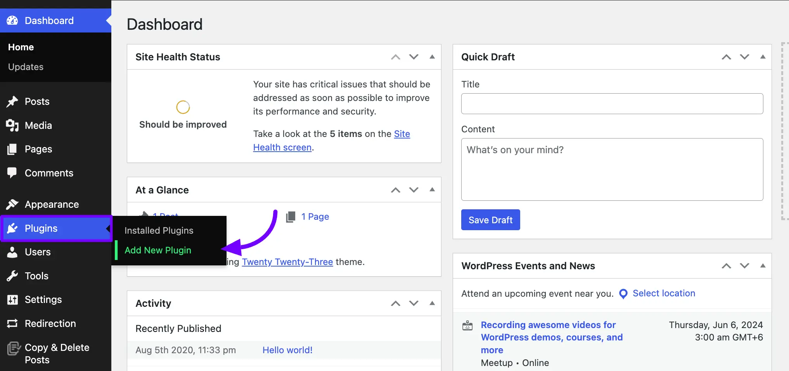
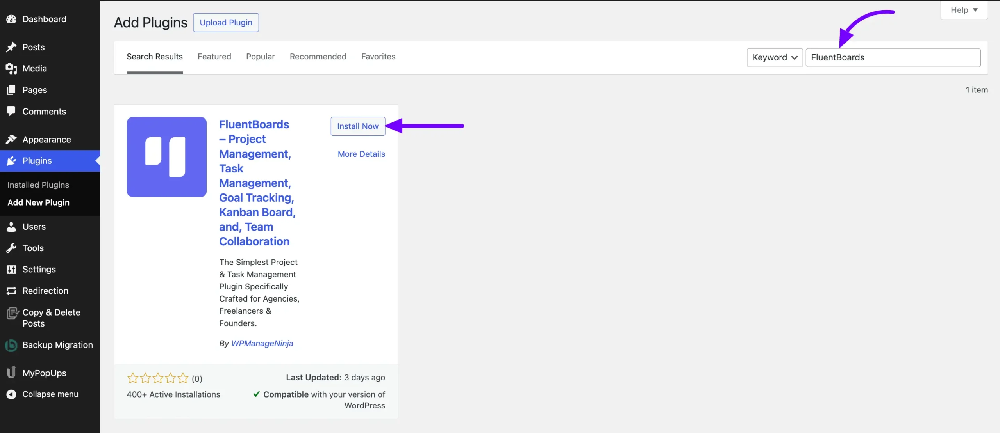
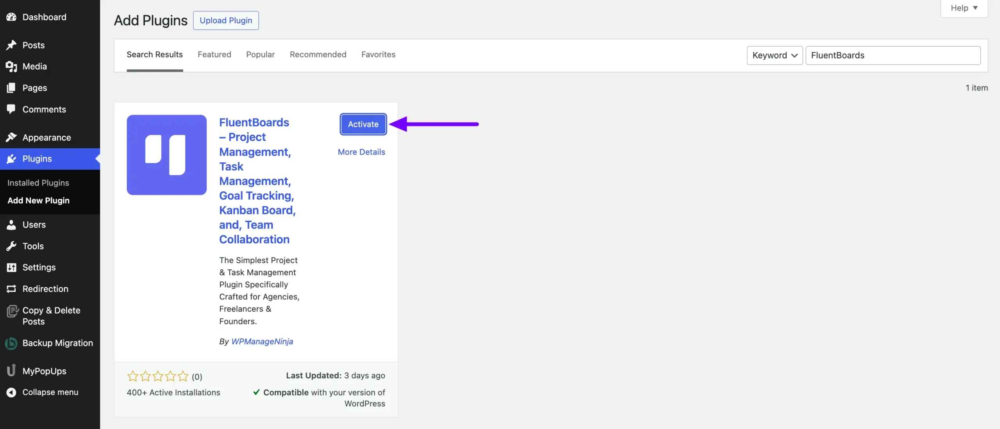
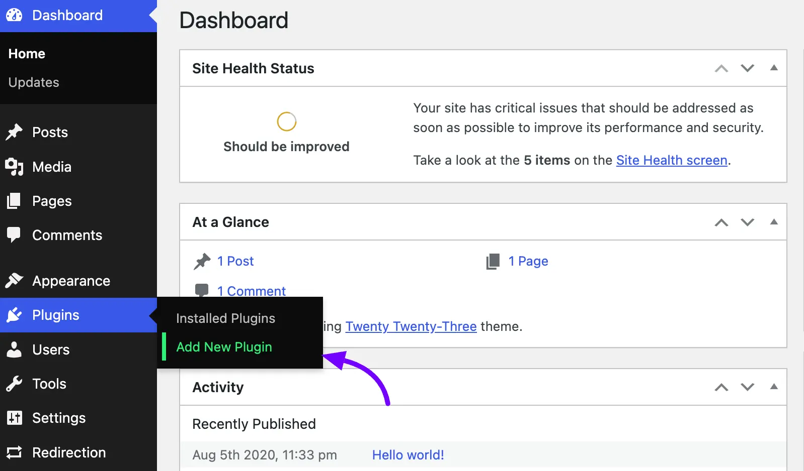
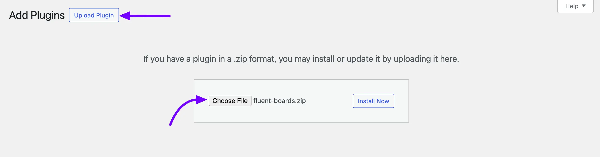
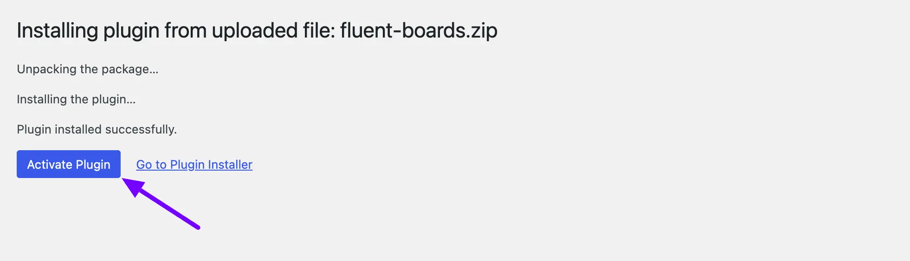
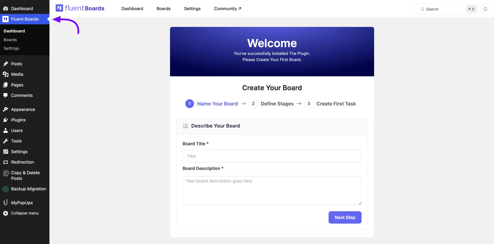

# Installing FluentBoards

Start organizing your projects smoothly with FluentBoards on your WordPress site. Installing FluentBoards is very simple, and this article will guide you through the entire process step by step.

Let's Start!

## Installing From WordPress Plugin Directory

To install the free version of FluentBoards, navigate to your WordPress Dashboard then select **Plugins > Add New Plugin**.

Now, search for FluentBoards in the WordPress Plugin Directory. Once you find it, click on the **Install Now** button.

Now your plugin will be installed on your site you just need to click the **Activate** button to activate it.

## Install FluentBoards Pro by Uploading the ZIP File

You can purchace and download the FluentBoards Pro from the FluentBoards [site](http://fluentboards.com){:target="_blank"}. After Downloading the ZIP file of the FluentBoards Pro login to your WordPress site.

Go to your WordPress Dashboard hover over **Plugins** from the left sidebar and Select the **Add New Plugin**.

Now Click on the **Upload Plugin** button and you will get the option to **Choose File** from your local storage. Select the file from your local storage and click on the **Install Now** button.

Now the FluentBoards Pro plugin will be installed on your WordPress site click on the **Active Plugin** button. After the plugin install is complete you will see an **Active Plugin** button click on it.

Congratulations! FluentBoards has been successfully installed on your site.

> To activate your FluentBoards Pro, you'll need to use the License Key. Refer to the [Activating Your License](/fluentboards-licence-activation) guide for steps on how to activate FluentBoards Pro with the License Key.

When you will enter the FluentBoards for the first time you will get the opportunity to [set up your first board](/onboarding-board). Give the details about boards and create new ones.

