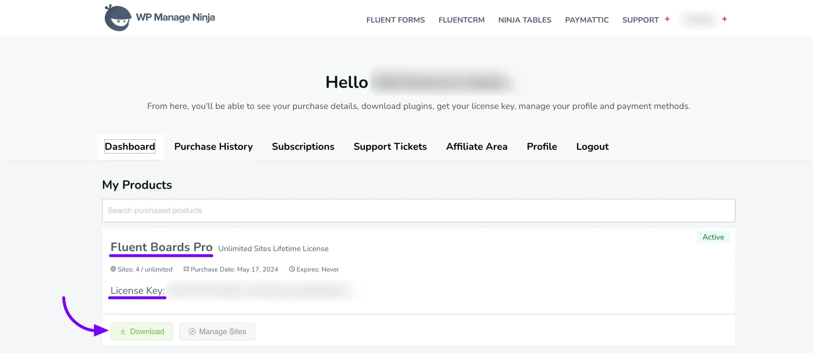
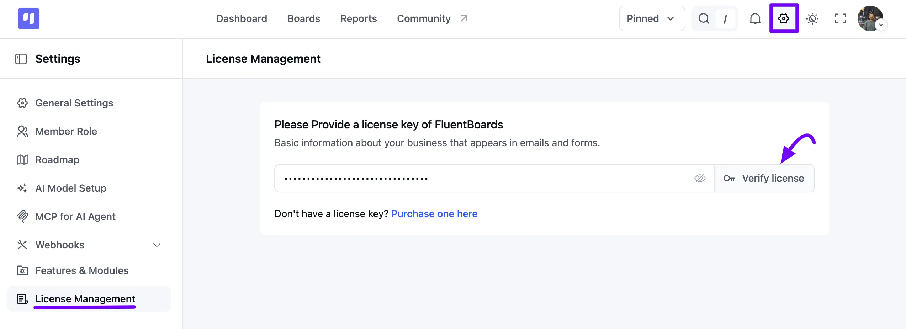
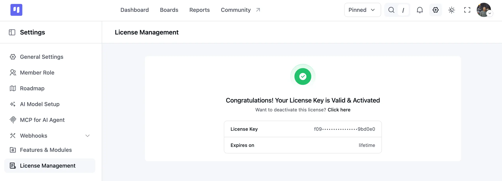

# Activating Your License

FluentBoards Pro offers a variety of advanced features to enhance your project management. To access these features, you need to activate the Pro version with a license key. You can purchase FluentBoards Pro from [WPManageNinja](https://community.wpmanageninja.com/portal/){:target="_blank"}.

Once you have the license key, simply activate it to unlock all the Pro functionalities.

## License Key

Go to the *Dashboard* of your **WPManageNinja** [account](https://wpmanageninja.com/account/dashboard/){:target="_blank"}, where you will find the FluentBoards Pro **License** and the **Pro Zip** file. Download the Zip file and copy the license key from there.

## Activate FluentBoards Pro

Go to your FluentBoards Dashboard and click on the **Settings** icon in the top navbar, then select **License Management** from the left sidebar. You will see a field for your FluentBoards Pro license. **Paste** your license key here and click on the **Verify license** button.

After that, you will see a success notification and a message that **Congratulations! Your License Key is Valid & Activated**.

Congrats! You are using Fluent Boards Pro now.
