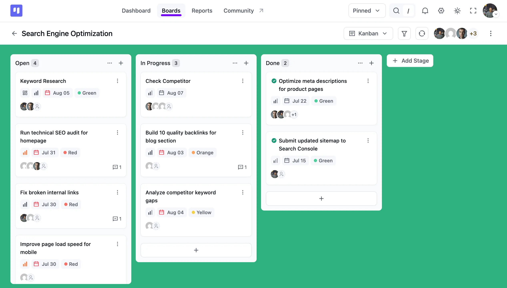
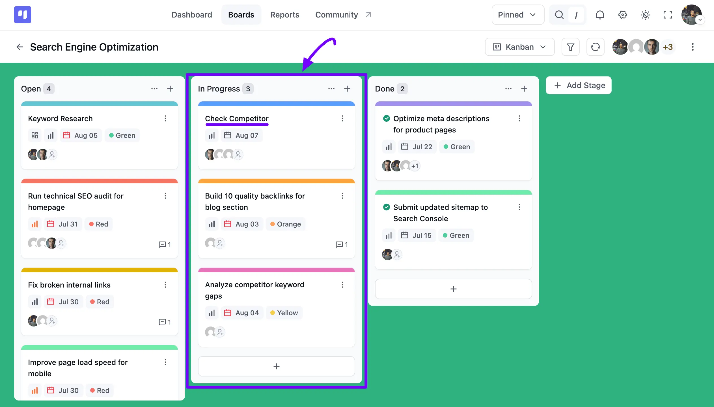
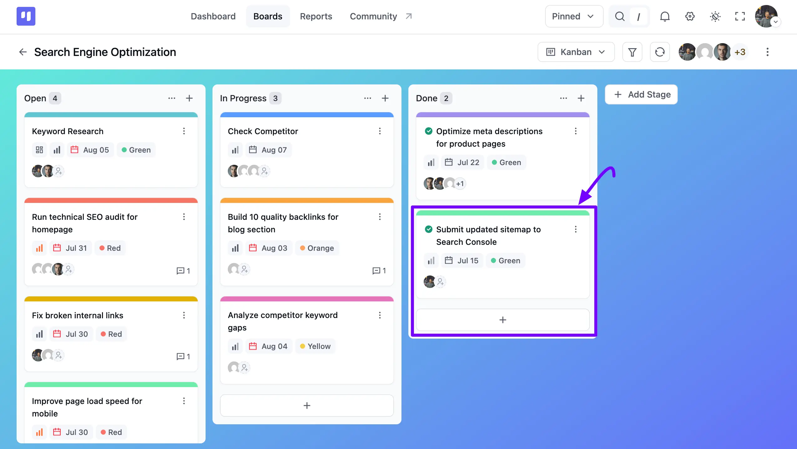
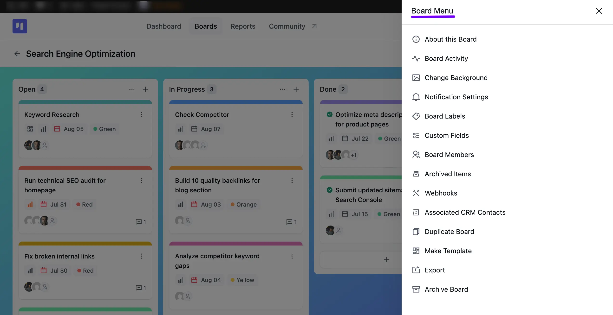
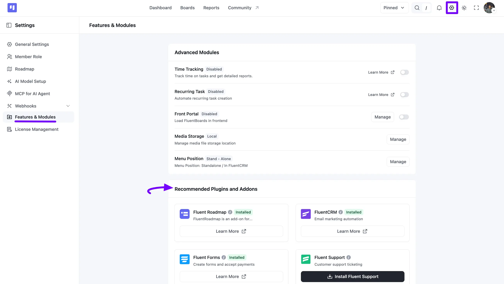

# Introduction to FluentBoards

Getting started with boards is incredibly simple. Let's delve into the fundamental features of board components, including boards, stages, task cards, and board menu settings.

<VideoEmbed id="Nl-Qa0eBn1I" />

## Introduction to FluentBoards

FluentBoards is a Project Management Plugin designed to facilitate collaborative work among team members. It offers the ability to showcase your team's workflow directly on your WordPress site, eliminating the need for additional tools.

With FluentBoards, you can display your boards within the WordPress backend or on the front-end portal of your website. Packed with essential features, FluentBoards ensures seamless project planning and execution.

## Understanding Boards

A **Board** serves as a centralized hub for organizing workflow-related information. Whether you're initiating a new project, planning, or managing ongoing tasks, the board provides a comprehensive overview of your team's progress.

You can easily monitor tasks, assignees, and more within the board interface. Available in Kanban View, List View, Calendar View, Table, and Grantt View formats.

## Exploring Stages

**Stages** represent sequential lists where tasks are organized. These stages are displayed within your boards, allowing you to add and manage tasks easily. Each stage accommodates an unlimited number of tasks, facilitating efficient project management.

Additionally, you can freely move stages and tasks if needed.

## Understanding Task Cards

**Task Cards** serve as the primary components within the board interface, displaying essential task details. Each card contains information such as task descriptions, sub-tasks, assignees, due dates, Labels, comments, and more.

Task cards provide a comprehensive snapshot of individual tasks within the broader project context.

## Navigating the Board Menu

The **Board Menu** offers a centralized location to configure various settings for your boards. From here, you can view board details and activity, change the board background, and adjust notification settings.

You can also manage board labels, custom fields, and board members, or check archived items and set up webhooks.

Additionally, you can associate CRM contacts, duplicate the board, save it as a template, export it, or archive it.

The board menu provides comprehensive control over your board configurations, ensuring optimal customization and management.

## Integrations

FluentBoards integrates with other plugins to enhance your WordPress board management experience.

Go to your FluentBoards **Settings** and select **Features & Modules** from the left sidebar. Here you will find **Advanced Modules** like **Time Tracking**, **Recurring Task**, and **Front Portal**. You'll also see your **Media Storage** and **Menu Position** settings here.

Below that, the **Recommended Plugins and Addons** section lists related plugins like **Fluent Roadmap**, **FluentCRM**, **Fluent Forms**, and **Fluent Support**. You can install or learn more about each one without leaving your dashboard.

Seems easy, doesn't it? Let's start by [setting up your first board](/onboarding-board).