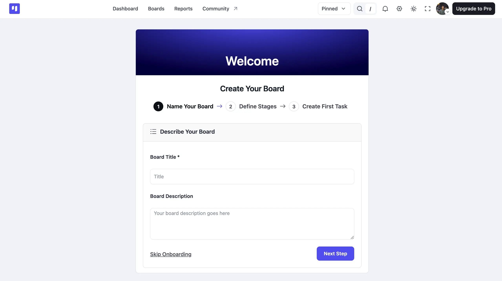
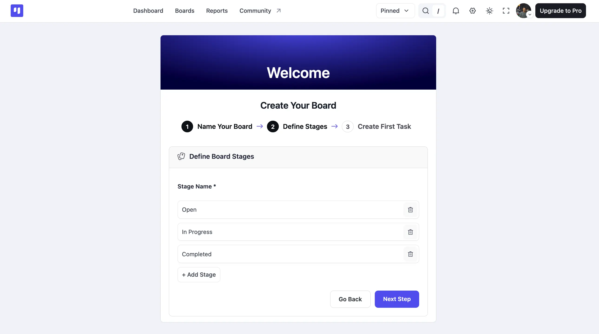
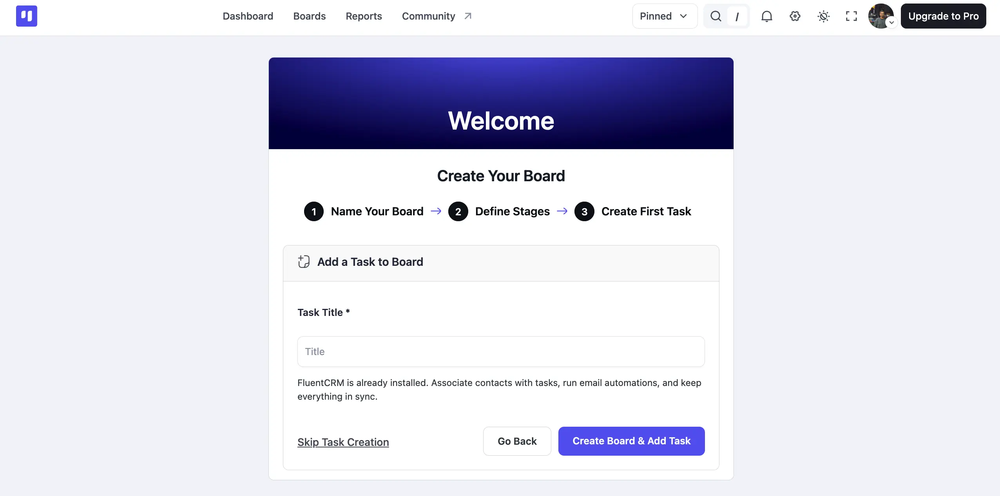

# Setting Up Your First Board

When you first install FluentBoards, the onboarding process guides you through the steps to create and set up your first board. You can add your board details, customize its stages, and create your first task—all in just a few steps.

<VideoEmbed id="sJbRqlo5HA8" />

## Creating Your First Board

To begin, enter your board title in the **Board Title** field, then add an optional description in the **Board Description** field. Once you're done, click on the **Next Step** button to proceed.

If you'd rather set things up later, click **Skip Onboarding** instead.

## Customizing Stages

By default, FluentBoards provides three stages: **Open, In Progress,** and **Completed**. If you require additional stages, simply click on the **Add Stage** button.

Conversely, you can delete any default stages by clicking on the **Delete** icon button next to them. Click on **Next Step** once you've customized your stages.

## Adding Task

Finally, if you wish to add a task to your board, enter a title in the **Task Title** field, then click on the **Create Board & Add Task** button.

If FluentCRM is active on your site, you'll see a note letting you know you can associate contacts with tasks, run email automations, and keep everything in sync.

Alternatively, if you prefer not to add a task right now, click **Skip Task Creation**.

Following that, you'll gain access to your boards, where you can organize various elements, including the association of **[FluentCRM](/fluentboards-integration-with-fluentcrm)** contacts.

This simple onboarding process ensures that you can quickly set up your Boards and begin organizing your Tasks efficiently.