# FluentBoards Integration with CloudFlare R2

FluentBoards integrates with Cloudflare R2, helps you to store your media files and manage storage more efficiently right from your WordPress site.

In this guide, we’ll walk you through everything you need to do. You’ll learn how to create and configure an R2 bucket, generate API tokens, and set up the plugin settings inside your WordPress site.

Follow these simple step by step process to connect Cloudflare R2 with your FluentBoards.

## Get your CloudFlare Account ID

First, log in to your [CloudFlare Account](https://dash.cloudflare.com/login){:target="_blank"}. Then go to the **R2 Object Storage** section from the left side bar. Locate the **Overview** of your Cloudflare account you will find the **API** button click on it and select **Use R2 with APIs**.

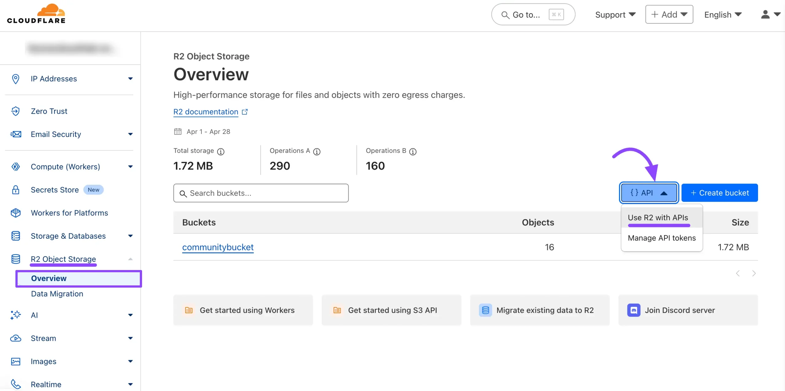

Now a pop-up will arrive where you will see your **Account ID**, copy your account ID from here for later use.

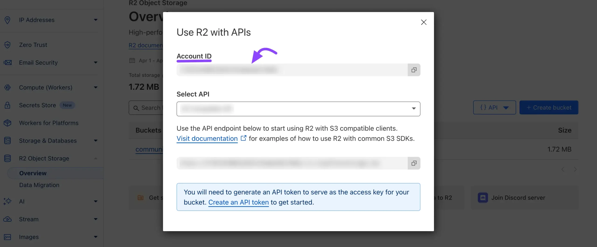

Alternatively, you can find your **Account ID** in the **URL** of your Cloudflare account, as shown in the screenshot below. You can also copy your Account ID from here.

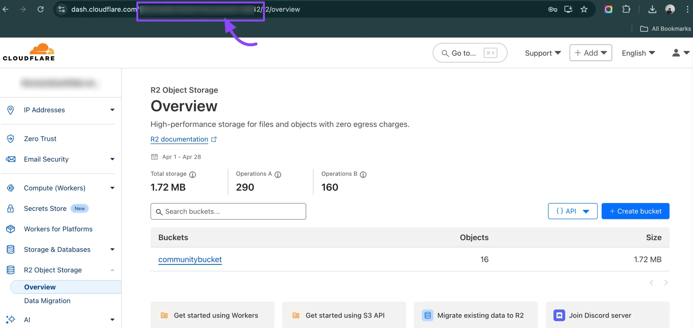

## Create a Cloudflare R2 Bucket

Navigate to **R2 Object Storage** from the left sidebar, find **Overview** under R2 Object Storage, and click on it. Now click on the **Create Bucket** button to create a bucket.

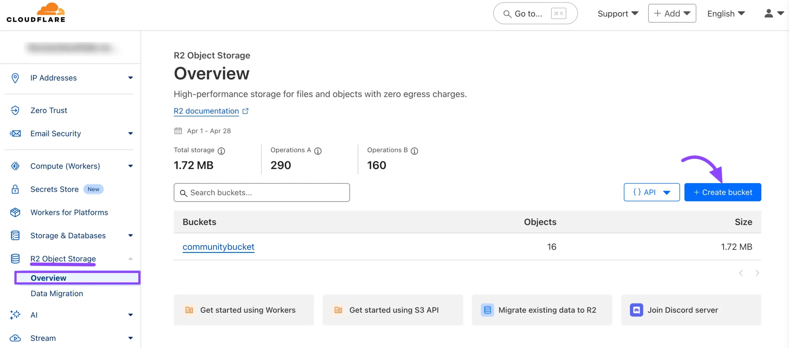

Enter a **Bucket name** that is easy to identify and unique across your projects. Leave the **Location** of the bucket as **Default** unless you have specific storage.

After that, click the **Create Bucket** button.

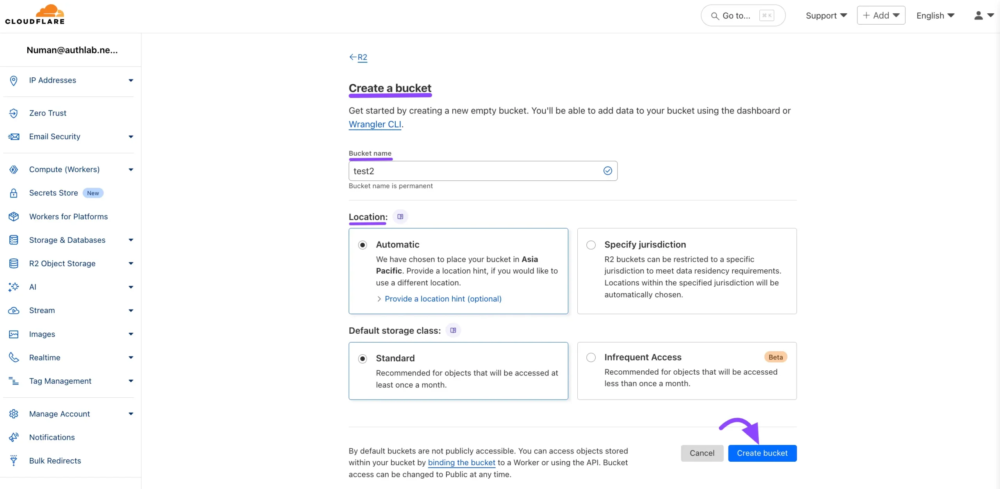

## Get the Cloudflare Bucket Public URL

Now here you will be able to see the Bucket Details after clicking the Setting option. Scroll down for the **R2.dev Subdomain** section. Here you need to **Allow Access** to this R2.dev subdomain.

Click the **Allow Access** button, and a pop-up will appear. Type “allow” in the field to grant access to the Public R2.dev Bucket URL.

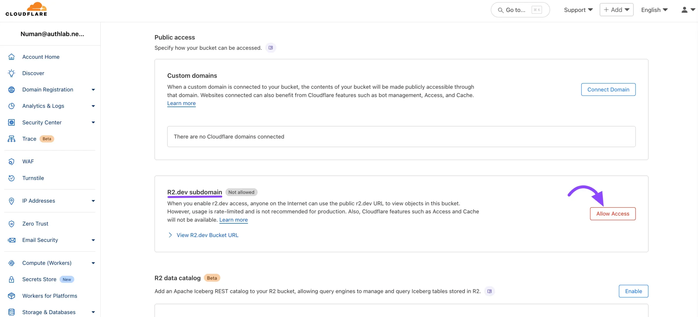

Now from here, you will get the **Public R2.dev Bucket URL**.

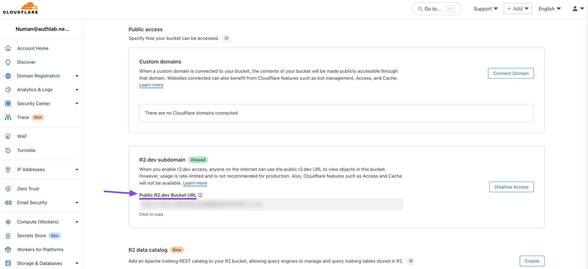

## Generate your Access Key & Secret Key

To create a Cloudflare Access Key go to your Cloudflare account dashboard again and click on the **Manage R2 API Token** from the **API** section.

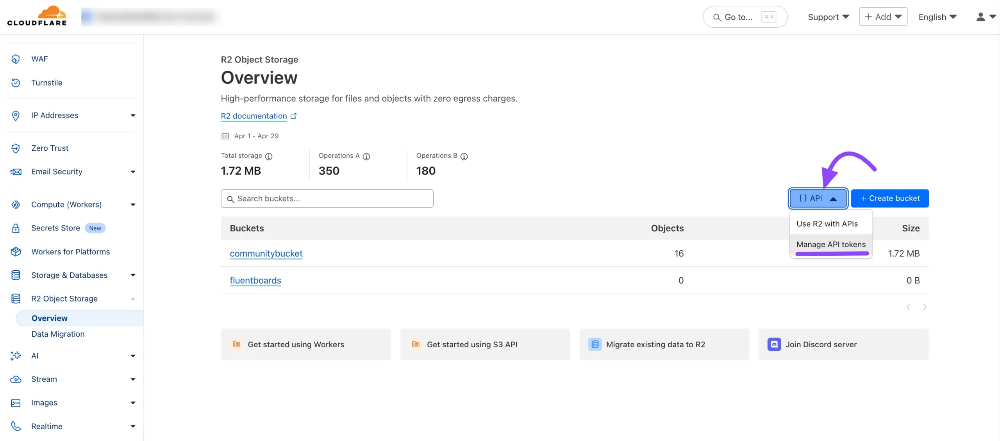

Now you will be redirected to the R2 page here click on the **Create Account API Token** button.

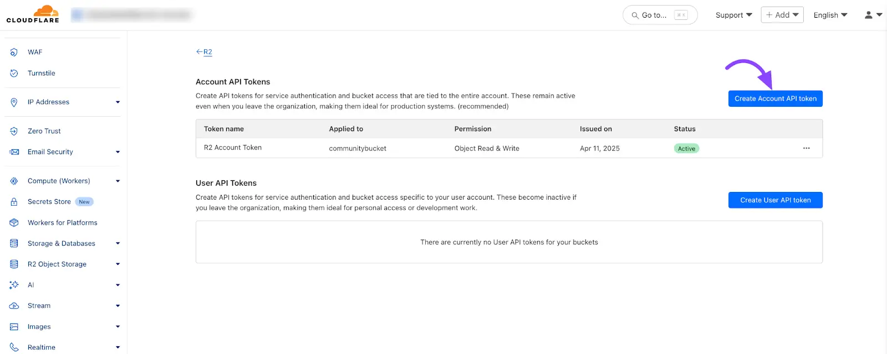

The API creation page will appear, where you’ll need to configure the settings for your API. Start by giving your **Token name**. In the **Permissions** section, select **Object Read & Write** permission.

Next, choose the **Specify Bucket(s)** where you want to store your files from the dropdown menu. Adjust any other settings as needed, and then click the **Create Account API Token** button.

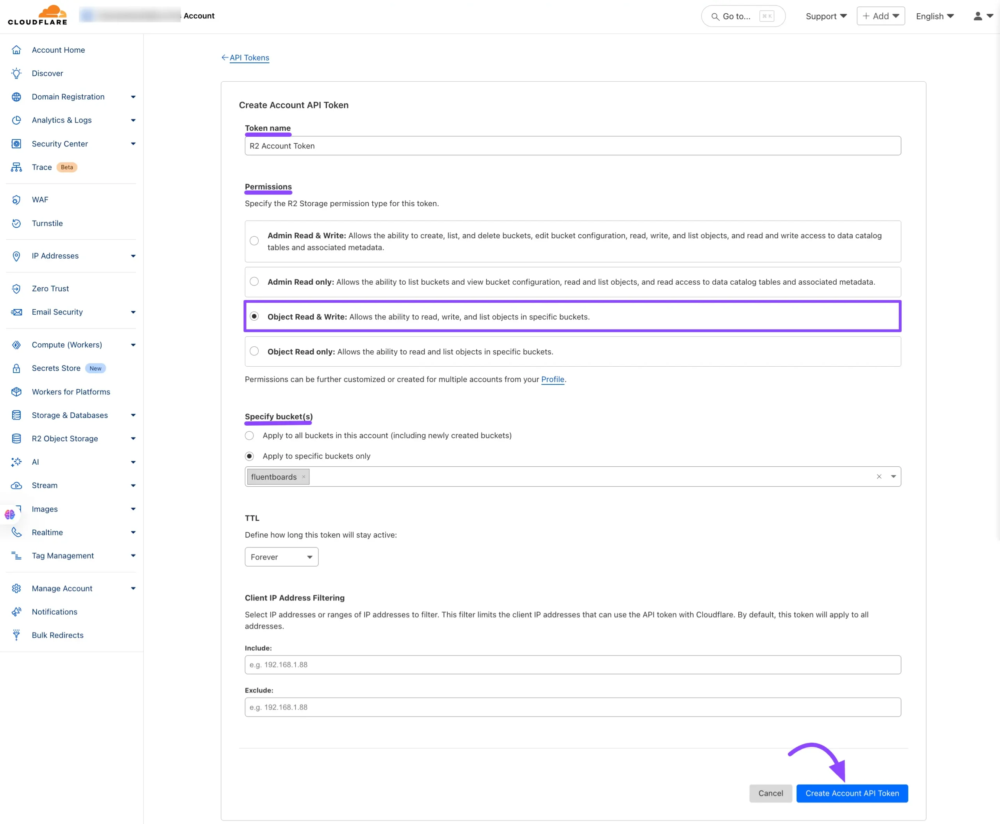

Here, you will find the **Access Key ID** and **Secret Access Key**. Make sure to copy them immediately, as you won’t be able to revisit this page later.

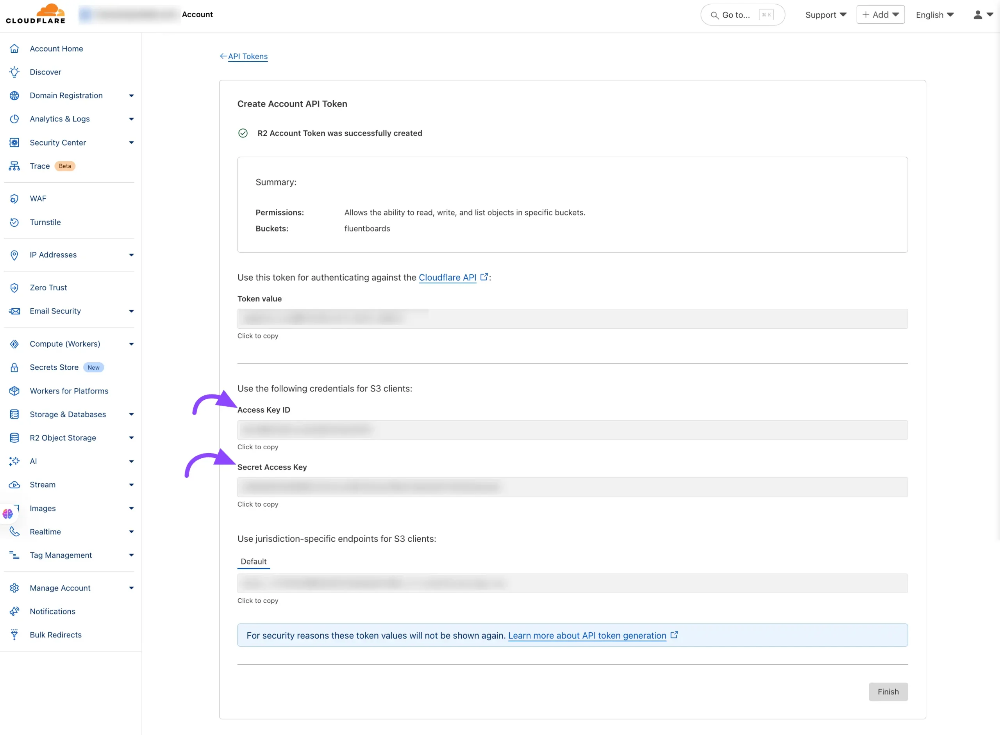

## Configure the FluentBoards with Cloudflare R2

Now access FluentBoards and go to **Settings > Features & Modules**. Here you will see the **Media Storage** option, then click on the **Manage** button.

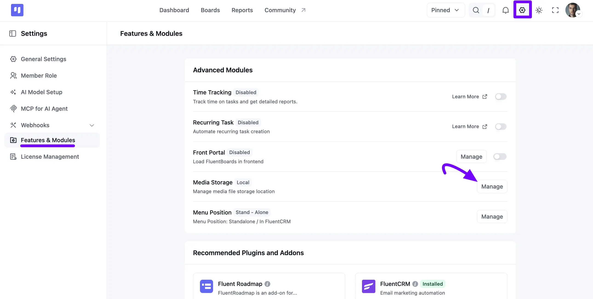

A **Configure Media Storage** pop-up will appear. Select **Cloudflare R2 (Recommended)** from the **Storage Location** dropdown, then enter the credentials you collected from your Cloudflare account in the earlier steps of this guide.

**Cloudflare Account ID:** Input your CloudFlare Account ID.

**Cloudflare Access Key:** Paste the Access Key you received from your Cloudflare API token.

**Cloudflare Secret Key:** Enter the Secret Key from your Cloudflare API token.

**Cloudflare Bucket Name:** Enter the name of the R2 bucket you created.

**Cloudflare Bucket Public URL:** Provide the Public R2.dev Bucket URL.

**Bucket Sub-Folder (Optional):** If you want to store files in a specific folder within the bucket, provide its name here. Otherwise, leave it empty.

After you’ve completed all the fields, simply click the **Save** button to store your Cloudflare configuration.

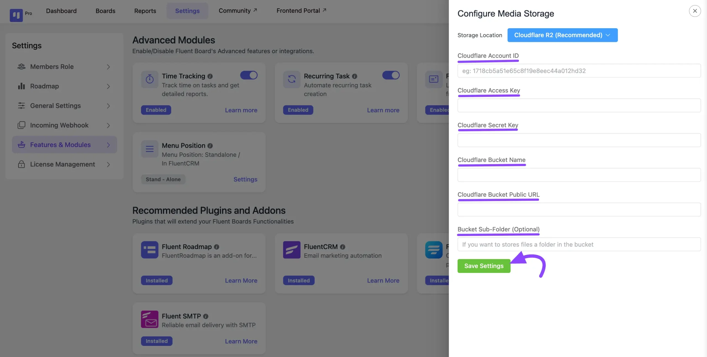

## Additional Configuration (Optional)

If you want to advanced setups, you can define your Cloudflare R2 settings in your **wp-config.php** file. This method provides an extra layer of security and is useful for managing configurations across different environments.

// CloudFlare R2 Configuration

define('FLUENT_BOARDS_CLOUD_STORAGE', 'cloudflare_r2');

define('FLUENT_BOARDS_CLOUD_STORAGE_ACCOUNT_ID', 'ACCOUNT_ID'); // like: 1718cb5a51e65c8f19e8sahdakh763

define('FLUENT_BOARDS_CLOUD_STORAGE_ACCESS_KEY', 'ACCESS_KEY_HERE');

define('FLUENT_BOARDS_CLOUD_STORAGE_SECRET_KEY', 'SECRET_KEY_HERE');

define('FLUENT_BOARDS_CLOUD_STORAGE_BUCKET', 'BUCKET_NAME');

define('FLUENT_BOARDS_CLOUD_STORAGE_PUBLIC_URL', 'https://pub-SOME_RANDOM_STRINGS.r2.dev'); // You can use the r2 custom domain too

define('FLUENT_BOARDS_CLOUD_STORAGE_SUB_FOLDER', 'my-folder-name'); // optional

If defined in `wp-config.php`, these values will override any settings in the plugin’s configuration form.

### Troubleshooting

- Ensure that your API token has the correct permissions for R2 access.
- Double-check that the bucket name and public URL are correct.
- If using a custom domain, make sure it’s properly configured in CloudFlare.
