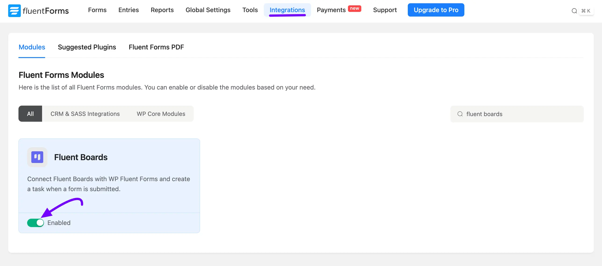
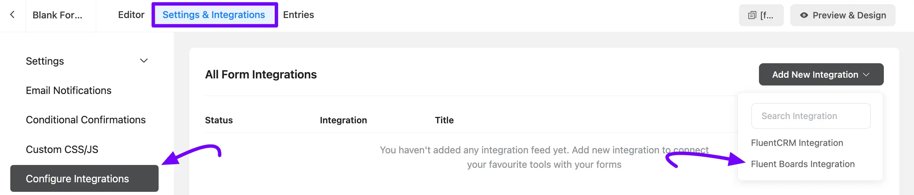
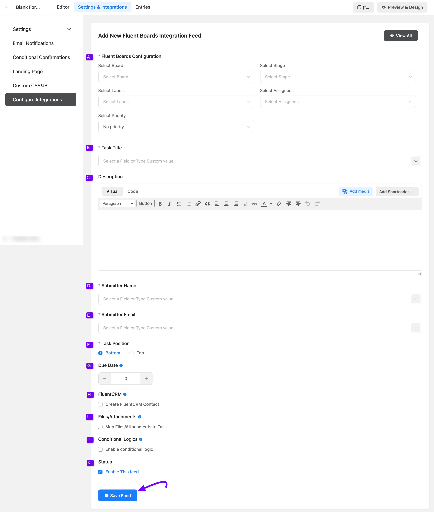
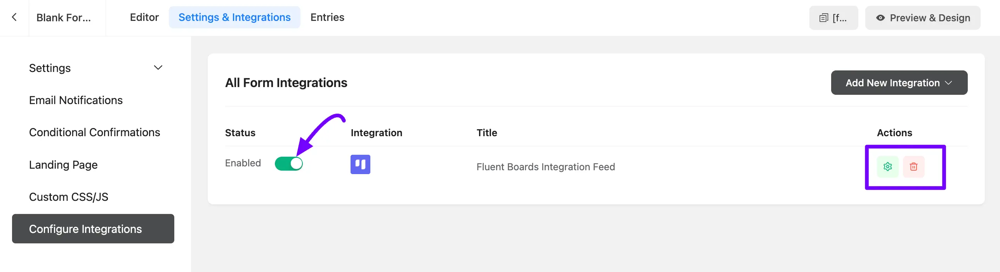

# FluentBoards Integration with Fluent Forms

Suppose you have a form on your website from where you want to add a task on your FluentBoards Board. Now you can easily add this task to your board with the Fluent Forms by following a very simple process. Here We will show you how you can configure this integration of FluentBorads with Fluent Form.

<VideoEmbed id="3Xdns_0r9ws" />

## Enable FluentBoards Modules

To integrate FluentBoards with Fluent Forms, go to Fluent Forms **Integrations** and select the **Modules** tab. Search for **Fluent Boards**, then click its **Toggle** button to enable the module.

## Integration with Form

Now go to the specific form where you want to integrate FluentBoards. Click on **Settings & Integrations**, then select **Configure Integrations** from the left sidebar.

Click the **Add New Integration** button, then select **Fluent Boards Integration** from the dropdown to open the *FluentBoards Integration Feed*.

## Configure FluentBoards Integration Feed

Now here you need to configure your **FluentBoards Integration Feed** to add a Task from your Fluent Forms to FluentBoard.

**A. Fluent Boards Configuration:** From the dropdowns here, you can select the Board, Stage, Labels, Assignees, and Priority for the task.

**B. Task Title:** Select a Fluent Forms field to use as the Task Title, or type a custom value directly.

**C. Description:** Write the Task Description using the Visual or Code editor, and click **Add Shortcodes** to pull in values from your form fields.

**D. Submitter Name:** Select the user name field to get the Submitter Name, or type a custom value.

**E. Submitter Email:** Select the submitter's email field. This will be matched with a contact in the CRM, if the email belongs to a CRM contact, they will be automatically linked with the task.

**F. Task Position:** Choose whether the task is added to the **Top** or **Bottom** of the stage.

**G. Due Date:** Use the **Plus (+)** or **Minus (-)** icons to set how many days from submission the task is due.

**H. FluentCRM:** Check **Create FluentCRM Contact** to automatically create a new contact in FluentCRM if the submitter's email does not already exist in your contact list.

**I. Files/Attachments:** Check **Map Files/Attachments to Task** to automatically link uploaded files with the corresponding task during form submission.

**J. Conditional Logics:** Check **Enable conditional logic** to run this integration only when certain conditions are met based on the form submission values.

**K. Status:** Check **Enable This feed** if you want to create a Task with this Form.

Click on the **Save Feed** button to save this FluentBoards Integration Feed.

Back on the **All Form Integrations** page, your new **Fluent Boards Integration Feed** appears in the list. Use the **Status** toggle to enable or disable it anytime, or click the **Setting** icon under **Actions** to edit it and the **Trash** icon to delete it.

Now, your task will be automatically generated upon form submission and placed into the board and stage you've chosen.

If you have any further questions, please do not hesitate to contact our [support team](https://wpmanageninja.com/support-tickets/?utm_source=wpmn&utm_medium=home&utm_campaign=site#/){:target="_blank"}.

