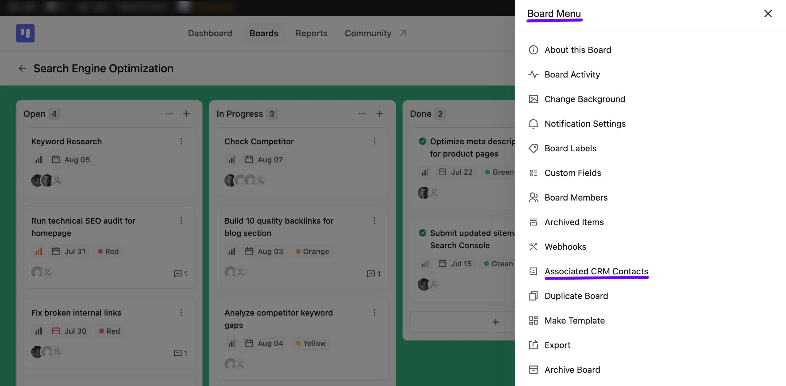
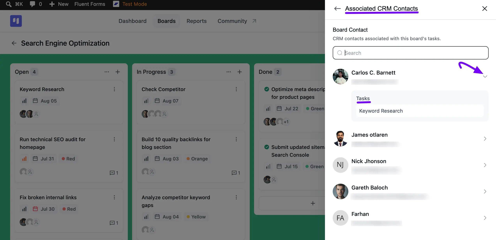
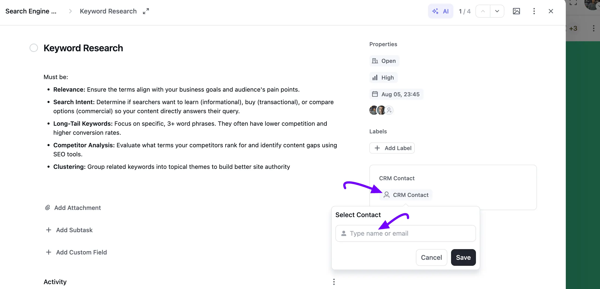
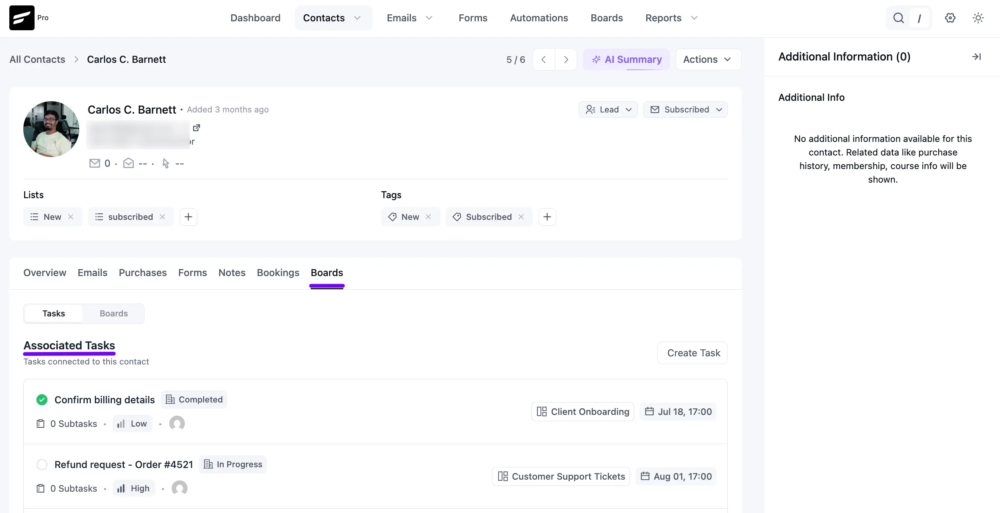
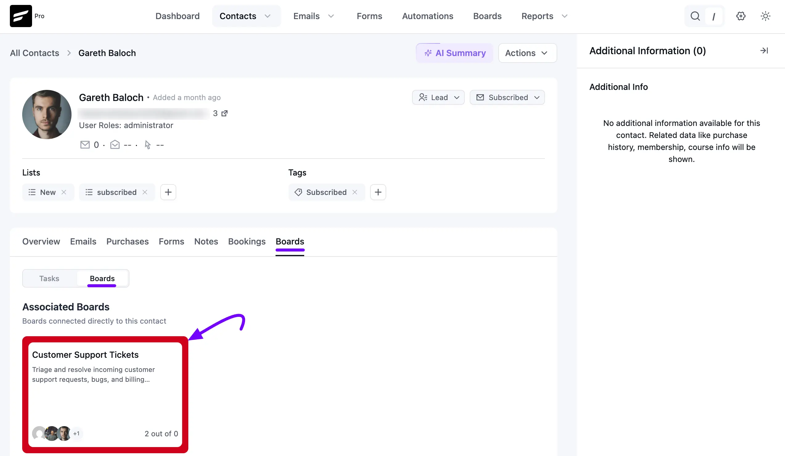
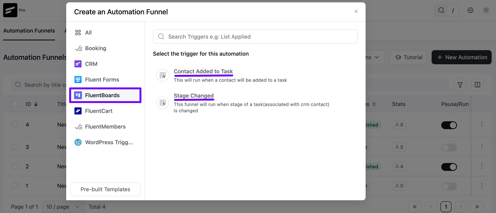
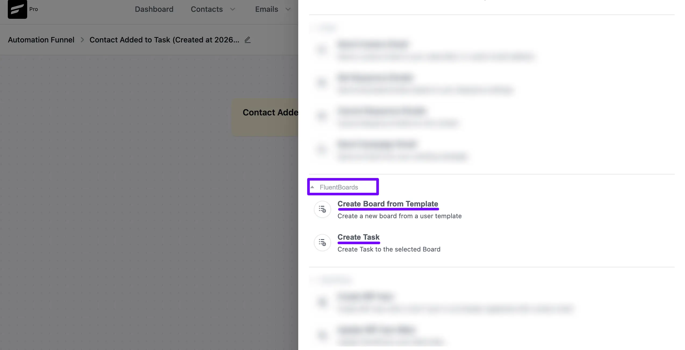

# FluentBoards Integration With FluentCRM

FluentBoards integrates directly with [FluentCRM](https://fluentcrm.com/), allowing you to connect your contacts, boards, and tasks in one place. This helps you manage customer-related work without switching between plugins.

With this integration, you can link CRM contacts to tasks, view a contact's related boards and tasks from their FluentCRM profile, and automate your workflows using FluentCRM automation triggers and actions. You can also create new tasks or create boards from templates automatically through automation.

In this guide, you'll learn how to connect contacts to tasks, view associated boards and tasks, and use FluentCRM automations with FluentBoards.

<VideoEmbed id="NoVkFvqlE60" />

## CRM Contacts in Boards

FluentBoards allows you to add FluentCRM contacts to your tasks. You can view all CRM contacts associated with your board's tasks right from the **Board Menu**.

To view CRM contacts associated with tasks on a board, go to your board and click on the **three-dot** button in the top right corner to open the **Board Menu**. Then, select **Associated CRM Contacts** to see the CRM contacts linked to your board's tasks.

An **Associated CRM Contacts** panel will slide in with a search field and a list of every contact linked to the board. Click the **Arrow** icon next to a contact to expand it and reveal the **Tasks** associated with them.

## Adding CRM Contacts to Tasks

To associate a CRM contact with your task, follow these steps:

Go to the task where you wish to add the CRM contact, or create a new task. Under **Properties**, click on the **CRM Contact** button. A **Select Contact** box will appear. Type a name or email to search for your contact, then click the **Save** button to link it to your task.

## Boards and Tasks Inside the FluentCRM Contact View

If you're using FluentCRM with FluentBoards, the contact profile includes a dedicated **Tasks** and **Boards** tab. You can view and manage a contact's related boards and tasks directly from their CRM profile, without switching between plugins.

Head to the **All Contacts** section from the FluentCRM Dashboard, then open the specific contact you want to check.

Select the **Boards** tab within the contact details. Here, you'll find two sub-tabs: **Tasks** and **Boards**.

### Associated Tasks

Under the **Tasks** sub-tab, you'll see every **Associated Task** for this contact, along with its board, status, and due date. Click the **Create Task** button right here to add a new task tied to this contact.

### Associated Boards

Switch to the **Boards** sub-tab to see the **Associated Boards** for this contact, boards connected directly to their profile rather than through individual tasks. Each board appears as a card with its description, member avatars, and task progress, so you can tell how things are moving at a glance.

## FluentCRM Automation

In Fluent CRM you will get some Automation based on your Board and Task changes. When creating an automation funnel, you'll find a **FluentBoards** trigger category with two triggers:

- **Contact Added to Task:** This Automation will run when a contact will be added to a task.
- **Stage Changed:** This automation will run when the stage of a task changes.

## Automation Action

Under the **FluentBoards** section of your automation funnel, you'll find two actions:

- **Create Task:** Set this action to create a new task in your FluentBoards.
- **Create Board from Template:** Set this action to create a brand new board directly from one of your existing board templates.

Selecting **Create Task** opens a pop-up where you can fill in the necessary details.

**A. Internal label:** Enter a unique and clear task name.

**B. Internal Description:** Add a short description to help you or your team understand the purpose of this task within the automation setup.

**C. Select Board & its stage:** Choose the board where the task should be created. Then, select the specific stage where the task will be placed.

**D. Task Title:** Enter the task title. For additional options, you can insert dynamic shortcodes by clicking the **three-dot** icon.

**E. Due Date:** Set a due date for the task using the **plus (+)** or **minus (-)** icons to adjust the date as needed.

**F. Description:** You can write out the task details in the description field. For dynamic content, click on **Add Smartcode** to insert smart data automatically.

**G. Select Priority:** From the dropdown options, select the priority level for your task: **No Priority**, **Urgent**, **High**, **Medium**, or **Low**. If no priority is selected, it will default to **No Priority** automatically.

Once you have completed all the details, click the **Save Settings** button to save and apply your automation task to the board.

That’s all about FluentCRM integration with FluentBoards.
