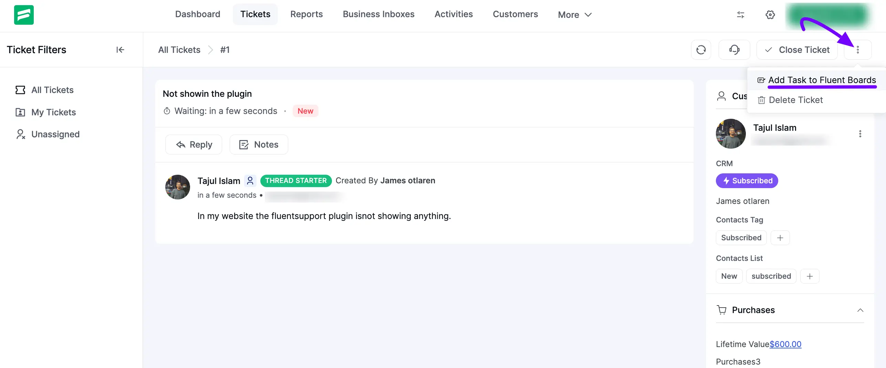
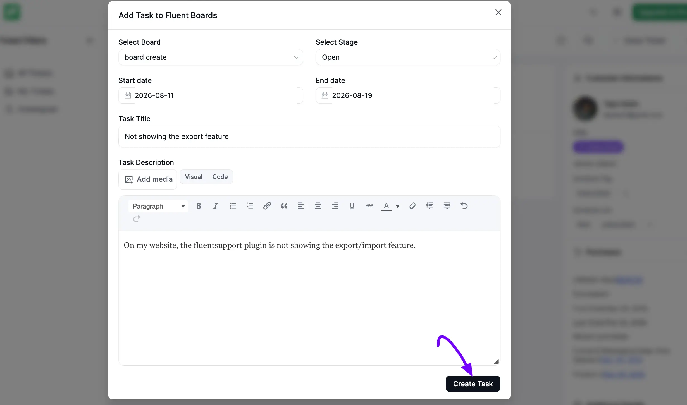
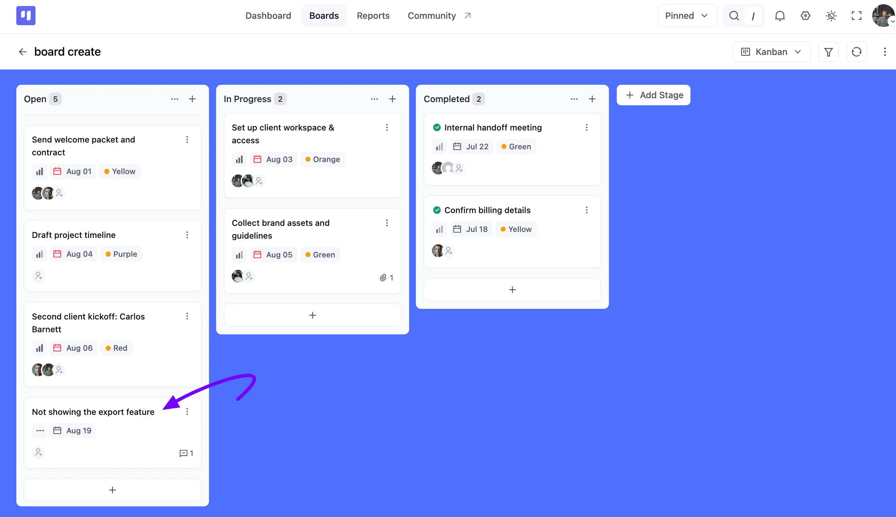

# FluentBoards Integration with FluentSupport

You can create a task directly from your Fluent Support Tickets. If any Tickets come in your Fluent Support your support agent can add that Tickect as a task on your Fluent Boards.

The integration of Fluent Board and Fluent Support is straightforward. You just need to install both plugins on your site. In this article, we will demonstrate the whole thing.

<VideoEmbed id="MxZFd_ots6M" />

## **Adding Task from Fluent Support Ticket**

Go to the Fluent Support Tickets and then open the specific ticket you want to add to your FluentBoards task.

In your ticket, you will see a three-dot button on the top right corner of your ticket. Now click on that **three-dot** button and you will see **Add Task to Fluent Boards** select it.

An **Add Task to Fluent Boards** pop-up will appear. Choose the **Board** and **Stage** from the dropdown menus, then set a **Start date** and **End date** for the task. Fluent Support Agents can only choose from the boards they have access to.

The **Task Title** is automatically filled in from your ticket's subject, and the **Task Description** from the ticket's content, using the same Visual or Code editor and **Add Media** option you'd find on a form. Feel free to edit either before creating the task.

Once you're done, click the **Create Task** button.

> If the ticket opener is a FluentCRM User, they'll be automatically linked to the task as an Associated CRM contact.

If you need to make further changes to the task, simply open it from your FluentBoards. From there, you can add assignees, set priorities, add labels, adjust dates, and make any other necessary adjustments.

This outlines all the options available to integrate your Fluent support with Fluent Boards. 
