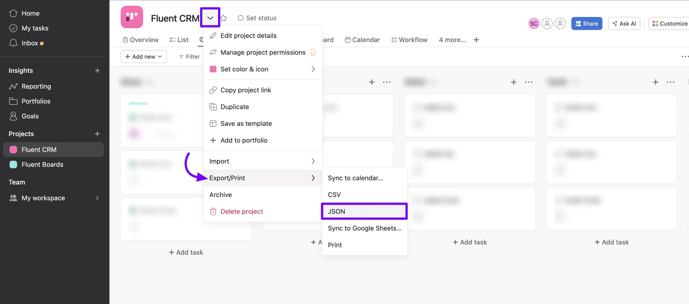
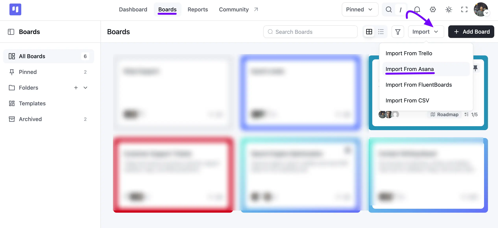
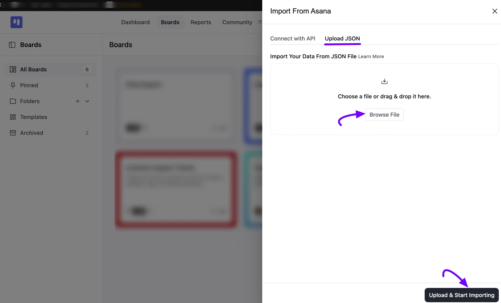
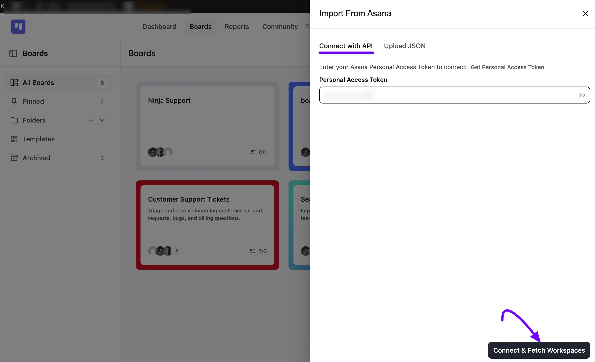

# Import Boards from Asana

With the Import feature of FluentBoards, you can Import Boards from **Asana**. It’s a very simple process we will show you the process in this article.

## Export Board from Asana

Go to your [Asana account](https://app.asana.com/-/login?_gl=1*dxfx2s*_ga*MTk0MzA4OTc3My4xNzE1MjU1MDE3*_ga_J1KDXMCQTH*MTcxNTY4NDE5Mi4yLjEuMTcxNTY4NDE5Mi42MC4wLjE4NjE0NzkzMDg.*_fplc*Tnd0dnlkNUFiWDN6b3c2UjZsZ2NSQ2JaalpGbUJ6MzhxUktTbFZlT295UUN4QTVFOCUyQlpqektEckpVNmFJMnJURDdQd04yNGV6cDJKR3UzcWtia1pJVFJEMGJlVjE3eXVUSlIxYUp6Qk5xJTJCWmVWb25PSGE1NXhFNkZHNDVoUSUzRCUzRA..){:target="_blank"} and open the Boards you want to migrate in your FluentBoards. Now click on the **Dropdown** button beside the Board Name.

Select the **Export/Print** from the dropdown list and click on the **JSON** button. Your Asana Board will be now downloaded in JSON format.

## Import Asana Board

Now navigate to your FluentBoards and go to the **Boards** from the Navbar. Click the **Import** dropdown in the top right corner, then select **Import From Asana**.

An **Import From Asana** panel will open from the right, with **Connect with API** and **Upload JSON** tabs. On the **Upload JSON** tab, click **Browse File** or drag and drop the JSON file you downloaded from Asana, then click the **Upload & Start Importing** button.

Now you will see your imported board in your FluentBoards.

Alternatively, switch to the **Connect with API** tab. Paste your **Personal Access Token**.

If you don't have a **Personal Access Token** yet, click **Get Personal Access Token** to create one. Then, click **Connect & Fetch Workspaces** to import your workspaces directly without downloading a **JSON** file first

