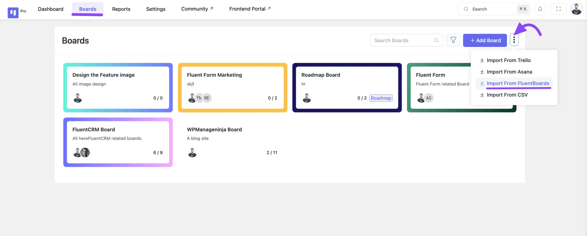
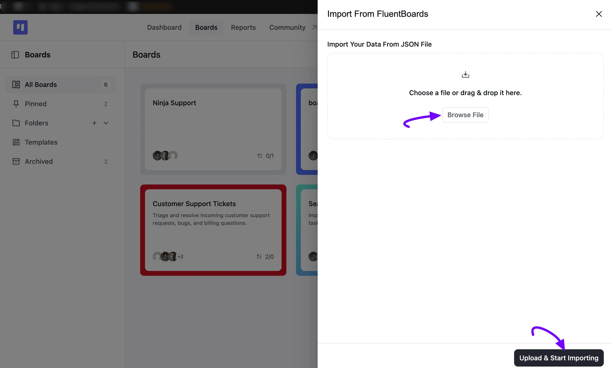
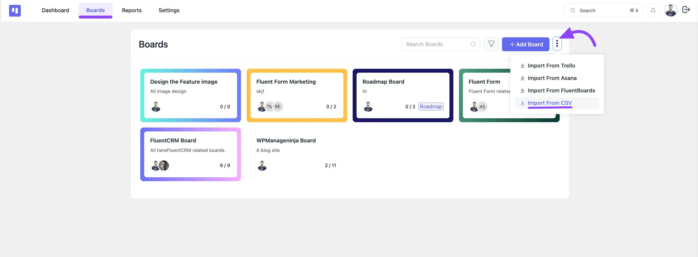
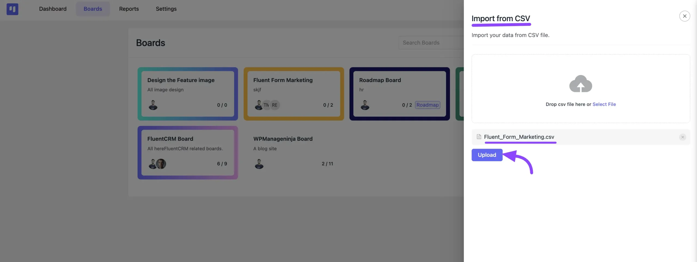

# Import Your Boards

FluentBoards lets you easily import boards from a previous workspace or another platform. Whether you’re migrating from a different site or restoring a backup.

In this article, we’ll walk you through the steps to import boards into your FluentBoards workspace.

## Import From FluentBoards

> [!Note]
> If you want to import your FluentBoards from another site or restore them from a backup, the first step is to export the boards from FluentBoards. To learn how to **Export** boards, check out the [Board Settings](/board-settings#export) guide.

To import boards from another FluentBoards installation or restore a backup, follow these steps:

Go to FluentBoards and click on **Boards** from the navigation bar. Then, click the **Import** dropdown at the top right corner of the boards dashboard and select **Import From FluentBoards**.

An **Import From FluentBoards** panel will open from the right. Click **Browse File** or drag and drop the JSON file of the board you previously exported, then click **Upload & Start Importing** to begin the import process.

## Import CSV File

FluentBoards allows you to import your task boards from a CSV file. This is especially useful if you’re switching from another platform or managing tasks in spreadsheets.

To import a CSV file, go to FluentBoards and click on **Boards** from the navbar. Now, click on the **Import** dropdown in the top right corner of the boards dashboard, then select **Import From CSV**.

An **Import From CSV** panel will open from the right. Click **Browse File** or drag and drop the CSV file of your workspace, then click the **Upload** button to begin the import.

> [!Note]
> Remember all task details will be imported, but you’ll need to assign users again, as assignee information won’t be carried over from the original board.

