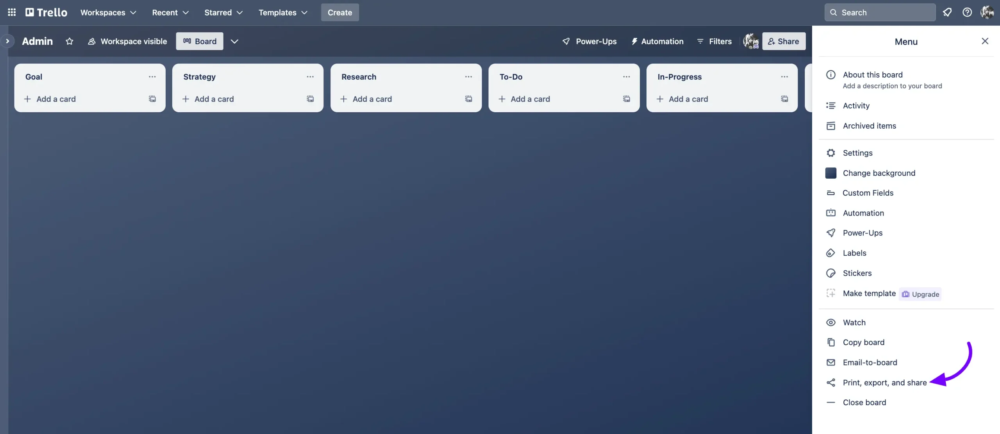
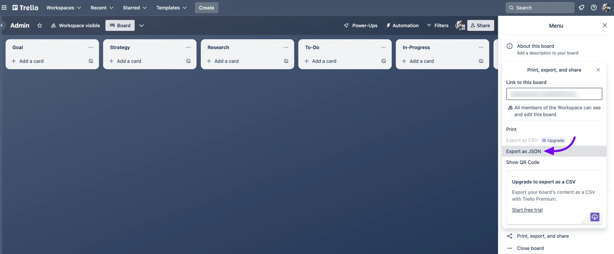
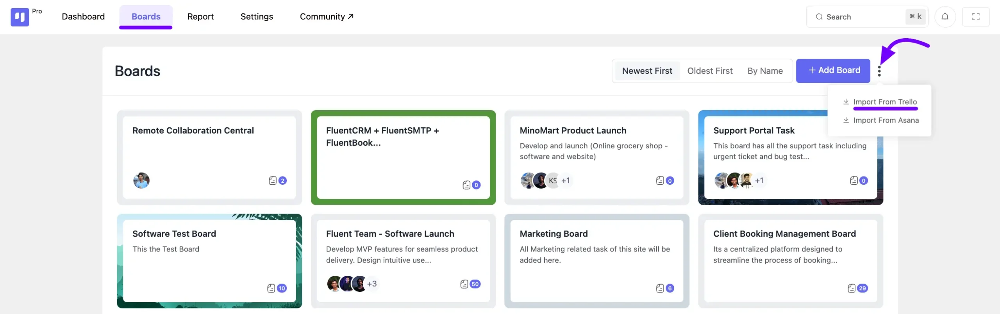
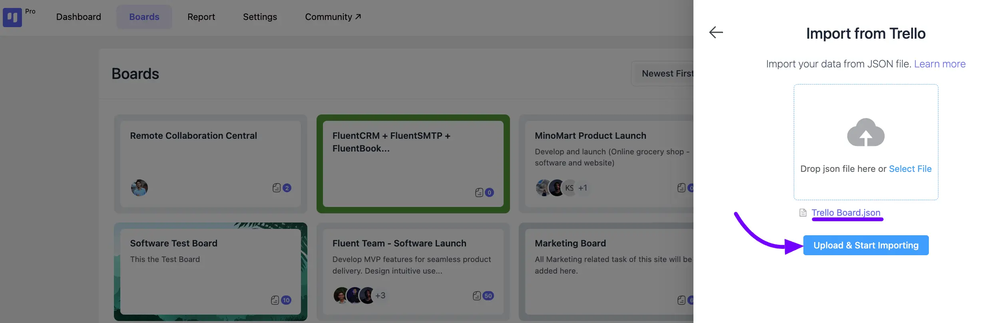

# Import Boards from Trello

You can **Import** your Trello Board in Fluent Boards very easily. With a few small steps, you can migrate your Boards from Trello to your Fluent Boards.

## Export Board from Trello

To export your Boards From Trello go to your [Trello Account](https://trello.com/){:target="_blank"}. Then go to the specific Board you want to Import in your Fluent Boards.

At the top right corner of Trello boards, you'll spot a **three-dot** button, also known as the **Menu** button. Click on this button to reveal a menu, where you'll find the **Share** option. Selecting this option will provide you with choices to either download the board with a link or export it in JSON format.

Now Select the **Export as JSON**. Your Trello Board will be shown in JSON format and you can download it from here.

## Import Trello Board in FluentBoards

Now go to your Fluent Boards and select the **Boards** from the Navbar. In the Boards dashboard you will see a **three-dot** button in the Top right corner click on the button. Now select the **Import From Trello**.

Select the JSON file you have downloded from Trello and click on the **Upload & Start Importing**.

Your JSON File will be uploaded and you will see your imported board in your FluentBoards.

Now, every detail from the Trello Board will be imported here. Like, you need to assign the assignees to your board, as the assignee information from your Trello Board will not be displayed here.