# Import Boards from Trello

Moving your boards from **Trello** to **FluentBoards** is simple. You can export a Trello board as a JSON file and import it directly into FluentBoards, or connect your Trello account with an API Key and Token to import a board directly, without exporting anything first.

This guide walks you through both methods of importing your Trello boards into FluentBoards.

<VideoEmbed id="99VfIHTnYj0" />

## Export Board from Trello

To export your Boards From Trello go to your [Trello Account](https://trello.com/){:target="_blank"}. Then go to the specific Board you want to Import in your Fluent Boards.

At the top right corner of Trello boards, you'll spot a **three-dot** button, also known as the **Menu** button. Click on this button to reveal a menu, where you'll find the **Share** option. Selecting this option will provide you with choices to either download the board with a link or export it in JSON format.

Now Select the **Export as JSON**. Your Trello Board will be shown in JSON format and you can download it from here.

## Import Trello Board in FluentBoards

Now go to your Fluent Boards and select the **Boards** from the Navbar. In the Boards dashboard, click the **Import** dropdown in the top right corner, then select **Import From Trello**.

An **Import From Trello** panel will open from the right, with **Connect with API** and **Upload JSON** tabs. Stay on the **Upload JSON** tab, then click **Browse File** or drag and drop the JSON file you downloaded from Trello. Once you're done, click the **Upload & Start Importing** button.

Your JSON File will be uploaded and you will see your imported board in your FluentBoards.

Now, every detail from the Trello Board will be imported here. Like, you need to assign the assignees to your board, as the assignee information from your Trello Board will not be displayed here.

## Import via Trello API

Alternatively, switch to the **Connect with API** tab to import a board directly, without going through the export-and-import process. Your Trello lists come over as FluentBoards **Stages**, while your cards are imported as **Tasks**.

Follow these steps to get connected:

1. Go to [Trello's Power-Ups admin page](https://trello.com/power-ups/admin){:target="_blank"} and click the **New** button to create an app.

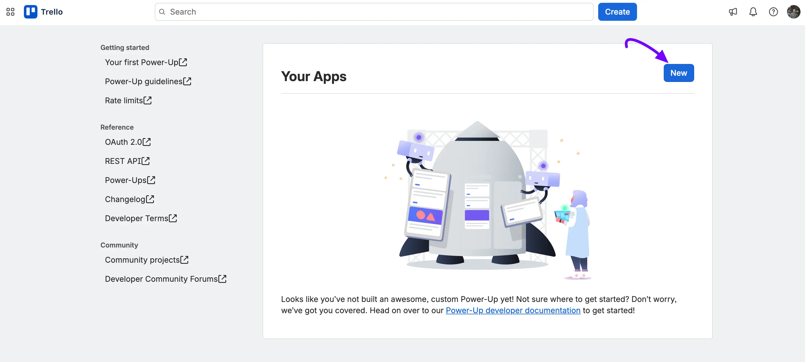

2. Select **My app doesn't use Power-up capabilities**, fill in the **App name**, **Workspace**, **Email**, **Support contact**, and **Author** fields, then click the **Create** button.

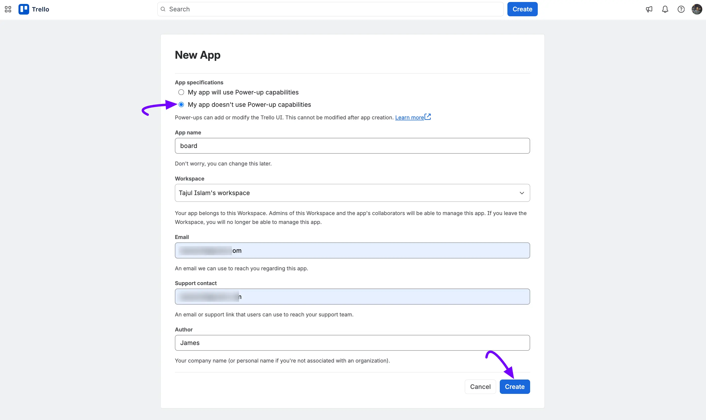

3. Your app opens on the **OAuth 2.0** page. Check the **Scopes** as your requirment and click **Trello Auth** in the sidebar instead.

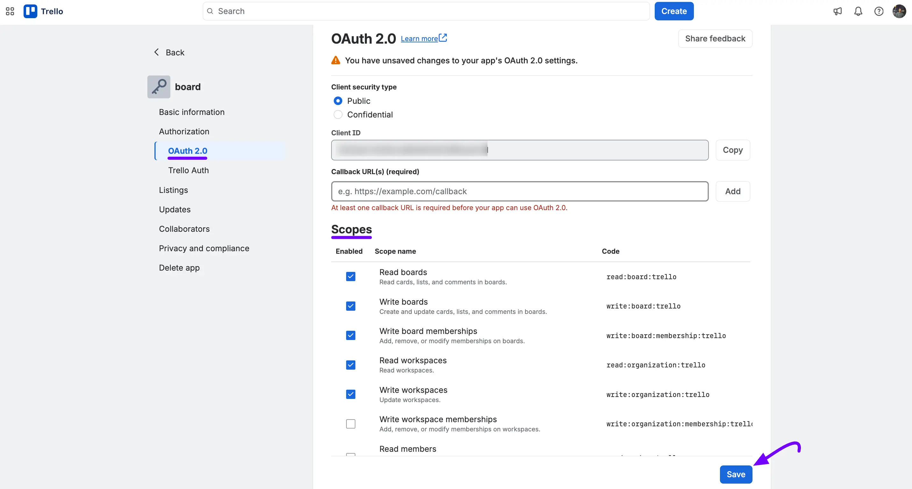

4. Click **Generate a new Trello Auth API key for this app**.

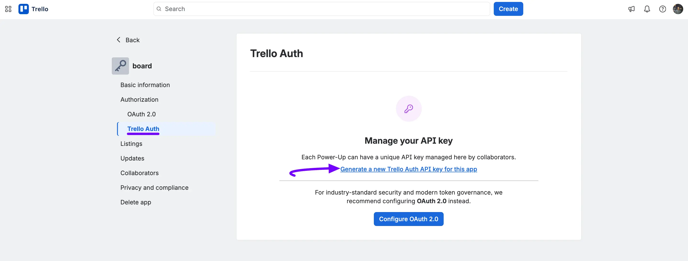

5. Click the **Generate API key** button to confirm.

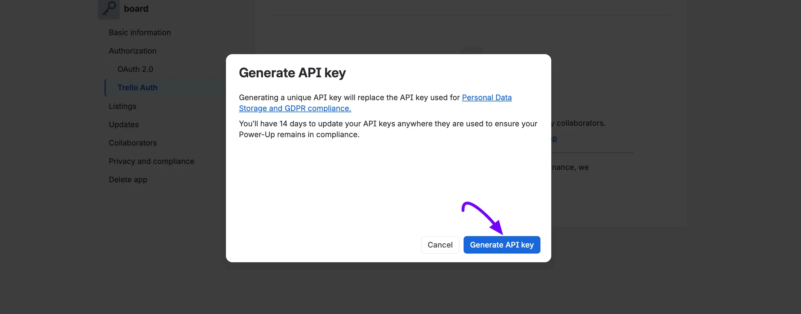

6. Click the **Copy** icon next to your **API key** to copy it.

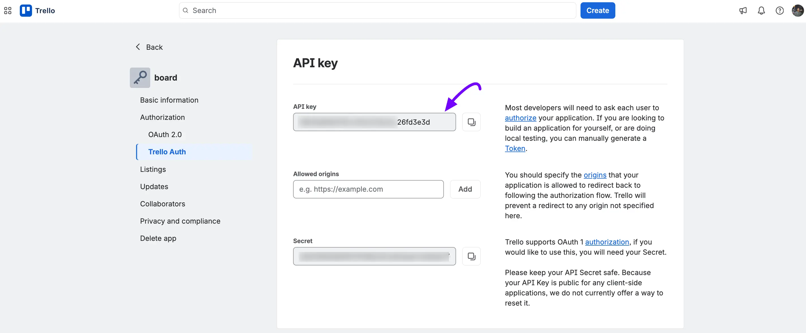

7. Now go to your FluentBoards **Boards** dashboard, click the **Import** dropdown, select **Import From Trello**, and switch to the **Connect with API** tab. Paste your **API Key**, then click **Generate Token**.

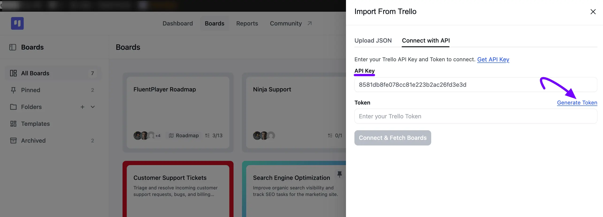

8. Trello asks if you'd like to give the app access to your account. Click the **Allow** button.

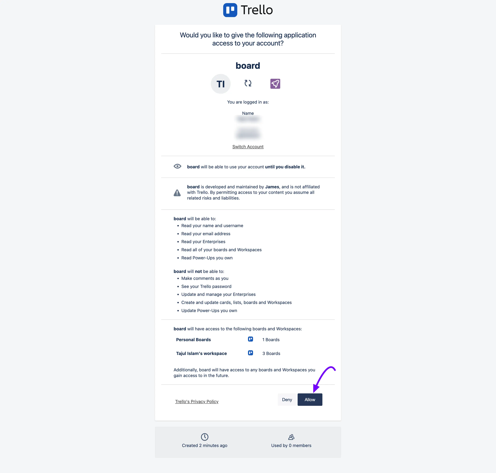

9. Copy the **Token** Trello generates for you.

10. Paste the **Token** into FluentBoards, then click the **Connect & Fetch Boards** button.

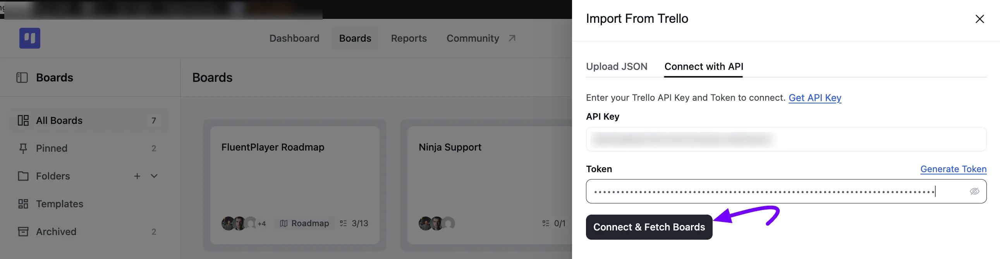

11. Choose the board you want to import from the dropdown. If you'd like FluentBoards to create a WordPress user for each Trello member automatically, check **Import Trello members and create missing WordPress users**. Once you're done, click the **Import Selected Board** button.

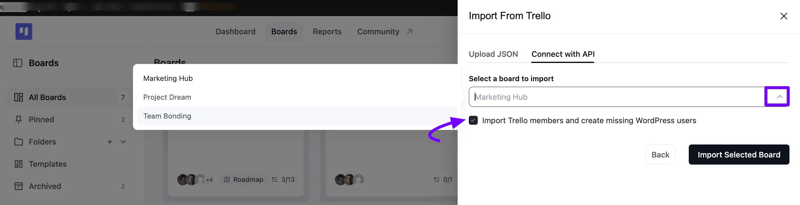

Stay on the page until the import finishes. Your Trello board then appears in FluentBoards, with your lists converted to **Stages** and your cards converted to **Tasks**.

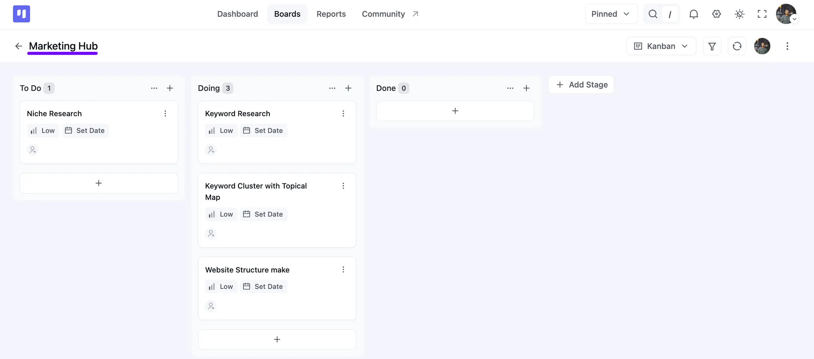