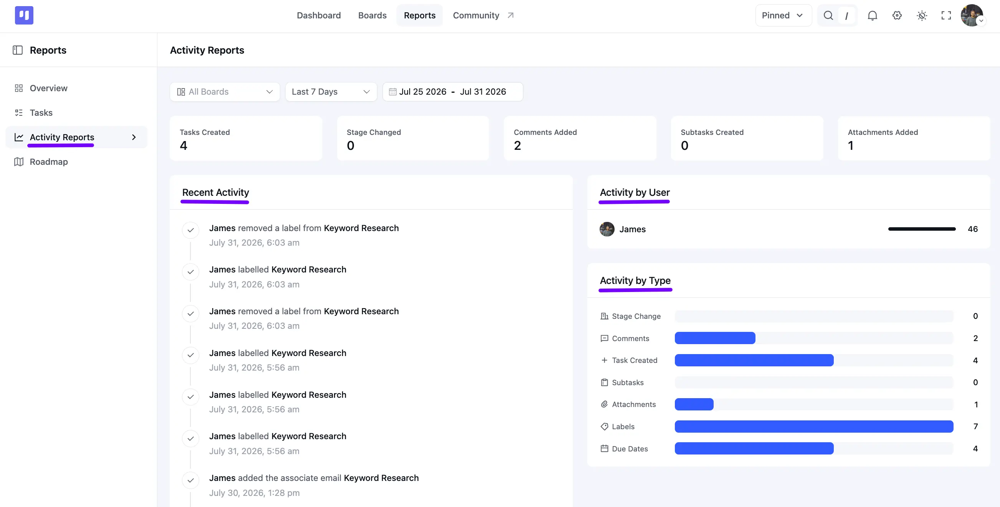

# Activity Reports

The **Activity Reports** section shows you everything happening across your Boards, from tasks created to labels changed, so you can keep track of your team's work at a glance.

In this guide, you'll learn how to access the Activity Reports, filter report data, view activity statistics and charts, and check the recent activity feed.

## Accessing the Activity Reports

Go to the FluentBoards Dashboard and click on **Reports** from the top navbar, then select **Activity Reports** from the sidebar.

Use the **All Boards** dropdown to filter by a specific Board, and pick a preset or custom date range next to it, just like on the **Overview** report.

### Stat Cards

Right below the filters, five stat cards give you an instant read on your selected range:

**Tasks Created**: How many new tasks were created.

**Stage Changed**: How many times a task moved to a different **Stage**.

**Comments Added**: How many comments were added to tasks.

**Subtasks Created**: How many new subtasks were added.

**Attachments Added**: How many attachments were uploaded to tasks.

### Recent Activity

The **Recent Activity** feed lists every action taken on your Boards in order, showing who did what, which task it happened on, and exactly when.

### Activity by User

The **Activity by User** panel lists each member alongside a bar showing their total activity count, so you can see who's been the most active.

### Activity by Type

The **Activity by Type** chart breaks activity down by type, **Stage Change**, **Comments**, **Task Created**, **Subtasks**, **Attachments**, **Labels**, and **Due Dates**, so you can see exactly what kind of work has been happening.
