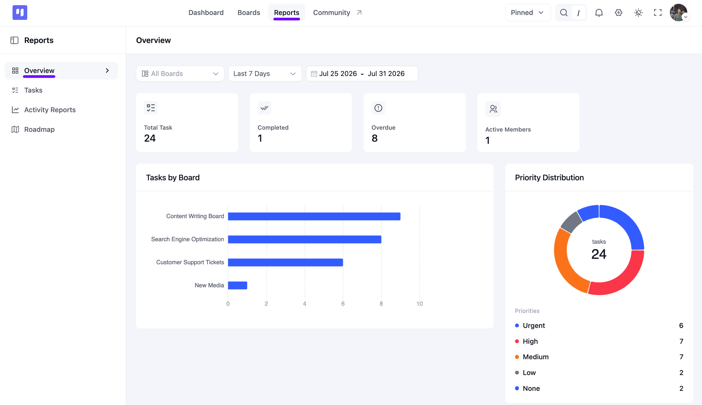
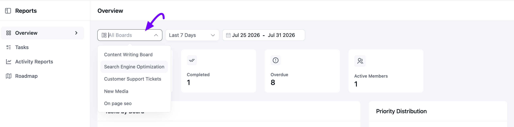
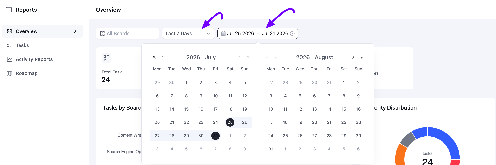
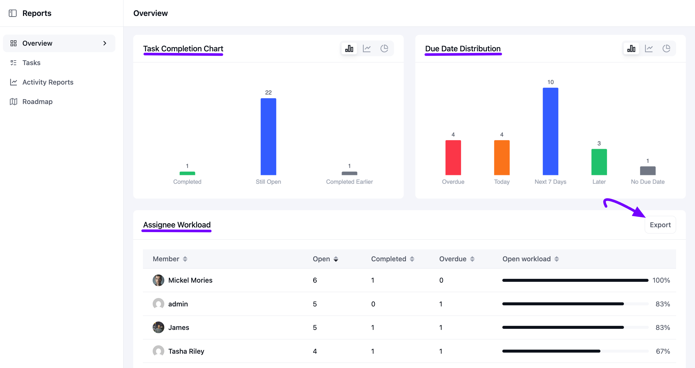

# Reports

The **Reports** section in FluentBoards helps you track task progress, team activity, and workload across your boards. It provides an overview of your projects with charts, statistics, and reports that make it easier to monitor work and identify trends.

In this guide, you'll learn how to access the Reports section, filter report data, understand the available charts and statistics, export reports, and view your roadmap insights.

## Accessing Reports

Go to the FluentBoards Dashboard and click on **Reports** from the top navbar. Here you will see a sidebar with **Overview**, **Tasks**, **Activity Reports**, and **Roadmap**.

For a full breakdown of the **Tasks** tab, check out the [Tasks Report](/task-report) guide. For a full breakdown of the **Activity Reports** tab, check out the [Activity Reports](/activity-report) guide.

## Overview

The **Overview** report gives you a quick, high-level snapshot of everything happening across your Boards.

### Filter Your Report

At the top of the page, use the **All Boards** dropdown to narrow the report down to a single Board, or leave it on **All Boards** to see everything at once.

Click the dropdown to pick from any of your Boards.

Next to it, choose a preset range like **Last 7 Days**, or click the date field to pick a custom date range from the calendar.

### Stat Cards

Right below the filters, four stat cards give you an instant read on your selected range:

**Total Task**: The total number of tasks in the selected range.

**Completed**: How many of those tasks have been marked as completed.

**Overdue**: How many tasks have passed their due date.

**Active Members**: How many board members were active during the range.

### Tasks by Board

The **Tasks by Board** chart shows a horizontal bar for each Board, so you can compare task volume across all your Boards at a glance.

### Priority Distribution

The **Priority Distribution** donut chart breaks your tasks down by **Priority** level, **Urgent**, **High**, **Medium**, **Low**, and **None**, with a running total in the center and a full legend underneath.

### Task Completion Chart

The **Task Completion Chart** shows how many tasks are **Completed**, **Still Open**, or **Completed Earlier** (finished before your selected date range began). Use the **Bar**, **Line**, or **Pie** icons at the top right to switch how the chart displays.

### Due Date Distribution

The **Due Date Distribution** chart groups your tasks into **Overdue**, **Today**, **Next 7 Days**, **Later**, and **No Due Date**, so you can plan ahead at a glance. It comes with the same **Bar**, **Line**, and **Pie** view options.

### Assignee Workload

Below the charts, the **Assignee Workload** table lists every member with their **Open**, **Completed**, and **Overdue** task counts, plus an **Open Workload** bar showing how much of their open workload is still outstanding. Click any column header to sort the table.

### Exporting Your Report

Click the **Export** button above the **Assignee Workload** table to download the report data as a CSV file.

## Roadmap

The **Roadmap** report shows how your public Roadmap is performing: total and newly submitted ideas, how many are public, how many were completed, a breakdown by **Stage** and submission source, and your most popular ideas. For more on setting up the Roadmap board itself, check out the [Roadmap Overview](/fluentboards-roadmap-overview) guide.

That's everything covered in the Reports section of FluentBoards.
