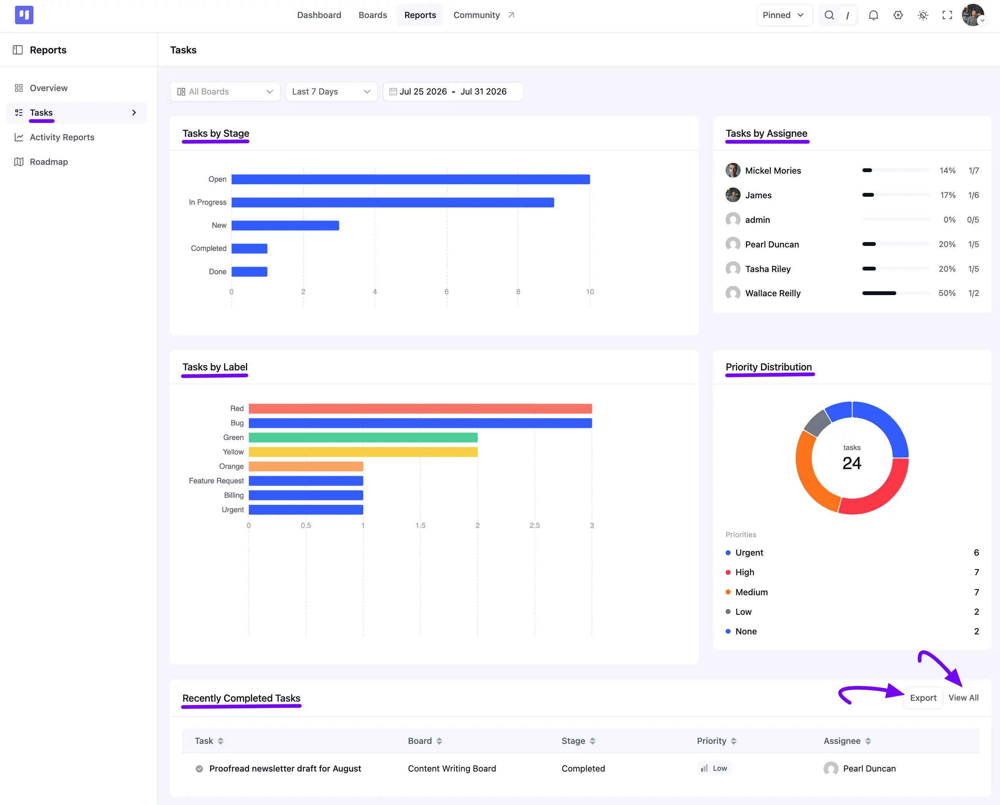

# Tasks Report

The **Tasks** report helps you understand how tasks are organized across your boards. It shows task distribution by stage, assignee, label, and priority, making it easier to monitor workloads and track completed tasks.

In this guide, you'll learn how to access the Tasks report, filter report data, view task distribution charts, and export task reports.

## Accessing the Tasks Report

Go to the FluentBoards Dashboard and click on **Reports** from the top navbar, then select **Tasks** from the sidebar.

Use the **All Boards** dropdown to filter by a specific Board, and pick a preset or custom date range next to it, just like on the **Overview** report.

### Tasks by Stage

The **Tasks by Stage** chart shows a bar for each **Stage** across your Boards, so you can see where most of your tasks currently sit.

### Tasks by Assignee

The **Tasks by Assignee** panel lists every member alongside a completion bar and a **completed/total** count, so you can see how much of each person's workload is done.

### Tasks by Label

The **Tasks by Label** chart breaks your tasks down by **Label**, showing how many tasks carry each one.

### Priority Distribution

The **Priority Distribution** donut chart shows the same **Priority** breakdown as the **Overview** report, **Urgent**, **High**, **Medium**, **Low**, and **None**, with a running total in the center.

### Recently Completed Tasks

At the bottom, the **Recently Completed Tasks** table lists your latest finished tasks, along with their **Board**, **Stage**, **Priority**, and **Assignee**. Click **View All** to see the complete list, or click the **Export** button to download the data as a CSV file.
