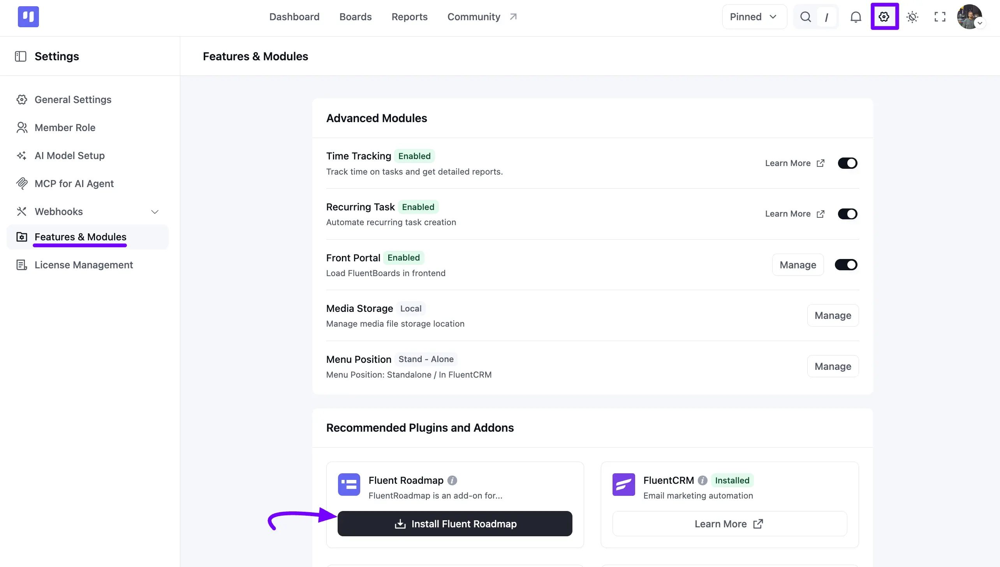
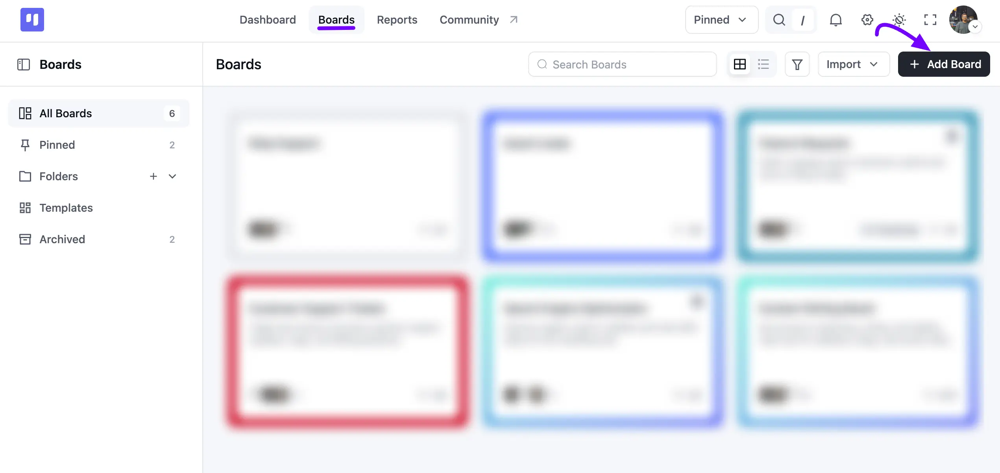
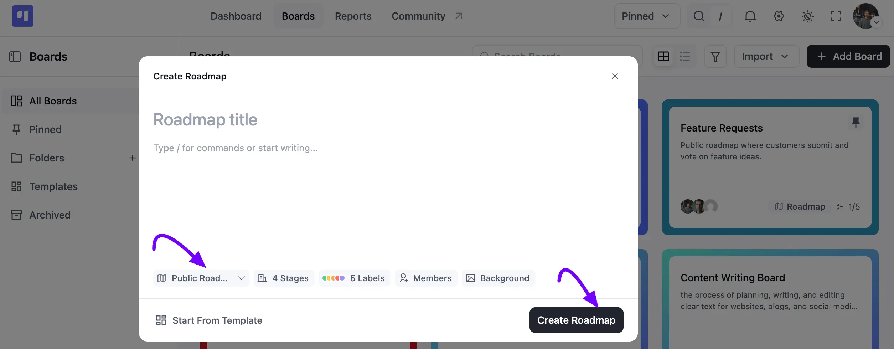
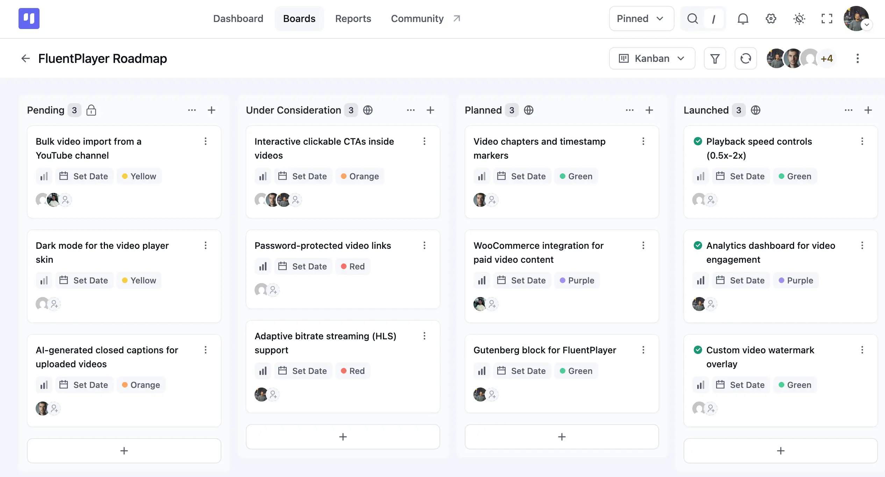
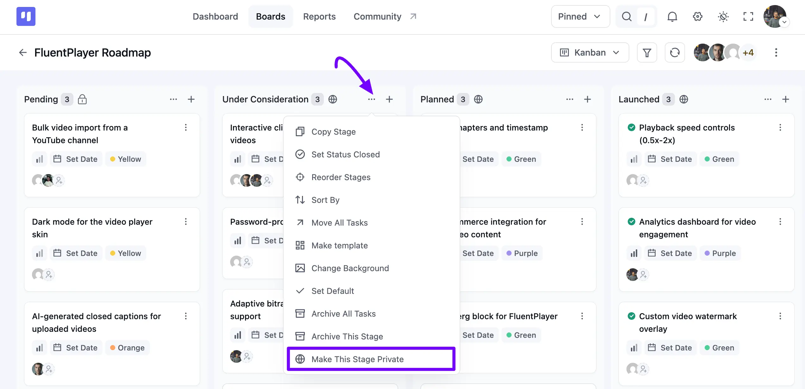
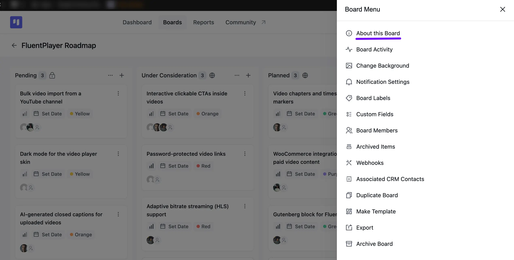
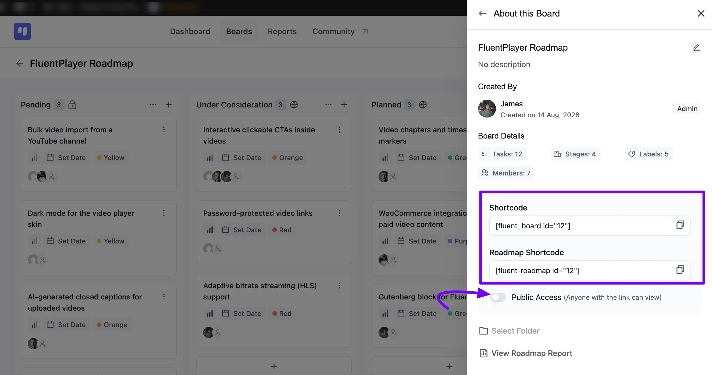
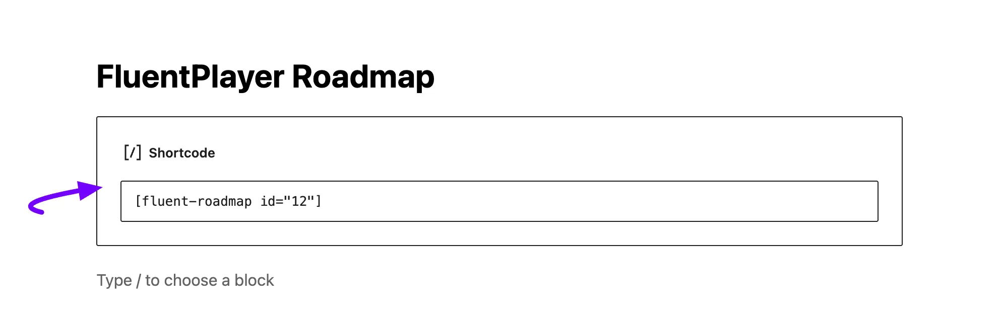
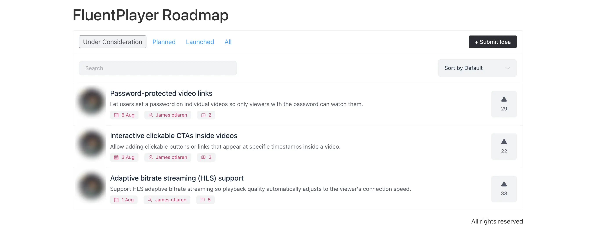

# Roadmap Overview

FluentBoards offers an excellent feature called Roadmap, which allows you to create a roadmap for your products and services on your website's front end. This enables users to view your future plans and share their ideas with you. The roadmap will be displayed on your site's front end for easy access and interaction.

In this article, we will guide you through the steps to create and utilize the Roadmap feature using FluentBoards.

## **Enable the Fluent Roadmap Addon**

To enable the Roadmap feature in FluentBoards, go to the FluentBoards Dashboard. Click on the **Settings** button in the navbar, then select **Features & Modules** from the left sidebar.

In the **Recommended Plugins and Addons** section, you will see the **Fluent Roadmap** addon. Click the **Install Fluent Roadmap** button to install the addon. This is a single-click installation, so after clicking the button, the Fluent Roadmap addon will be installed automatically.

## Create Roadmap Board

To create a Roadmap Board go to your FluentBoards and click on the **Boards** from the navbar then select **+ Add Board** button.

A **Create Roadmap** pop-up will appear. Enter a **Roadmap title**, then choose **Public Roadmap** from the **Type** dropdown. From here, you can also customize the default **Stages**, **Labels**, **Members**, and **Background**, or start from an existing template. Once you're done, click the **Create Roadmap** button.

Now you'll be redirected to your Roadmap Board. Here, you can add tasks, manage assignees, and handle other task-related settings that are similar to the normal **Boards settings**.

At the top of each stage, you will see an icon indicating if the stage is public or private. A globe icon means the stage is visible on your frontend Roadmap, while a lock icon means it stays internal. To make a public stage private, click on the **Three Dot** icon at the top of the stage, then select **Make This Stage Private** from the stage menu.

## **FluentBoards Roadmap Frontend View**

To display your Roadmap Boards on the frontend, navigate to the specific board you wish to add. Click on the three-dot button located at the top of your board to open the **Board Menu**. Next, select **About This Board** from the menu options.

Here you will see your board details, like the number of **Tasks**, **Stages**, **Labels**, and **Members**. Below that, you'll find two shortcodes: the **Shortcode** for embedding the board itself, and the **Roadmap Shortcode** for embedding the public-facing Roadmap. Turn on the **Public Access** toggle so anyone with the link can view your Roadmap.

Navigate to the desired page where you want to embed your Roadmap and add a **Shortcode block** from the Gutenberg Blocks. Paste the copied **Roadmap Shortcode** from the **About This Board** panel into the block. Finally, click the **Update** button to save your changes.

Now, when you preview your Roadmap Board on the frontend of your website, you will see it displayed like this.

Here's how you can create a Roadmap for your site using Fluent Boards. 