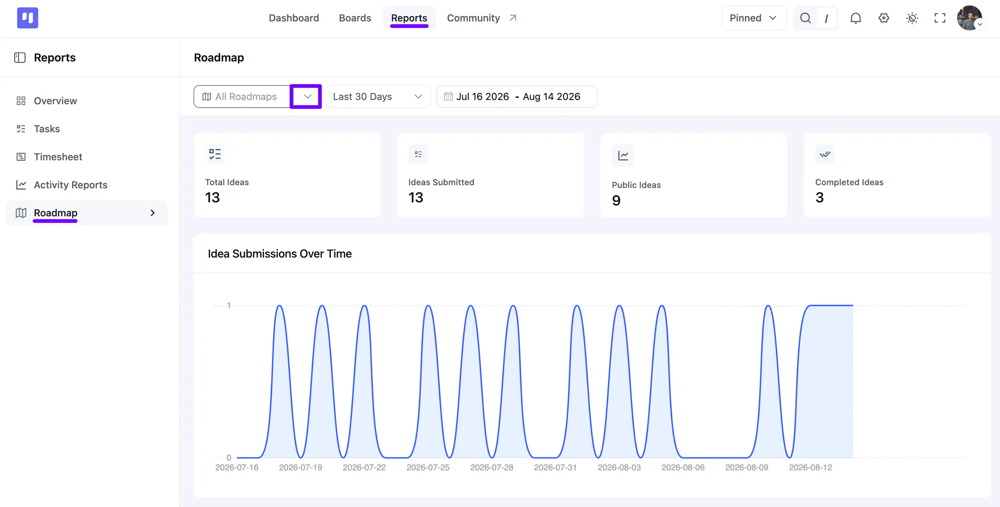
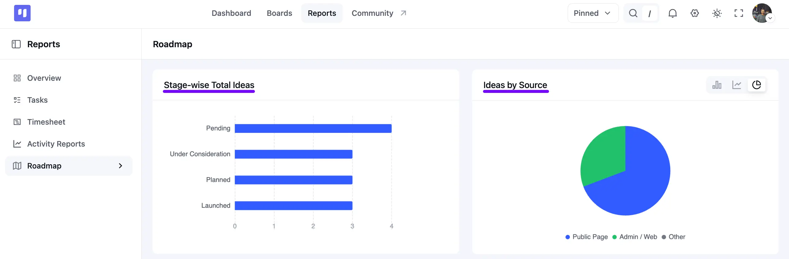
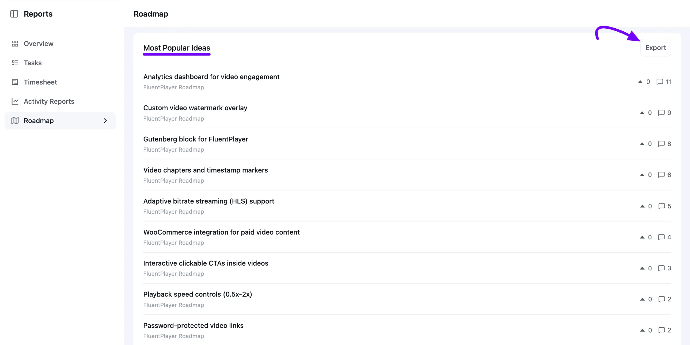

# Roadmap Report

FluentBoards provides a dedicated **Roadmap Report** feature within the Reports section. This report offers a comprehensive overview of user-submitted product ideas, stage progression, submission channels, and community engagement metrics, helping you analyze public feedback and track your project roadmaps effectively.

In this article, we will guide you through the components and features available in the Roadmap Report.

## Accessing Roadmap Reports

To view your Roadmap Report in FluentBoards:

1. Go to your **FluentBoards Dashboard** and click on **Reports** from the top navigation bar.
2. From the left sidebar, click on **Roadmap**.
3. Use the **All Roadmaps** dropdown at the top to select a specific Roadmap Board, or keep it on **All Roadmaps** to see combined data from every board.
4. Filter by timeframe using the date range dropdown next to it, such as **Last 30 Days**, or click the calendar field beside it to set a custom date range.

Once you apply a filter, every card and chart on the page updates automatically to reflect your selected Roadmap and timeframe.

## Key Metric Cards

At the top of the Roadmap Report page, four key metric cards summarize your overall roadmap activity:

- **Total Ideas:** Displays the overall count of ideas across your selected Roadmaps, regardless of the date range.
- **Ideas Submitted:** Shows the total number of ideas submitted within your selected timeframe.
- **Public Ideas:** Displays the count of ideas that are visible to your visitors on the public-facing Roadmap page.
- **Completed Ideas:** Indicates how many ideas have reached your Launched stage within the selected timeframe.

These cards give you a quick, at-a-glance summary before you dig into the detailed charts below them.

## Idea Submissions Over Time

The **Idea Submissions Over Time** section features a wave-like line graph. This graph plots how many new ideas came in on each day of your selected date range, so you can see the daily trend at a glance.

Hover over any point on the graph to see the exact date and how many ideas were submitted that day. This makes it easy to spot peak periods, such as after a product update or a marketing campaign, when users are most active in sharing feedback.

## Stage-wise Total Ideas & Ideas by Source

Scroll down the page, two visual charts provide deeper insight into idea status and submission origins:

- **Stage-wise Total Ideas:** A bar chart showing the number of ideas currently in each Roadmap stage, such as **Pending**, **Under Consideration**, **Planned**, and **Launched**. This gives you a quick overview of how your ideas are distributed and helps you identify where most ideas are waiting or progressing.

- **Ideas by Source:** A breakdown chart displaying where your ideas came from. Simply click the icons in the top-right corner of this card to switch between **Bar**, **Line**, and **Pie** chart styles. The source channels include:

  - **Public Page:** Ideas submitted directly from your public Roadmap page by your visitors.
  - **Admin / Web:** Ideas added internally by you or your team from the FluentBoards dashboard.
  - **Other:** Ideas that came in through any other channel.

## Most Popular Ideas & CSV Export

The **Most Popular Ideas** section ranks submitted ideas based on community interest and engagement:

- **Idea List:** Displays each idea's title, the Roadmap Board it belongs to, its total upvotes (shown with an arrow icon), and its comment count. Ideas are ranked by combining upvotes and comments, so the most talked-about ideas rise to the top.
- **Exporting Data:** Click the **Export** button at the top-right of the Most Popular Ideas table to download your full roadmap idea report in **CSV format** for offline analysis, such as in a spreadsheet.

That covers everything in the **Roadmap Report** section of FluentBoards! 
