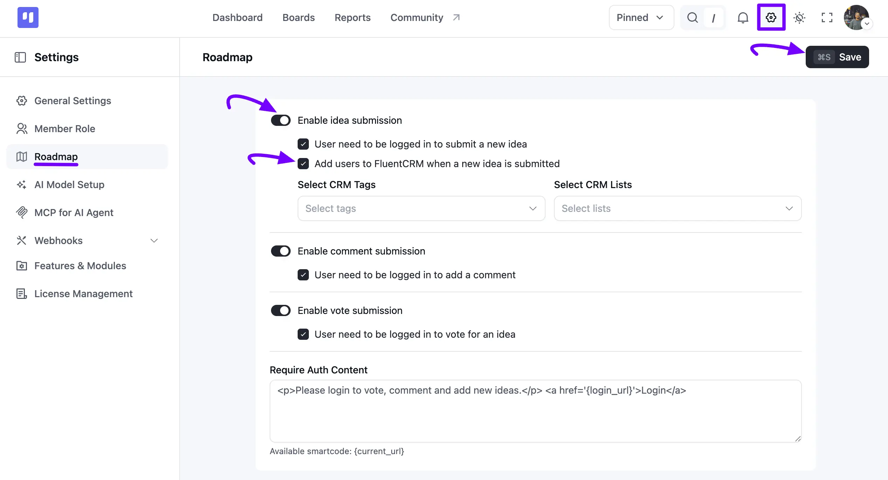

# Roadmap Settings

FluentBoards provides various settings for your Roadmap. To access them, go to the FluentBoards **Settings** from the navbar, then click on the **Roadmap** option in the left sidebar.

## Here are the available settings:

### **Enable Idea Submission**

**User need to be logged in to submit a new idea:** Requires users to log in before adding an idea.

**Add users to FluentCRM when a new idea is submitted:** If a user submits an idea, they will be automatically added to your CRM contacts when this option is enabled. Choose the desired options from the **Select CRM Tags** and **Select CRM Lists** dropdown fields to assign the contact to specific tags and lists.

### **Enable Comment Submission**

**User need to be logged in to add a comment:** Requires users to log in before commenting.

You can also reply to a user's comment right from your task dashboard and choose whether your reply is **Public** or **Private**. Public comments appear automatically to the user, while private comments stay within your team.

### **Enable Vote Submission**

**User need to be logged in to vote for an idea:** Requires users to log in before voting.

### **Require Auth Content**

In the **Require Auth Content** section, you can customize the message displayed to users who need to log in to interact with the Roadmap. By default, this shows a **Login** link, and you can use the `{current_url}` smartcode to send users back to the same page after they log in.

After configuring these settings, click the **Save** button at the top right to apply the changes to your Roadmap Boards.

