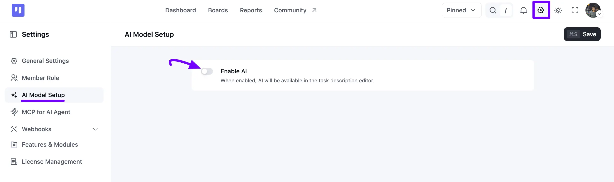
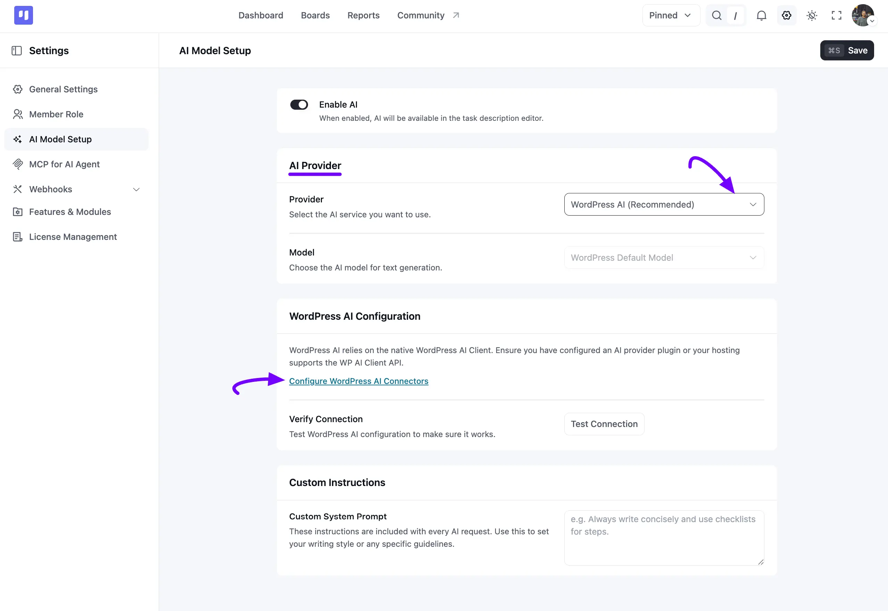
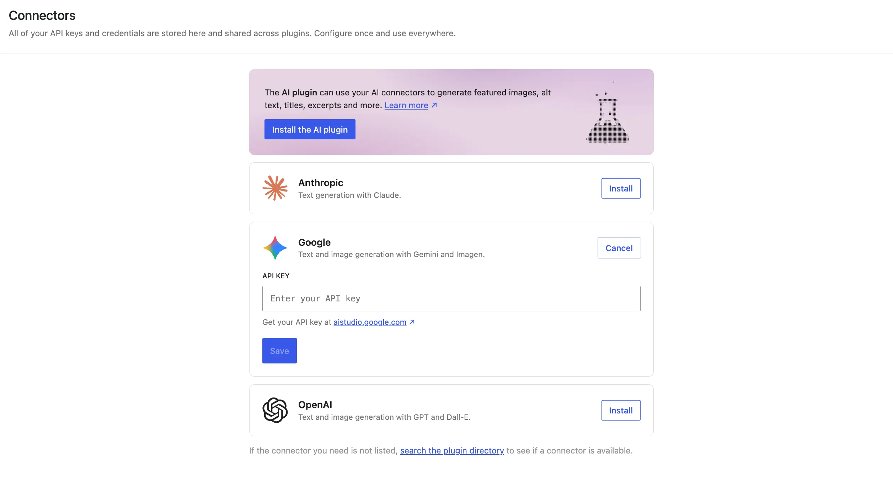
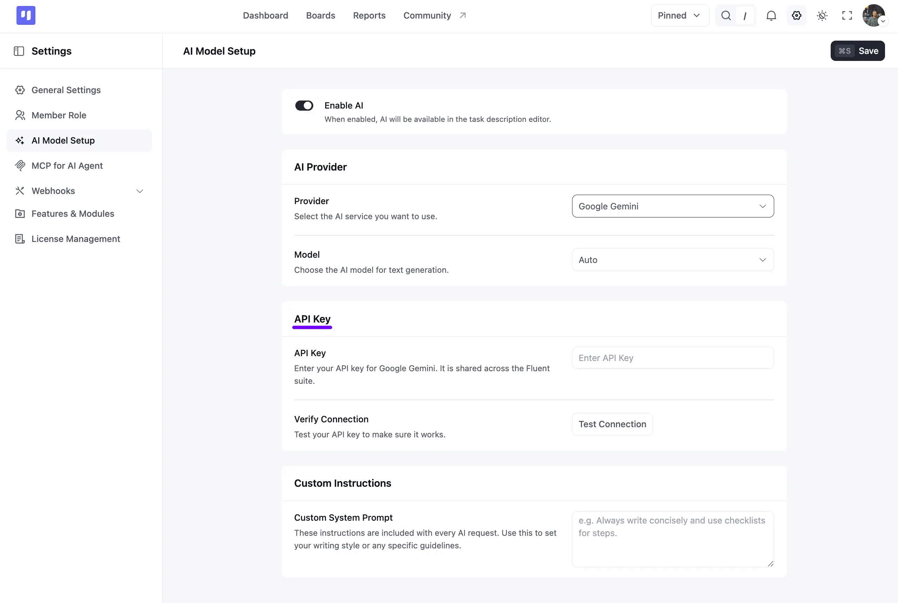
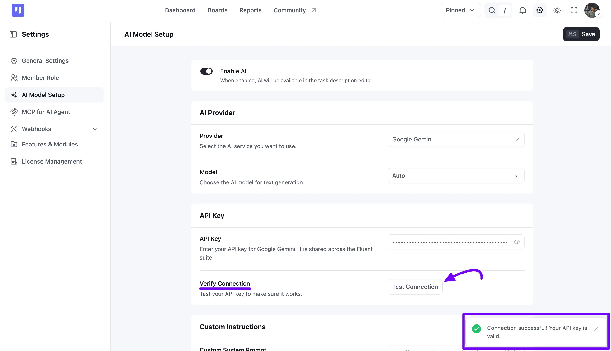
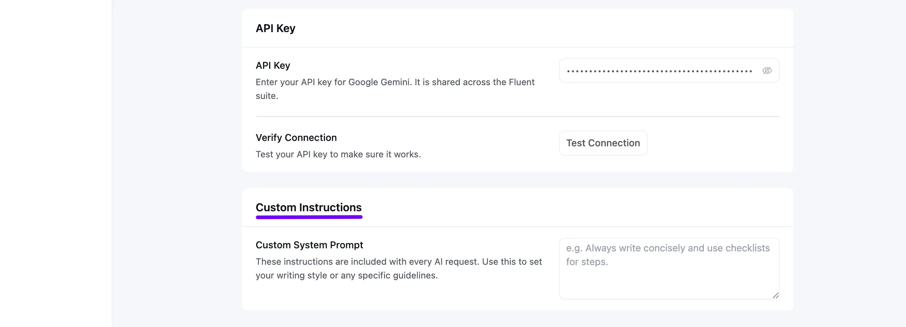

# AI Model Setup

In **FluentBoards**, the **AI Model Setup** feature allows you to integrate artificial intelligence directly into your workspace. Once configured, AI assistance becomes available inside the task description editor, helping you generate, edit, or summarize content seamlessly.

This guide walks you through enabling AI, selecting an AI provider, and configuring custom system instructions.

> [!Note]
> This is different from connecting external AI assistants to FluentBoards. If you want an AI assistant to access your boards directly, check out the [MCP for AI Agents](/mcp-for-ai-agents) guide instead.

> [!Note]
> Once you've enabled AI here, head to the [AI Features in Task Cards](/ai-features-in-task-cards) guide to start using the AI Writing Assistant, task summaries, and other AI tools inside your tasks.

## Step 1: Enable AI

To enable AI features in FluentBoards:

1. Go to your **FluentBoards Dashboard** and click on **Settings** from the top menu or left sidebar.
2. Select **AI Model Setup** from the left settings sidebar.
3. Switch on the **Enable AI** toggle button.

> [!Note]
> When enabled, AI capabilities become active and accessible within the task description editor.

## Step 2: Select AI Provider & Model

Under the **AI Provider** section, you can select which service and model will handle text generation for your tasks.

Click the **Provider** dropdown and select your preferred AI service. Available options include:

- **WordPress AI (Recommended)**
- **OpenAI**
- **Anthropic Claude**
- **Google Gemini**

Then, choose the specific **Model** for text generation from the dropdown menu, or leave it as **Auto / Default**.

## Step 3: Configure AI Providers

Depending on your selected provider, follow the corresponding setup steps below.

### WordPress AI (Recommended)

WordPress AI uses the native WordPress AI Client API.

- Make sure you have an AI provider plugin or hosting that supports the WP AI Client API.
- Click on **Configure WordPress AI Connectors** to manage API keys globally across plugins.
- In the Connectors window, click **Install**, or enter your key for services like **Anthropic**, **Google**, or **OpenAI**, then click **Save**.

### OpenAI, Anthropic Claude, or Google Gemini (Direct API Key)

If you select **OpenAI**, **Anthropic Claude**, or **Google Gemini** as your direct provider:

1. Locate the **API Key** field on the page.
2. Enter your valid API key from your provider (e.g., OpenAI API Key, Anthropic API Key, or Google Gemini API Key).

Your API key is shared securely across the Fluent suite.

## Step 4: Verify Connection

After entering your API Key or setting up WordPress AI:

1. Scroll to the **Verify Connection** section.
2. Click the **Test Connection** button.
3. A success notification, **AI configuration saved successfully**, will confirm that your connection is live and working.

## Step 5: Custom Instructions

You can define global behavior and tone for all AI text requests generated within FluentBoards.

1. Scroll to the **Custom Instructions** panel.
2. In the **Custom System Prompt** text area, enter your custom guidelines. For example: *Always write concisely, use bullet points, and maintain a professional tone.*
3. Click the **Save** button in the top-right corner to apply all your settings.

That covers everything for setting up AI models in **FluentBoards**! If you have any further questions or encounter any issues, please do not hesitate to contact our [support team](https://wpmanageninja.com/support-tickets/?utm_source=wpmn&utm_medium=home&utm_campaign=site#/){:target="_blank"}.
