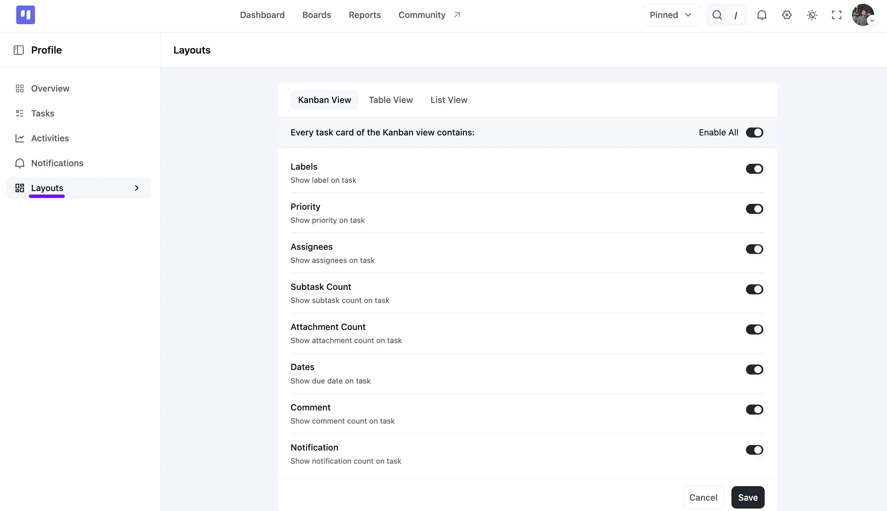

# Card View Preferences

To enhance the effectiveness of your Task Card View, you can personalize the information displayed. Here's how you can customize your Task Card View:

Go to your FluentBoards Dashboard and click on your **Profile** image in the top right corner, then select **Layouts** from the left sidebar.

Use the **Kanban View**, **Table View**, and **List View** tabs at the top to customize what shows up in each layout. The **Enable All** toggle turns every option on or off at once.

For the **Kanban View**, you can toggle each of these on or off:

- **Labels**: Show the Label on the task.
- **Priority**: Show the Priority on the task.
- **Assignees**: Show assignees on the task.
- **Subtask Count**: Show the subtask count on the task.
- **Attachment Count**: Show the attachment count on the task.
- **Dates**: Show the due date on the task.
- **Comment**: Show the comment count on the task.
- **Notification**: Show the notification count on the task.

Switch to the **Table View** or **List View** tab to customize the same kind of details for those layouts.

Once you're done, click the **Save** button to apply your changes.

That's all it takes to personalize your FluentBoards Card View.
