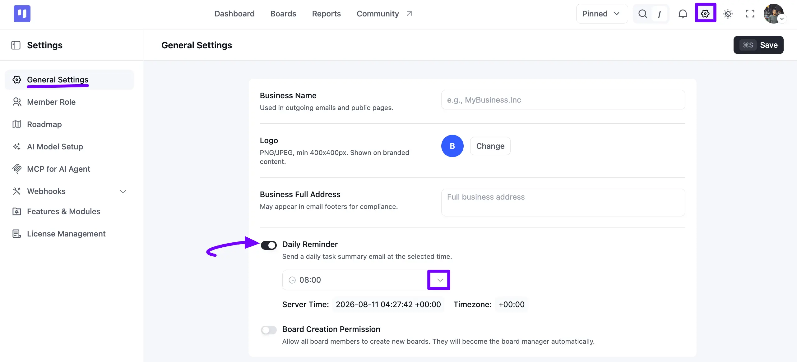
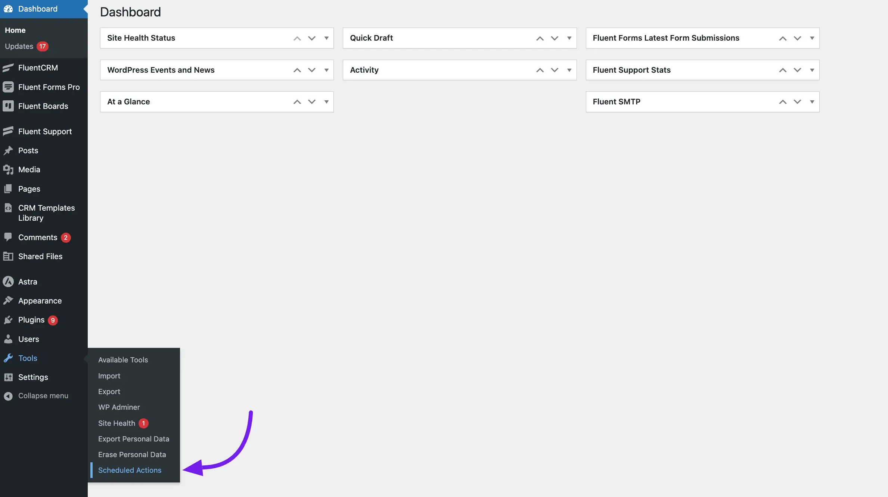
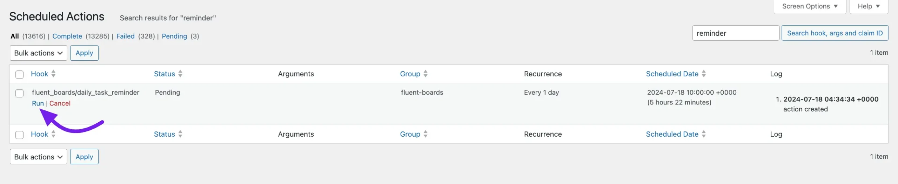

# Daily Reminders

In FluentBoards, the General Settings section allows you to configure task reminders for **Overdue** tasks. This feature sends automatic email notifications to users about their board tasks. Both WordPress Administrators and Full Admins can enable and manage these reminders to ensure tasks are completed on time.

## General Settings

Navigate to FluentBoards **Settings** from the navbar. Next, click on the **General Settings** tab in the left sidebar. Here, among other options, you'll find the **Daily Reminder** setting.

Click the **Toggle** button next to **Daily Reminder** to send a daily task summary email at a time you choose. 

Once enabled, click the time field below it to pick the hour, and use the **Server Time** and **Timezone** shown underneath to make sure it lines up with your day.

Once you're done, click the **Save** button in the top right corner to save the settings.

## Run Daily Reminder with Scheduled Action

You can send your Daily Reminder email notification anytime using WordPress Scheduled Action. To do this, go to your WordPress dashboard, hover over **Tools**, and select **Scheduled Actions**.

Search for the ***fluent_boards/daily_task_reminder*** and click on the **Run** button. Your daily task reminder email notification will now be sent to the task assignee.

So, this is how you can set a reminder for your task assignees.
