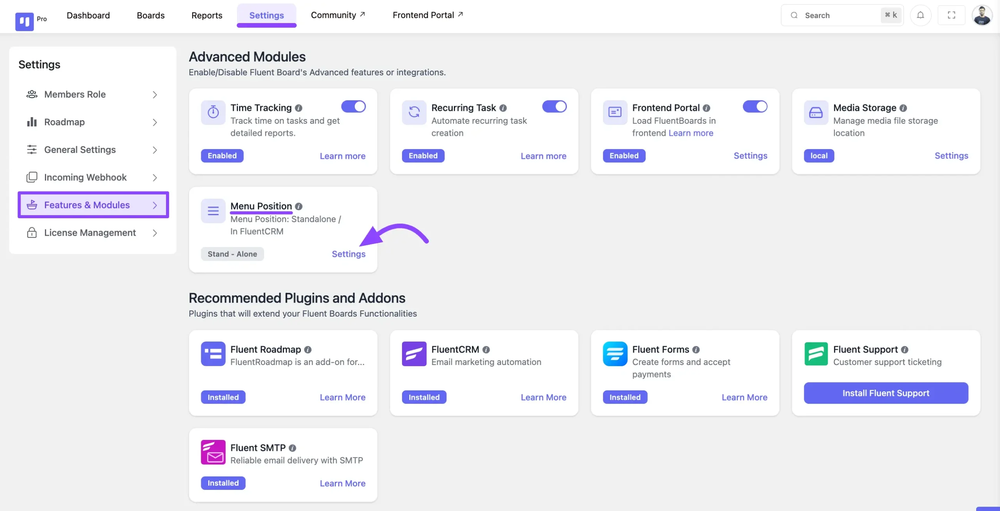
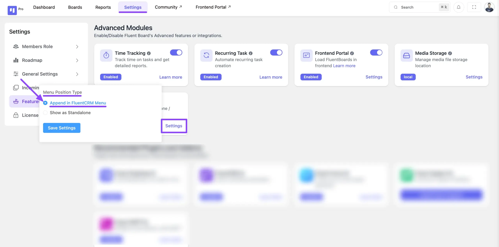
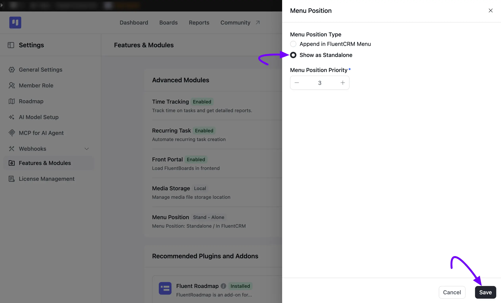

# Menu Position in WordPress

You can customize the position of FluentBoards in your WordPress Dashboard. You can Keep your FluentBoards plugin in your WordPress left sidebar also you can keep your project management tool FluentBoards in the FluentCRM menu.

In this guideline, we will show you how you can customize the FluentBoards position.

First, go to your FluentBoards and select **Settings > Features & Modules**. Under **Advanced Modules**, you'll find the **Menu Position** option.

Click the **Manage** button next to **Menu Position**.

## Append In FluentCRM Menu

A **Menu Position** pop-up will appear. Under **Menu Position Type**, if you want to keep your FluentBoards in the FluentCRM plugin menu then select **Append in FluentCRM Menu**.

## **Show as Standalone**

To show the FluentBoards in your WordPress left sidebar Menu, select **Show as Standalone** instead. Then use the **Menu Position Priority** stepper to set where it appears in the sidebar.

Lastly, click on the **Save** button to save.

