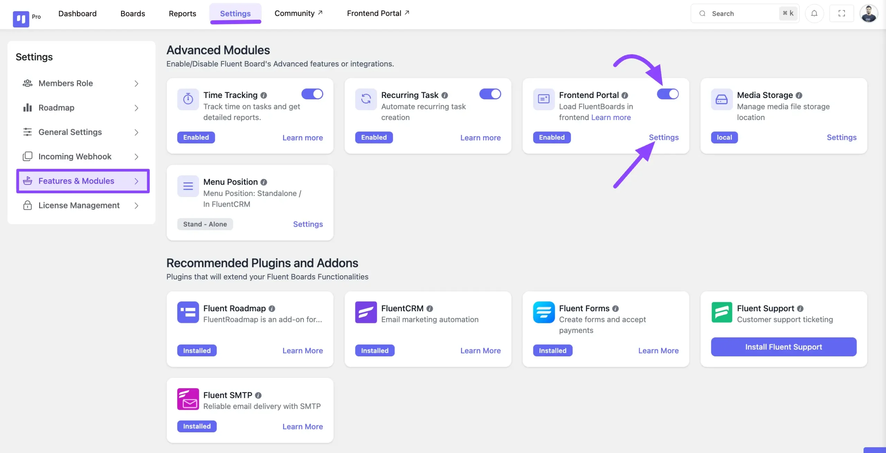
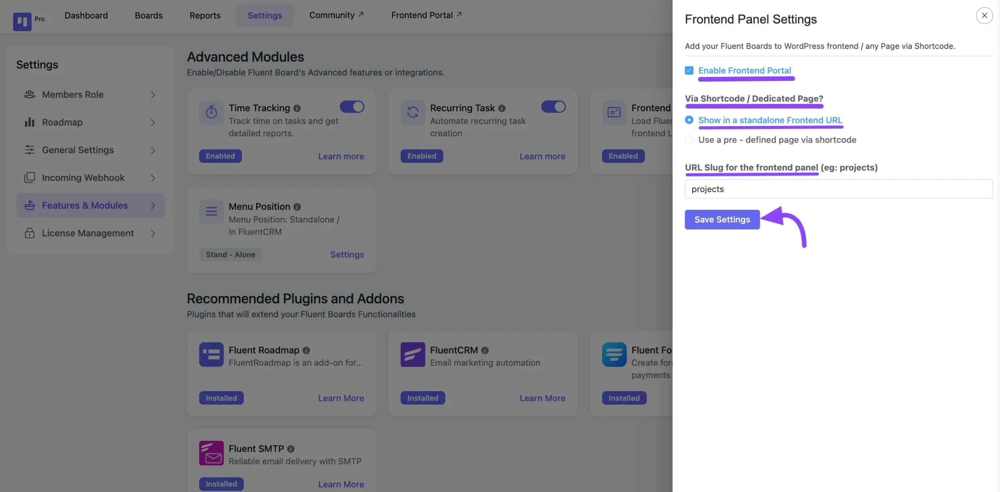
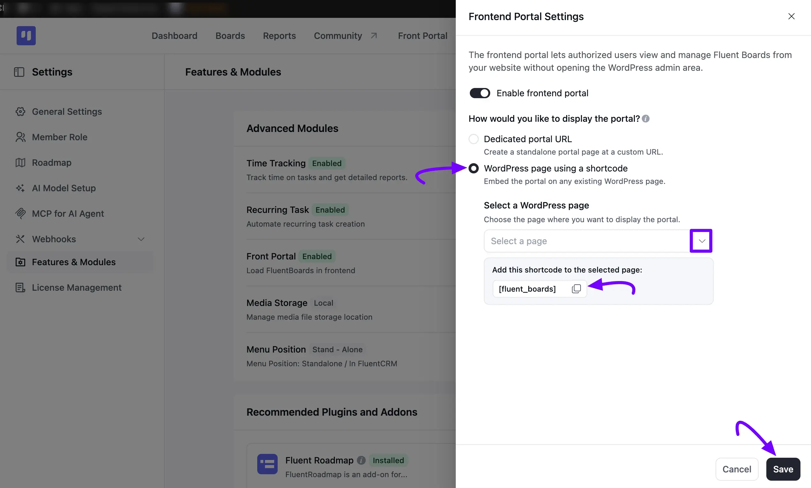
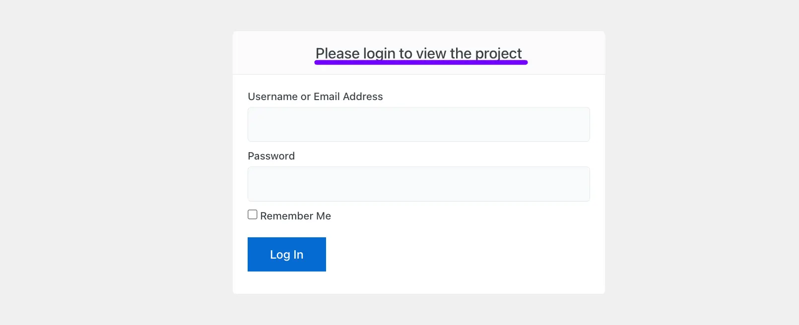

# Frontend Portal

With FluentBoards, you can establish a frontend portal. This feature enables your board members to log in directly from the frontend of your website using the FluentBoards frontend portal.

<VideoEmbed id="uXzspvMCHn4" />

## Enable Frontend Portal

Go to the FluentBoards **Settings** and choose **Features & Modules** from the left sidebar. Under **Advanced Modules**, locate **Front Portal** and turn on its **Toggle**, then click the **Manage** button next to it.

## Frontend Portal Setup

A **Frontend Portal Settings** pop-up will appear. Turn on the **Enable frontend portal** toggle, then choose how you'd like to display the portal under **How would you like to display the portal?**

If you select **Dedicated portal URL**, enter a **Portal URL Slug** this becomes the final part of your portal's custom link. You'll see a preview of the full URL right below it. Once you're done, click the **Save** button.

If you prefer an existing page, select **WordPress page using a shortcode** instead. Choose the page from the **Select a WordPress page** dropdown, then copy the **[fluent_boards]** shortcode and add it to that page. Once you've done this, click the **Save** button.

## Single Board Shortcode

If you only want to share one specific board, such as with a client or a stakeholder, instead of your entire frontend portal, you can generate a shortcode for that individual board.

Go to the board you want to share and click on the **project info** icon. Copy the board shortcode shown there, then paste it into the page where you want that board displayed.

## Frontend Portal Login

You'll see a login page on your website where your board members need to log in using their WordPress **User ID** and **Password**.

That's the process for enabling the Frontend portal for your FluentBoards.