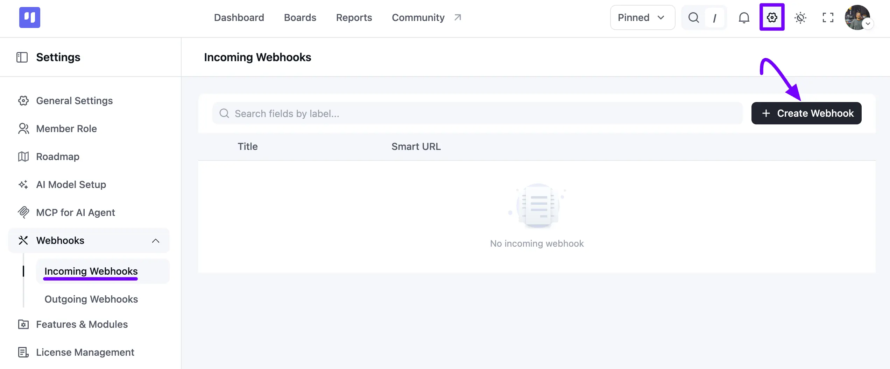
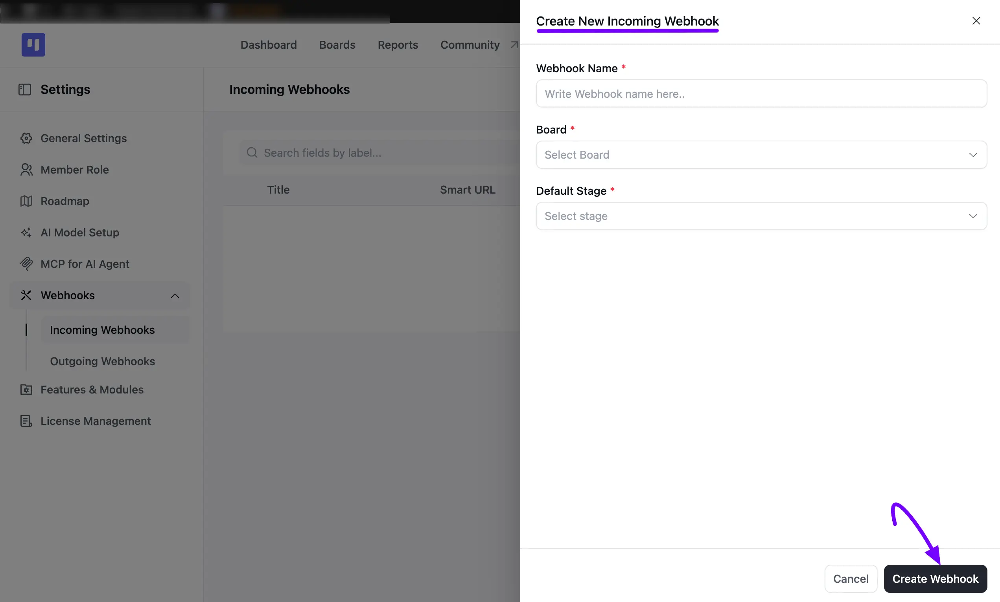
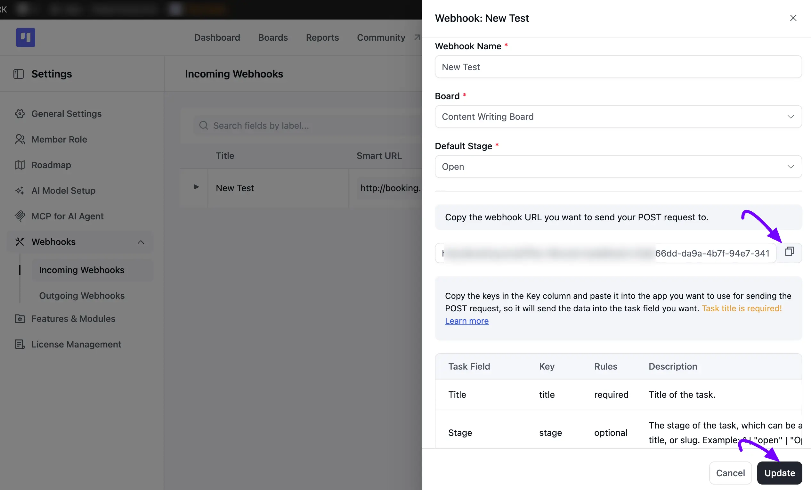
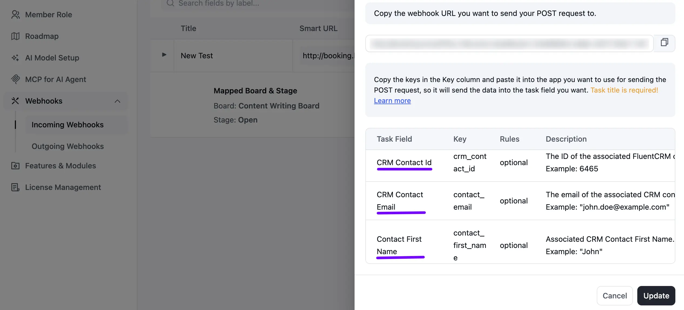
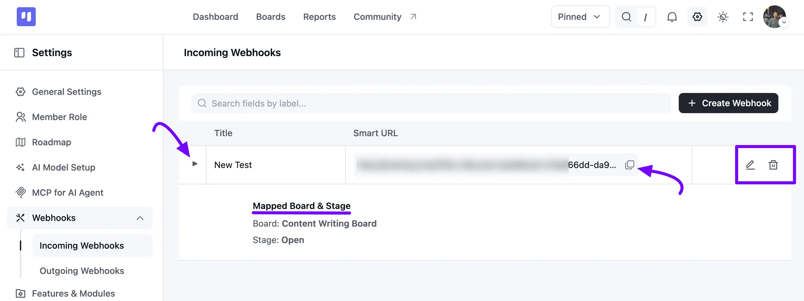
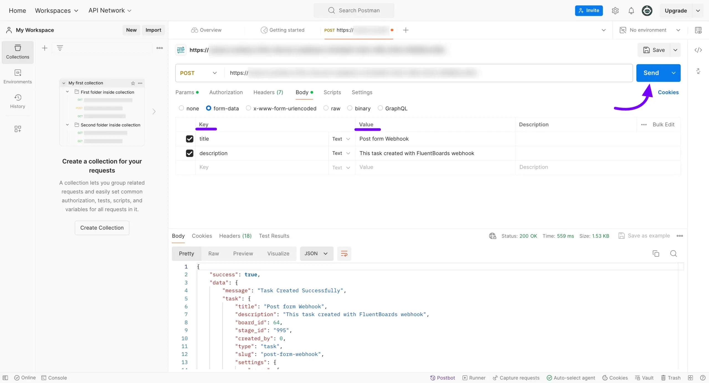
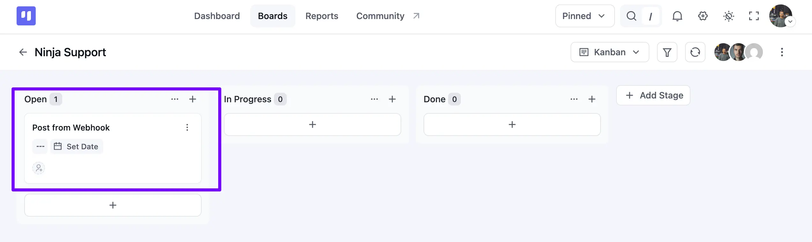

# Creating Tasks via Incoming Webhooks

Webhooks allow you to receive data from third parties without writing code or running a server. FluentBoards provides an incoming webhook feature that enables you to create new tasks on your boards.

With this feature, you can assign tasks, add labels, set dates, and use other functionalities to complete your tasks. Additionally, you can associate CRM contacts with tasks, streamlining your workflow and ensuring all relevant information is integrated.

This guideline will show you how to add tasks using the webhook feature in just a few simple steps.

<VideoEmbed id="IupOvjf8B5w" />

## Adding Webhook

First, go to the **Settings** of your FluentBoards. On the left sidebar, click **Webhooks** to expand it, then select **Incoming Webhooks**.

Next, click the **+ Create Webhook** button.

A **Create New Incoming Webhook** pop-up will appear from the right side. Enter a **Webhook Name**, then select the **Board** where the task will be saved and choose the **Default Stage**. Once you're done, click the **Create Webhook** button.

Your webhook is now created, and you can copy the **webhook URL** to use in your POST request. Below it, you'll find a **Task Field** table listing each **Key** you can map your data to, along with its **Rules** and **Description**. Only the **Title** key is required every other field is optional. 

Scroll down within the same panel, and you'll find the keys for associating FluentCRM contacts with your task as well. You can link your CRM contacts by their **CRM Contact Id**, **CRM Contact Email**, **Contact First Name**, or **Contact Last Name**. Once you're done, click the **Update** button to save your changes.

Back on the **Incoming Webhooks** list, you'll see every webhook you've created along with its **Smart URL**. Click the **Arrow** icon next to a webhook to expand it and view its **Mapped Board & Stage** at a glance.

Next to the URL, click the **Copy** icon to copy the webhook URL. On the right side of the row, click the **Pencil** icon to edit the webhook, or the **Trash** icon to delete it.

## Creating a Task using a third-party platform

In this process, we'll use [Postman](https://web.postman.co/){:target="_blank"} to generate a task with the webhook. Access your [Postman account](https://web.postman.co/){:target="_blank"} and paste your webhook URL into a new **POST** request.

Go to the **Body** tab and select **form-data**. Remember, it's mandatory to include the **title key**. Then, add the necessary keys based on your mapping needs. Once all adjustments are made, click on the **Send** button to initiate the task creation.

Navigate to the board where you've designated task creation from the webhook, and you'll observe the task successfully appended to your boards.

