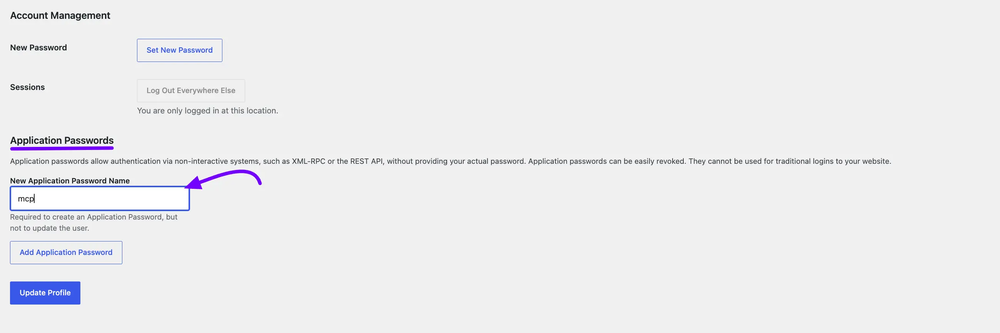
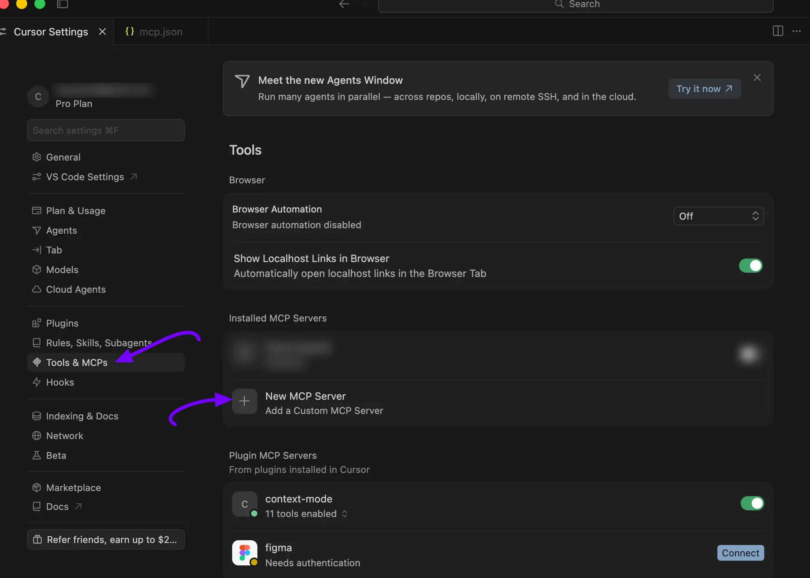
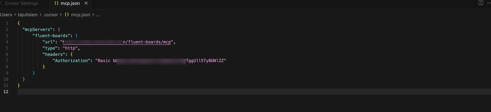
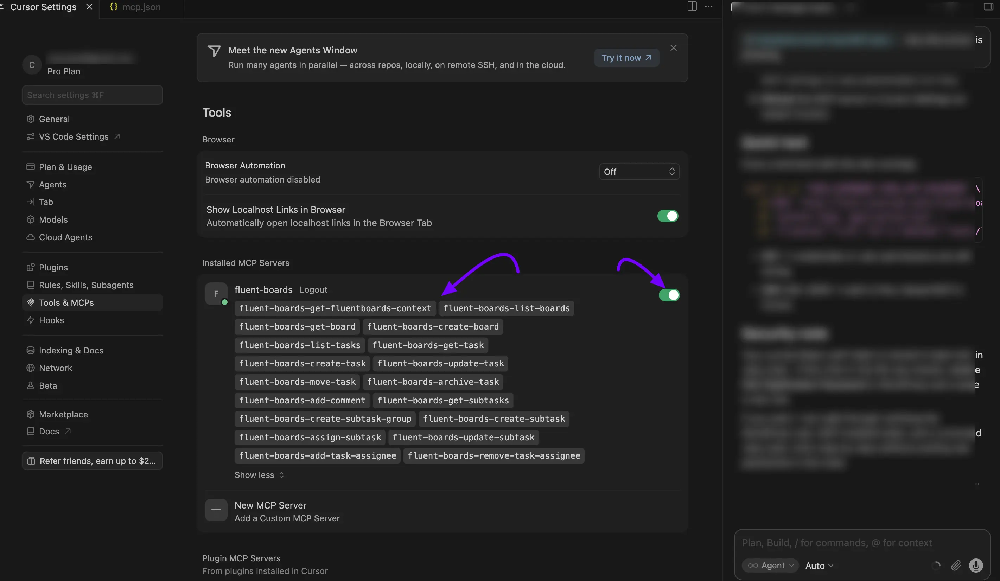
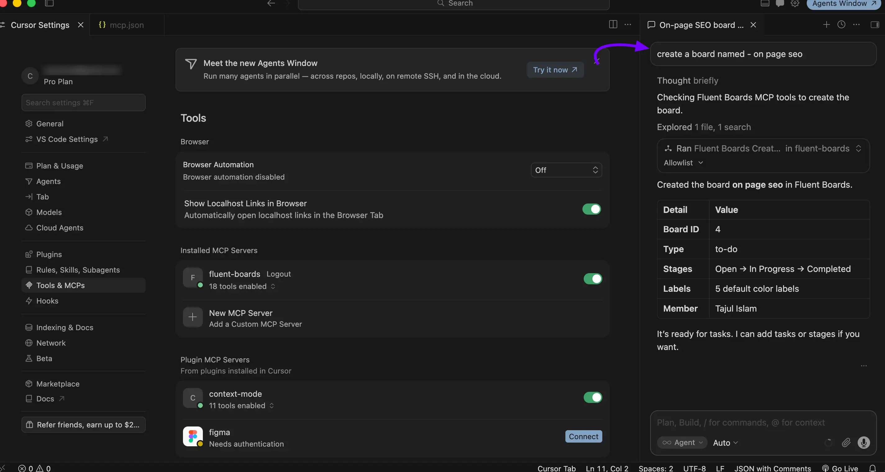

# MCP for AI Agents

The MCP (Model Context Protocol) integration in FluentBoards allows you to connect your project boards with AI tools like Anthropic Claude Desktop, Claude Code, Cursor, and OpenAI Codex. With this integration, AI agents can interact with your boards using natural language to read, create, and manage project data.

This integration works through a secure connection using a WordPress Application Password, giving you full control over access and permissions.

> [!Note]
> Looking for AI help inside a task itself, like writing descriptions or summarizing a card? That's a separate, built-in feature — check out the [AI Features in Task Cards](/ai-features-in-task-cards) guide instead.

### Open the MCP Settings

To access the configuration panel, log in to your WordPress dashboard. From the left sidebar, navigate to **FluentBoards** → **Settings**, and select the **MCP for AI Agent** tab from the settings menu. Everything you need to initialize, authenticate, and configure your connections lives on this single screen.


## Step 1: Enable MCP for AI Agents

To allow external AI assistants to discover your FluentBoards environment, toggle the **Enable MCP for AI Agents** switch located at the top of the configuration page. When turned on, FluentBoards dynamically exposes its underlying capabilities to authorized MCP clients.

> [!Note]
> If you need to instantly pause access for all connected AI tools simultaneously, simply flip this toggle off. The endpoint immediately stops responding to incoming MCP requests without altering your saved configurations.


## Step 2: Install and Activate FluentHub

FluentBoards utilizes a lightweight companion plugin called **FluentHub** to manage and expose its specific tool schema. If this plugin is missing or inactive, an **Adapter Required** warning will appear in your status panel.

* **One-Click Installation:** Click the **Install FluentHub** button on the settings page. WordPress will automatically download, install, and activate the extension in the background.
* **Manual Installation:** If utilizing a manual deployment, download the **FluentHub** plugin archive directly from the official repository. Upload it via **Plugins → Add New → Upload Plugin**, click activate, and return to the **MCP for AI Agent** configuration screen.

## Step 3: Verify the Connection Status

Once both the toggle is enabled and the toolkit is active, review the **Status** panel. This panel serves as confirmation that your local server is ready to accept authenticated client connections.

| Field | Description |
| --- | --- |
| **Adapter** | Displays the active version of your FluentHub plugin (e.g., FluentHub 2.1.0) along with a green **Connected** badge. |
| **Endpoint URL** | The direct REST API address your AI client requires to target this server (e.g., `https://your-site.com/wp-json/fluent-boards/mcp`). A **Copy** button sits right next to it. |
| **Tools Available** | Total number of MCP tools exposed, covering board, task, move, archive, and comment actions (29 in this example). |

> If your **Tools Available** counter displays 0, double-check that the main **Enable MCP for AI Agents** toggle from Step 1 is thoroughly switched on.


## Step 4: Generate a WordPress Application Password

External AI applications sign in to your WordPress installation via an isolated **Application Password**. Because this is built natively into WordPress, no secondary security extensions are required.

[Image: Application Passwords Generation Screen]

1. Navigate to **Users** → **Profile** from your WordPress admin dashboard and scroll down to the **Application Passwords** section.
2. Provide a unique, descriptive name to easily identify the specific client connection (e.g., *Cursor AI* or *Claude Desktop Office*).
3. Click **Add New Application Password**.
4. Securely copy the generated 24-character security key (`xxxx xxxx xxxx xxxx xxxx xxxx`).

> **Warning:** This key is explicitly displayed only once. If you exit the profile screen before copying it down, you must revoke that label and generate a brand new one.




## Step 5: Connect Your Preferred AI Client

Return to the **MCP for AI** panel inside FluentBoards and look for the **Connect a client** section. By providing your profile parameters here, the plugin automatically structures a personalized connection block for your target app.

1. Input your active WordPress account login name into the **Username** text field. A handy **Open Application Passwords** link sits right above this field if you still need to generate one.
2. Paste the un-spaced or spaced **Application Password** generated during Step 4 into the password field. Click the eye icon to reveal it and double-check for typos.
3. Choose the tab corresponding to your AI workspace provider (**Claude Code**, **OpenAI Codex**, **Cursor**, **Other**, or **Claude Desktop**).
4. Click **Copy snippet** to send the configured instructions to your clipboard.


## Worked example: connecting Cursor

Here's the full Cursor flow as a worked example. The same idea applies to other clients, only the snippet format changes.

1. **Open Cursor's MCP settings**. In **Cursor**, open the command palette and search for **Cursor Settings**, then go to **Tools & MCPs** in the left sidebar. Under **Installed MCP Servers**, click **New MCP Server**.



2. **Paste** the snippet into **mcp.json**. **Cursor** opens an editor for the **mcp.json** config file. **Copy** the snippet from the **Cursor** tab in Fluentboard Connect a client panel and paste it in. It looks like this:

```json
{
  "mcpServers": {
    "fluent-boards": {
      "url": "https://your-site.com/wp-json/fluent-boards/mcp",
      "type": "http",
      "headers": {
        "Authorization": "Basic <encoded-credentials>"
      }
    }
  }
}

```




3. **Save** and reload. Save mcp.json and reload **Cursor**. Open **Tools & MCPs** again, and you'll see fluent-boards in your Installed MCP Servers list with all available tools listed underneath:



#### Project & Board Contexts

* **List Boards (`fluent-boards-list-boards`):** Retrieves titles, metadata, and visibility properties of available workspaces.
* **Get Workspace Context (`fluent-boards-get-context`):** Provides a high-level overview of card volumes, active boards, and immediate priorities.

#### Card & Task Management

* **Create Task (`fluent-boards-create-task`):** Generates new task cards directly inside specified list stages.
* **Update Task Details (`fluent-boards-update-task`):** Modifies running descriptions, labels, priorities, or adjusts due dates dynamically.
* **Move Stages (`fluent-boards-move-task-stage`):** Drags task entries from open phases into review, progress, or complete stages.

#### Team Assignment & Communication

* **Assign Member (`fluent-boards-assign-member`):** Links profiles to specific cards to delegate tasks to team members.
* **Add Comment (`fluent-boards-add-comment`):** Posts text notes directly into task card event timelines for ongoing collaboration.

#### Natural Language Prompt Examples:

* *"Check my FluentBoards and show me the top 3 high-priority tasks due this week."*
* *"Create a task card called 'Draft marketing budget' in the Planning board under the 'To-Do' list."*
* *"Add a comment to the 'Design Fixes' card saying that the assets have been reviewed."*

### Other AI clients

The other tabs work the same way, only the snippet format changes to match the client:

 * **Claude Code:** A terminal command `(claude mcp add ...)` you paste into your terminal. After it runs, the FluentBoard tools appear in your next claude session.
 * **Claude Desktop:** A snippet for `claude_desktop_config.json`. Paste it into the file at the path Anthropic documents for your OS, then restart Claude Desktop.
 * **OpenAI Codex:** A configuration block for Codex's settings. Follow the instructions shown under the snippet on the OpenAI Codex tab.
 * **Other:** Generic configuration block you can adapt for any MCP-compliant client.
 * In every case, the workflow is the same: fill in the username and password fields, pick the right tab, copy the snippet, and paste it into the AI client where it expects an MCP server config.

## Step 6: Verify it's working

Open your AI client and ask it something only FluentBoard would know. For example:



Now, if you want to view it on the front end of your site, go to your website’s Boards section. There, you will see the newly created board.


### Security, Revocation, & Best Practices

* **Isolated Application Access:** Always generate a separate, uniquely named Application Password for each individual AI assistant tool. If you decide to stop using one client, you can safely remove it without breaking other active integrations.
* **Revoking Access:** To break a connection immediately, head to **Users** → **Profile** → **Application Passwords**, find your target device row, and click **Revoke**.
* **Credential Safety:** The snippet generated within your settings screen contains securely encoded access tokens. Treat this snippet as safely as a master password: never include it in public version control repositories, online pastebin boards, or open team screenshots.


### Troubleshooting Common Issues

* **The "Adapter Required" Shield Remains Up:** Give your web browser a hard refresh (`Ctrl + F5` or `Cmd + Shift + R`). If the badge remains, navigate to your core **Plugins** dashboard to double-check that **FluentHub** is explicitly flagged as **Active**.
* **The AI Client Reports an "Unauthorized" Exception:** Your username spelling or the 24-character application security password contains a typo. Regenerate a clean password from your user profile and reconstruct the snippet block.
* **Commands Complete Successfully but Do Not Reflect Production Realities:** Verify that your site's local **Endpoint URL** exactly matches the domain structure and protocol (HTTP vs HTTPS) configured inside your external AI workspace. WordPress application authentication strictly relies on a functioning, publicly clear REST API route.