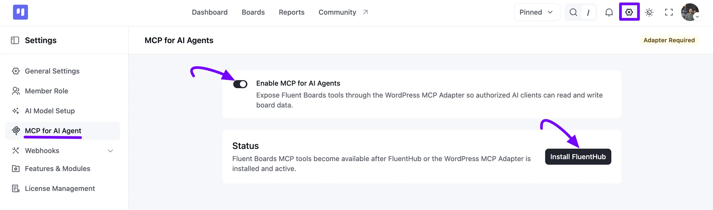
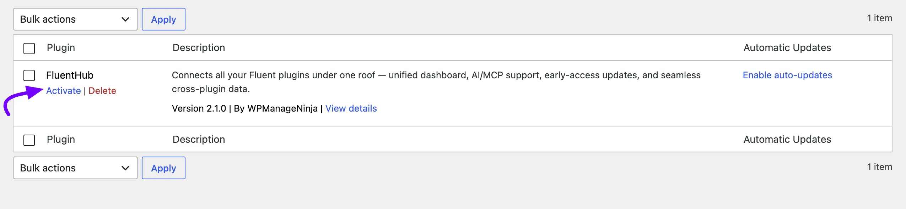
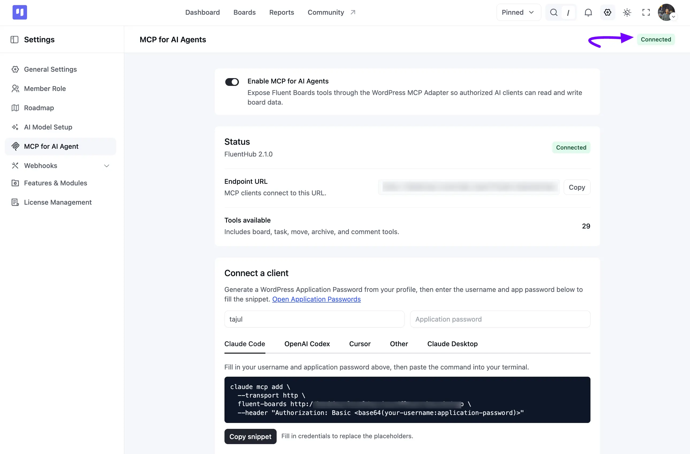
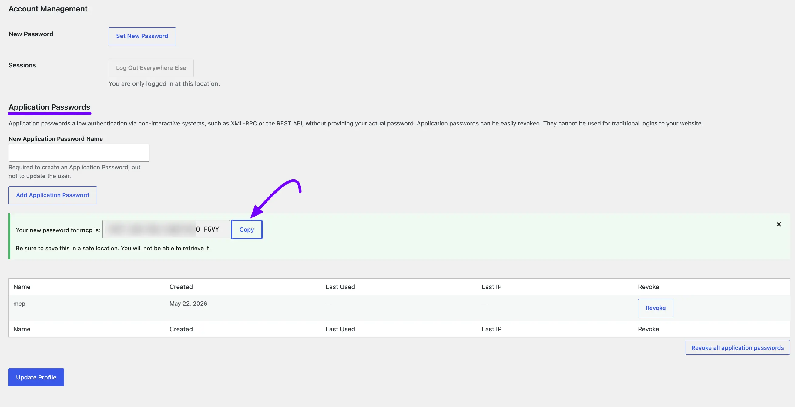
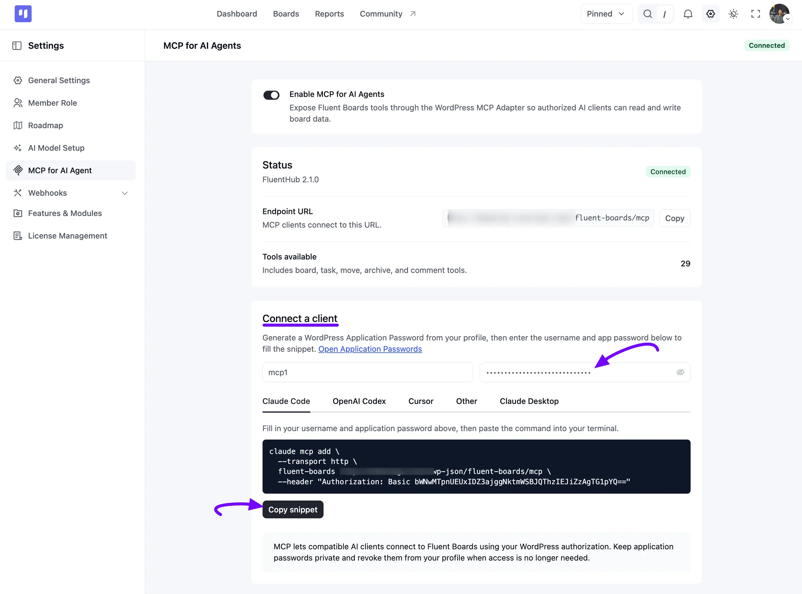
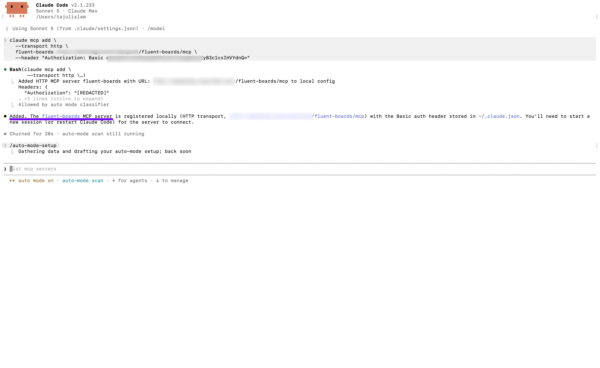
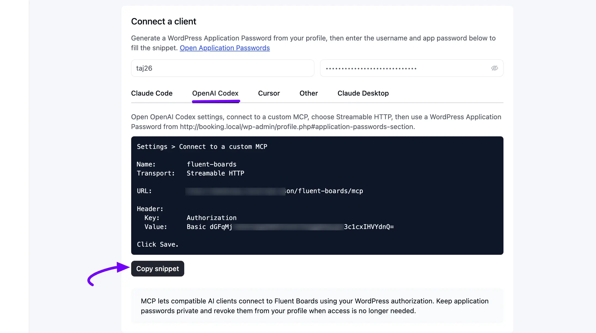
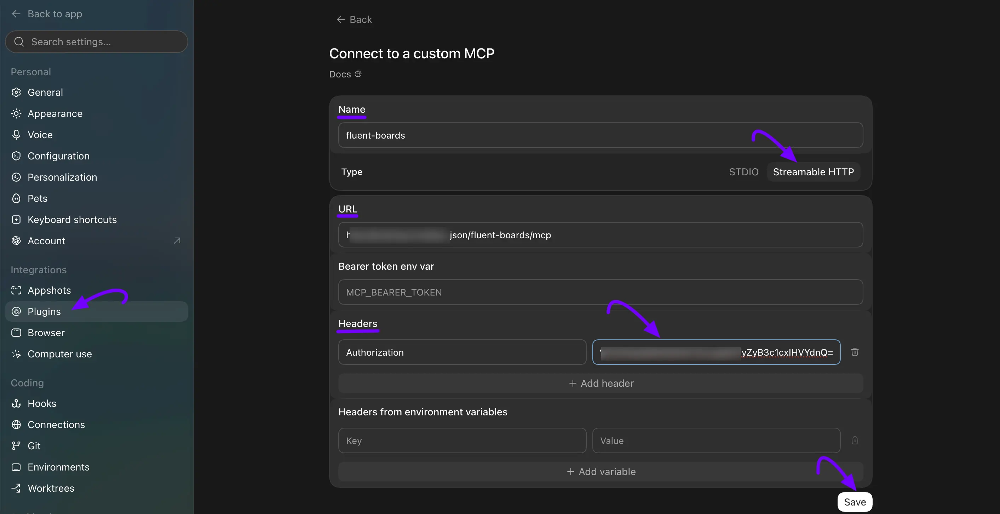
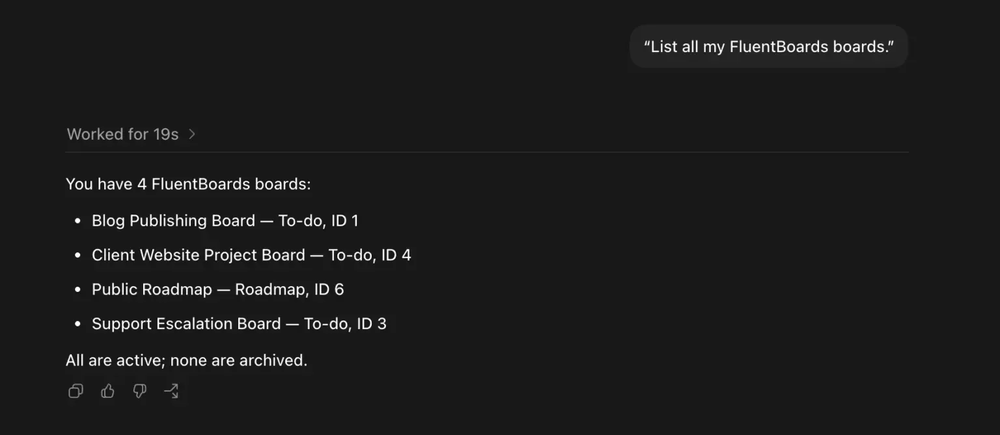
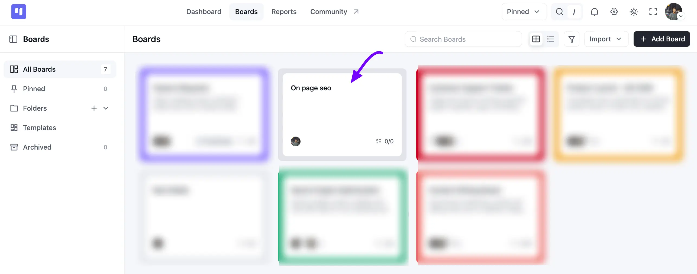

# MCP for AI Agents

With FluentBoards, you can connect your boards to AI tools like **Claude Code**, **Claude Desktop**, **Cursor**, and **OpenAI Codex** using MCP (Model Context Protocol). Once connected, you can ask your AI assistant to read your boards, create tasks, move tasks, assign members, and add comments, all in plain language.

Every connection uses a WordPress **Application Password**, so your AI assistant only ever has the same permissions as your WordPress account. It never gets more access than you already have.

> [!Note]
> The AI tools available through MCP are different from the built-in AI features inside task cards. If you want AI to write task descriptions or summarize a card, check out the [AI Features in Task Cards](/ai-features-in-task-cards) guide instead.

## Open the MCP Settings

Go to your **FluentBoards Dashboard** and click on **Settings** from the top menu or left sidebar. Select the **MCP for AI Agent** tab from the settings menu.

Here you will find everything you need to enable MCP, install the required plugin, check your connection status, and connect your preferred AI client.

## Step 1: Enable MCP for AI Agents

Simply toggle on the **Enable MCP for AI Agents** switch at the top of the page. Once enabled, FluentBoards makes its tools available to authorized AI clients.

> [!Note]
> If you ever want to stop every connected AI tool from accessing FluentBoards, just turn this toggle off. Your other MCP settings stay unchanged.



## Step 2: Install and Activate FluentHub

FluentBoards uses a lightweight companion plugin called **FluentHub** to power this connection. If it's missing or inactive, you'll see an **Adapter Required** notice on the settings page.

* **One-Click Installation:** Click the **Install FluentHub** button on the settings page. WordPress downloads, installs, and activates it for you.
* **Manual Installation:** Download the **FluentHub** plugin archive, then go to **Plugins → Add New → Upload Plugin**. Upload the file, click **Activate**, and return to the **MCP for AI Agent** tab.

> [!Note]
> Prefer to install it yourself? Download FluentHub directly from [static.wpmanageninja.com/fluent-toolkit.zip](https://static.wpmanageninja.com/fluent-toolkit.zip), then upload the ZIP via **Plugins → Add New → Upload Plugin** and activate it. Come back to this page afterwards and the endpoint fields appear.



## Step 3: Check the Connection Status

Once the toggle is on and FluentHub is active, review the **Status** panel. It confirms your site is ready to accept AI connections.

| Field | Description |
| --- | --- |
| **Adapter** | Shows your active FluentHub version with a green **Connected** badge. |
| **Endpoint URL** | The address your AI client needs to reach FluentBoards. Click **Copy** to grab it. |
| **Tools Available** | The total number of MCP tools your AI client can use. |

> [!Note]
> If **Tools Available** shows 0, double-check that the **Enable MCP for AI Agents** toggle from Step 1 is switched on.



## Step 4: Generate a WordPress Application Password

AI clients sign in to FluentBoards through a WordPress **Application Password**, not your regular login password. This lets you revoke a single AI connection later without changing your main password.

1. Go to **Users → Profile** from your WordPress dashboard and scroll down to the **Application Passwords** section.
2. Enter a name that identifies the connection, such as *Claude Desktop* or *Cursor*.
3. Click **Add New Application Password**.
4. Copy the generated password and save it somewhere safe.

> **Warning:** This password is shown only once. If you leave the page before copying it, you'll need to revoke that entry and generate a new one.




## Before You Connect: Check for Node.js

Some AI clients, including Claude Desktop and Cursor, need a small helper tool called **Node.js** to talk to your site. Most AI clients guide you through this automatically, but it helps to check first.

Open **Terminal** (on Mac) or **Command Prompt** (on Windows) and run:

```bash
node -v
```

If a version number appears, you're all set. If the command isn't recognized, head to [nodejs.org](https://nodejs.org), download the **LTS** version, and run the installer. Restart your computer once it finishes, then fully quit and reopen your AI client before connecting.

> [!Note]
> This is a one-time setup. Once Node.js is installed, you won't need to check for it again for future MCP connections.

## Step 5: Connect Your Preferred AI Client

Return to the **MCP for AI Agent** tab and find the **Connect a client** section. FluentBoards uses your details here to build a ready-to-use connection snippet.

1. Enter your WordPress login name in the **Username** field. Use the **Open Application Passwords** link above it if you still need to generate one.
2. Paste the **Application Password** from Step 4. Click the eye icon to double-check it for typos.
3. Choose the tab for your AI client: **Claude Code**, **Claude Desktop**, **Cursor**, **OpenAI Codex**, or **Other**.
4. Click **Copy snippet** to copy the connection details to your clipboard.



Here's the full flow for each client as a worked example. The same idea applies to every tab, only the snippet format and where you paste it change.

### Connecting Claude Code

1. **Copy the snippet.** With your username and application password filled in, select the **Claude Code** tab and click **Copy snippet**. It looks like this:

```bash
claude mcp add \
  --transport http \
  fluent-boards https://your-site.com/wp-json/fluent-boards/mcp \
  --header "Authorization: Basic <encoded-credentials>"
```

2. **Run it in your terminal.** **Paste** the snippet into the terminal where Claude Code is installed and press **Enter**.

3. **Check the confirmation.** Claude Code confirms that the `fluent-boards` MCP server was added to your local config, pointed at your endpoint with the Basic auth header.



You can verify the connection anytime by running `claude mcp list` or `claude mcp get fluent-boards`.

### Connecting Claude Desktop

Claude Desktop reads its MCP servers from a configuration file, and it opens that file for you.

1. Go to **Settings → Developer → Edit Config**. Claude Desktop creates the file if it doesn't exist yet and shows you where it lives. On macOS, it's `~/Library/Application Support/Claude/claude_desktop_config.json`. On Windows, it's `%APPDATA%\Claude\claude_desktop_config.json`.
2. Open the file in a plain text editor. TextEdit on macOS or Notepad on Windows both work fine.
3. Paste the snippet from the **Claude Desktop** tab in FluentBoards, keeping the surrounding JSON valid if you already have other servers listed.
4. Save the file and fully quit Claude Desktop, then open it again. Closing the window isn't enough. Quit it from the menu bar (macOS) or the system tray (Windows).

> [!Note]
> Feel free to just paste the snippet into a Claude Desktop or Claude Code chat and ask it to add the file for you instead of editing it by hand.

### Connecting OpenAI Codex

Click the **OpenAI Codex** tab on the FluentBoards settings page, enter your username and application password, then hit **Copy snippet**. The snippet includes everything pre-filled, including the encoded authorization header.



Open the ChatGPT desktop app and go to **Settings → Plugins → MCPs → + Add server**, then fill in the details from the snippet:

* **Name:** fluent-boards
* **Transport:** Streamable HTTP
* **URL:** your endpoint URL
* **Header Key:** Authorization
* **Header Value:** the `Basic …` string from the snippet



Click **Save**, and everything is ready to run from your ChatGPT app.



> [!Note]
> The Node.js and npx check from earlier applies to OpenAI Codex too.

### Connecting Cursor

1. **Open Cursor's MCP settings.** In **Cursor**, open the command palette and search for **Cursor Settings**, then go to **Tools & MCPs** in the left sidebar. Under **Installed MCP Servers**, click **New MCP Server**.


2. **Paste the snippet into mcp.json.** Cursor opens an editor for the **mcp.json** config file. Copy the snippet from the **Cursor** tab in FluentBoards' **Connect a client** panel and paste it in. It looks like this:

```json
{
  "mcpServers": {
    "fluent-boards": {
      "url": "https://your-site.com/wp-json/fluent-boards/mcp",
      "type": "http",
      "headers": {
        "Authorization": "Basic <encoded-credentials>"
      }
    }
  }
}
```


3. **Save and reload.** Save `mcp.json` and reload **Cursor**. Open **Tools & MCPs** again, and you'll see `fluent-boards` in your Installed MCP Servers list with its available tools listed underneath.


### Connecting Other MCP Clients

If you use another AI application that supports MCP, select the **Other** tab and copy the raw endpoint URL and authorization header. Adapt it to the format your client requires.

### Connecting ChatGPT

ChatGPT can work with custom MCP apps, but this depends on your ChatGPT plan and workspace settings. OpenAI currently documents full MCP support, including write actions, for supported Business, Enterprise, and Edu workspaces.

If your ChatGPT workspace supports custom MCP apps:

1. Make sure your workspace has access to **Developer mode** or custom MCP apps.
2. In ChatGPT, open **Settings** and go to the **Apps** or developer section.
3. Create a new custom MCP app.
4. Enter the **FluentBoards MCP Endpoint URL** from Step 3.
5. Configure the authentication method your workspace requires.
6. Load the available FluentBoards tools.
7. Save the app and enable it for your account or workspace.
8. Open a new ChatGPT conversation, select the FluentBoards app, and test it with a simple request.

> [!Note]
> This is different from the **OpenAI Codex** connection above. Codex uses the snippet FluentBoards generates for you directly, while ChatGPT connects through your workspace's own custom MCP app settings. Availability and steps can change as OpenAI updates this feature, so follow the current instructions inside your ChatGPT workspace.

## Step 6: Verify It's Working

Open your AI client and ask it to do something real, like creating a board or listing your tasks.


Now check the front end of your site. Go to your **Boards** section, and you'll see the AI's changes reflected there too.



## What Your AI Agent Can Do

Once connected, you don't need to remember any technical commands. Just describe what you want, and your AI agent picks the right action.

### Boards and Workspace

* **List your boards** and see what's available across your account.
* **Get an overview** of a board, including its stages, labels, and members.
* **Create a new board**, complete with custom stages and labels.

**Try asking:** *"List all my FluentBoards."* or *"Create a board called 'Retainer Radar' with stages New Request, In Progress, Client Review, Delivered."*

### Tasks and Stages

* **Create, update, and move tasks** between stages.
* **Search or filter tasks** by status, priority, or due date.
* **Organize checklists** with subtasks and subtask groups.

**Try asking:** *"Create a task called 'Draft marketing budget' in the Planning board under the To-Do stage."* or *"Move the Homepage Design task to In Progress."*

### Team and Collaboration

* **Assign or remove members** on a task.
* **Add labels** to keep tasks organized.
* **Add comments** to keep collaboration inside the task.

**Try asking:** *"Assign the website redesign task to John."* or *"Add a comment to the Design Fixes task saying the assets have been reviewed."*

### A Few More Prompt Ideas

* *"What tasks are overdue across all my boards?"*
* *"Summarize progress on the Smith & Co. Redesign board: what's done, in progress, and blocked."*
* *"Archive everything marked Done on the E-Commerce Redesign board."*
* *"Give me an overview of the tasks currently in progress across my boards."*

## Security, Revocation, and Best Practices

* **Isolated Access:** Create a separate Application Password for each AI client you connect. If you stop using one client, you can remove it without breaking the others.
* **Revoking Access:** To disconnect a client right away, go to **Users → Profile → Application Passwords**, find the entry, and click **Revoke**.
* **Credential Safety:** The generated snippet contains an encoded access token. Treat it like a password. Never paste it into public repositories, pastebins, or shared screenshots.
* **Reviewable by Design:** Most AI clients ask you to approve a new action the first time it runs, unless you've set it to always allow. Nothing happens silently in the background.
* **Team Use:** Each teammate should connect with their own WordPress login and Application Password, so their AI assistant only ever sees what that person can already access.

## Troubleshooting Common Issues

* **The "Adapter Required" Notice Won't Go Away:** Refresh the settings page. If it's still there, go to your **Plugins** page and confirm **FluentHub** is listed as **Active**.
* **The AI Client Reports an "Unauthorized" Error:** Your username or Application Password likely has a typo. Generate a fresh password from your profile and copy a new snippet.
* **The Connection Looks Active, but Nothing Happens:** Check that you replaced any placeholder text in your AI client's configuration with your real Application Password. A "connected" status only confirms the tool started, not that it logged in successfully.
* **It Works Locally but Not on Your Live Site:** Confirm your **Endpoint URL** uses the correct domain and protocol (HTTP vs HTTPS), and that your site's REST API is publicly reachable.
