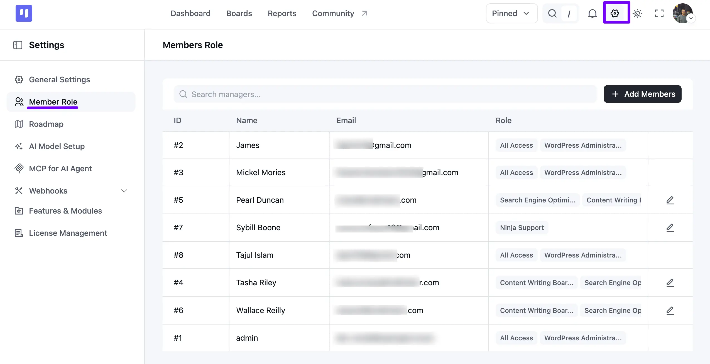
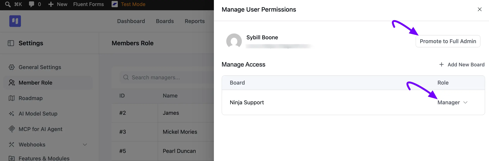

# Member Roles

Managing members and their permissions in FluentBoards is simple and flexible. You can add members to your boards, assign roles, and control their access based on their responsibilities. This guide explains the available member roles and how to manage permissions across your FluentBoards workspace.

## Members Role Global Setting

Go to the **Settings** of your FluentBoards and select **Member Role** from the left sidebar. Here you can see a table of all your members, with their **ID**, **Name**, **Email**, and **Role**. Use the **Search managers** field to find someone quickly, or click the **+ Add Members** button to add a new one.

Members with full site access show an **All Access** badge alongside their WordPress role, while regular members show the specific boards they're assigned to instead. Click the **Pencil** icon on the right side of a member's row to manage their access.

A **Manage User Permissions** pop-up will appear. Click the **Promote to Full Admin** button if you'd like to give this member full access to FluentBoards.

Under **Manage Access**, you'll see every board this member has a role on, along with a dropdown to change their **Role** for each one. Click **+ Add New Board** to give them access to another board directly from here.

We are describing all the roles within FluentBoards:

**WordPress Administrator:** WordPress Administrators have full access to FluentBoards.

**Full Admin:** This role has complete access to FluentBoards. A WordPress Administrator can promote a member to Full Admin, and a Full Admin can promote other members the same way. Any WordPress user role can be promoted to Full Admin.

**Admin/Manager:** An Admin or Manager can manage only those boards where they have been designated as Admin or Manager by a WordPress Administrator or Full Admin. Admin or Manager can be selected from any WordPress user role.

Admin/ Manager can manage the boards where they are assigned as an Admin/ Manager. They also have the ability to delete boards, add members on boards, and add another Admin/Manager on boards.

By default, only a WordPress Administrator or Full Admin can create new boards. If you want to let any team member create their own boards, go to the FluentBoards **Settings** and select **General Settings**, then toggle on **Board Creation Permission**.

**Members:** The roles mentioned above (WordPress Administrator, Full Admin, Admin/Manager) can add any WordPress user as a member to a board. Members have access only to the boards to which they are assigned. Members cannot delete or create boards. They can only manage board tasks and assign members to board tasks.

This is how you can manage your member role.
