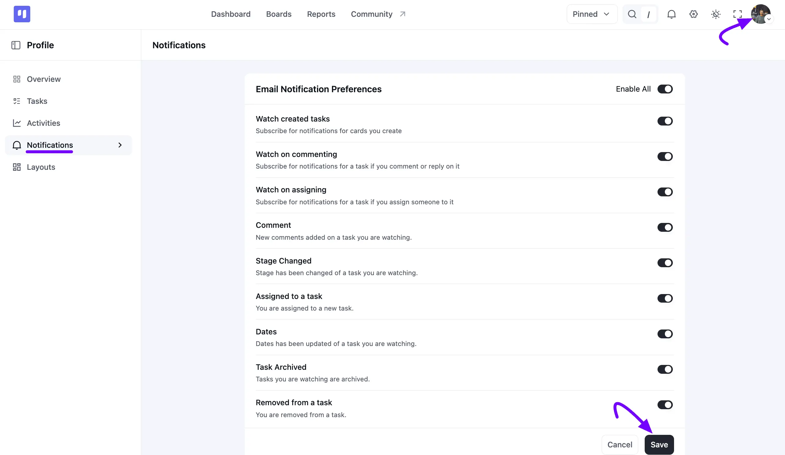
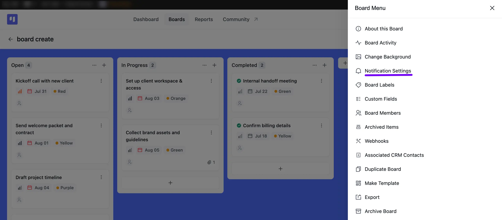
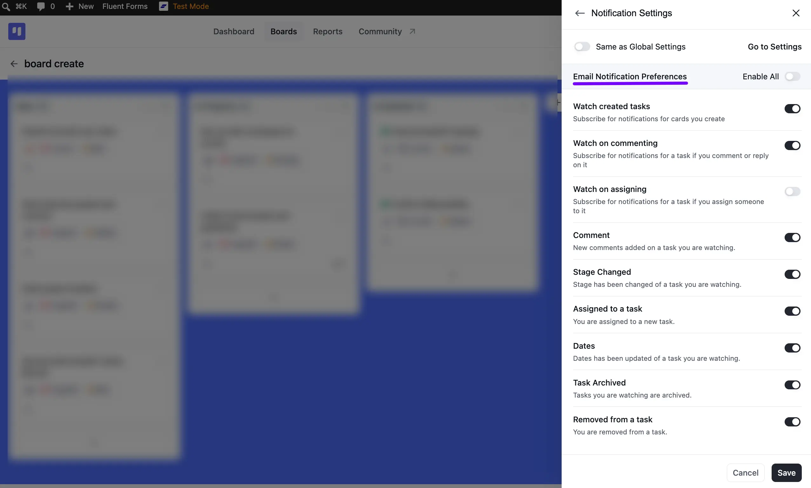

# Notification Settings

FluentBoards Notification Settings give you control over how and when you receive notifications for your board updates. You can customize notifications to match your workflow, choosing alerts for specific actions like task assignments, comments, or due date changes.

This guide will show you how to configure notification settings for individual tasks and entire boards, helping you stay updated.

## Email Notification Settings

To enable or disable your notification settings, click on your **Profile Image** in the top right corner of your FluentBoards Dashboard, then select **Notifications** from the left sidebar.

Under **Email Notification Preferences**, toggle **Enable All** to turn every notification on or off at once, or toggle individual options. Once you're done, click the **Save** button to apply your changes.

Here, you'll find various types of options for receiving notifications, which include:

- **Watch created tasks**: Subscribe for notifications for cards you create.
- **Watch on commenting**: Subscribe for notifications for a task if you comment or reply on it.
- **Watch on assigning**: Subscribe for notifications for a task if you assign someone to it.
- **Comment**: New comments added on a task you are watching.
- **Stage Changed**: Stage has been changed of a task you are watching.
- **Assigned to a task**: You are assigned to a new task.
- **Dates**: Dates has been updated of a task you are watching.
- **Task Archived**: Tasks you are watching are archived.
- **Removed from a task**: You are removed from a task.

## Board Notification Settings

You have the option to get notifications for specific boards as well. To do this, navigate to the board for which you want to customize notifications, then click on the **Three Dot** button in the top right corner. A **Board Menu** popup will appear, select **Notification Settings** from here.

A **Notification Settings** panel will open for this board. Toggle **Same as Global Settings** on if you'd rather this board just follow your account-wide preferences instead, or click **Go to Settings** to manage those directly.

Otherwise, toggle **Enable All** or the individual options below to personalize the notifications for this particular board:

**Watch created tasks:** Subscribe for notifications for cards you create.

**Watch on commenting:** Subscribe for notifications for a task if you comment or reply on it.

**Watch on assigning:** Subscribe for notifications for a task if you assign someone to it.

**Comment:** Get alerts when someone leaves a new comment on a task you're watching.

**Stage Changed:** Get alerts when a task you're following reaches a new stage.

**Assigned to a task:** Get alerts whenever a new task is given to you.

**Dates:** Get alerts when a task you are following updates in terms of its dates.

**Task Archived:** Get alerts when a task you are watching is archived.

**Removed from a task:** Get alerts when you are removed from a task.

Once you're done, click the **Save** button to apply your notification changes.

If you have any further questions, concerns, or suggestions, please do not hesitate to contact our [support](https://wpmanageninja.com/support-tickets/?utm_source=wpmn&utm_medium=home&utm_campaign=site#/){:target="_blank"} team.