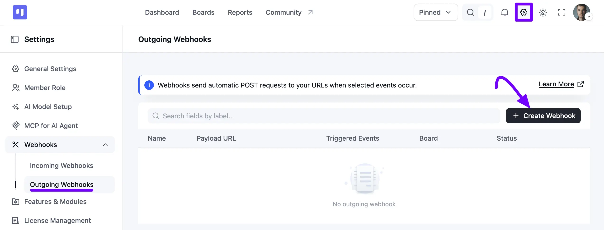
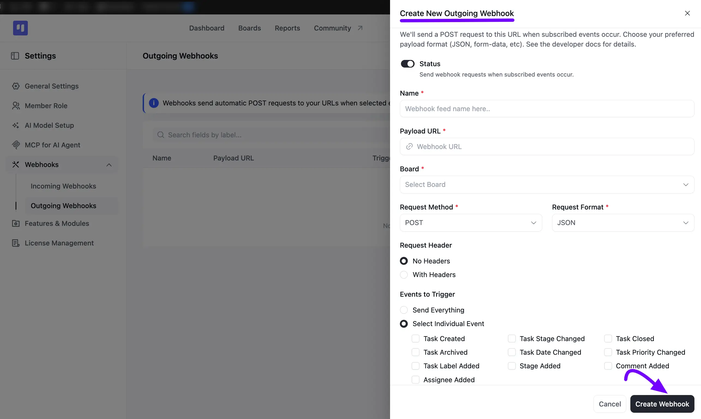
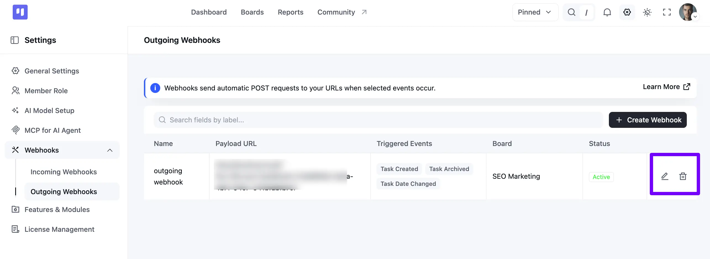

# Outgoing Webhooks

The Outgoing Webhooks feature in Fluent Boards provides a powerful way to connect your project management workflow with thousands of other applications and services. By using webhooks, you can send real-time data from your boards to external platforms, enabling automation and integration.

This guide will provide a detailed overview of how to configure and manage Outgoing Webhooks within Fluent Boards.

**Common Use Cases:**

- **Real-time Notifications:** Send a message to a Slack or Discord channel when a new task is assigned.
- **Workflow Automation:** Use services like Zapier or Make to trigger multi-step workflows, such as creating a Google Calendar event when a task's stage is changed.
- **Data Logging:** Add a new row to a Google Sheet or Airtable base every time a task is completed, creating a log of your team's accomplishments.
- **Custom Integrations:** Send task data to a custom-built application or a third-party API for advanced processing.

<VideoEmbed id="zl0Ot_Y3Y8k" />

## Configuration Steps

Configuring your webhook is a straightforward process.

#### Step 1: Navigate to the Webhook Settings

First, go to the **Settings** of your FluentBoards. On the left sidebar, click **Webhooks** to expand it, then select **Outgoing Webhooks**.

This screen is your main dashboard for managing all created webhooks. A banner at the top reminds you that webhooks send automatic POST requests to your URLs when selected events occur. Use the **Search fields by label** box to find a specific webhook.

#### Step 2: Create a New Webhook

Click the **+ Create Webhook** button to open the configuration form. Below is a detailed explanation of each field.

**Status:** This is the main on/off switch for your webhook. Turn it on when you want it to work.

**Name:** Give your webhook a simple name so you remember what it does. For example: Send new tasks to my team.

**Payload URL:** This is the special link you get from the other app (like Slack or Zapier). Just **copy that link and paste it here**.

**Board:** Choose **which project board** this webhook should watch. It will only pay attention to the board you select.

**Request Method & Request Format:** You can **safely ignore these**. The default settings (POST and JSON) are what you need.

**Request Header:** This is an advanced option for security. Choose **No Headers** to leave this alone, or **With Headers** to add a secret password or an ID badge to your message so the receiving application knows it's really you.

- **Header Name:** This is the *type* of ID the other app is looking for. The app will tell you exactly what to enter here, for example, Authorization or X-API-Key.
- **Header Value:** This is your actual *secret key or password*. You will copy this from the other service and paste it here.

**Events to Trigger:** This is where you choose which actions on your board will send the data. You have two main options:

- **Send Everything:** Select this option if you want the webhook to fire for every single event that happens on the board.
- **Select Individual Event:** Select this to choose specific events. Only the events you check will send data.

If you choose **Select Individual Event**, you can check the box next to the specific actions you want to monitor:

- **Task Created:** Triggers when a new task is made.
- **Task Stage Changed:** Triggers when a task is moved to a different stage.
- **Task Closed:** Triggers when a task is marked as complete.
- **Task Archived:** Triggers when a task is archived.
- **Task Date Changed:** Triggers when a task's due date is added or updated.
- **Task Priority Changed:** Triggers when a task's priority is changed.
- **Task Label Added:** Triggers when a label is added to a task.
- **Stage Added:** Triggers when a new stage (column) is created on the board.
- **Comment Added:** Triggers when a new comment is added to a task.
- **Assignee Added:** Triggers when a user is assigned to a task.

After filling out the form, click **Create Webhook**. Your webhook is now configured and, if set to **Active**, will begin monitoring your board for the specified trigger events.

#### **Managing Existing Webhooks**

Once you have created one or more webhooks, they will be listed on the **Outgoing Webhooks** dashboard. This central view allows you to see and manage all of your configured integrations at a glance.

Each row in the list provides a summary of the webhook's configuration:

- **Name:** The custom name you assigned to the webhook.
- **Payload URL:** The destination URL where the data is sent.
- **Triggered Events:** The specific events that will trigger this webhook, shown as tags.
- **Board:** The project board the webhook is associated with.
- **Status:** A badge indicating whether the webhook is currently **Active** or **Inactive**.

**Action Icons**

- **Pencil icon:** If you need to make a change, like updating the URL or adding a new trigger, click this icon.
- **Trash icon:** If you no longer need a webhook, click this icon to permanently remove it.

