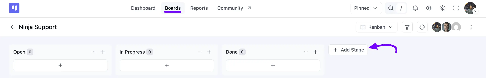
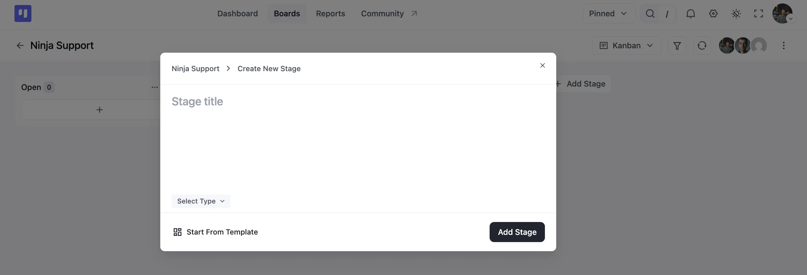
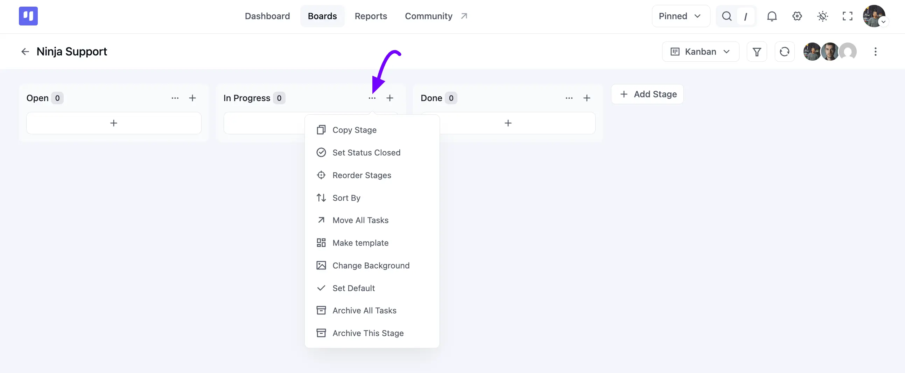
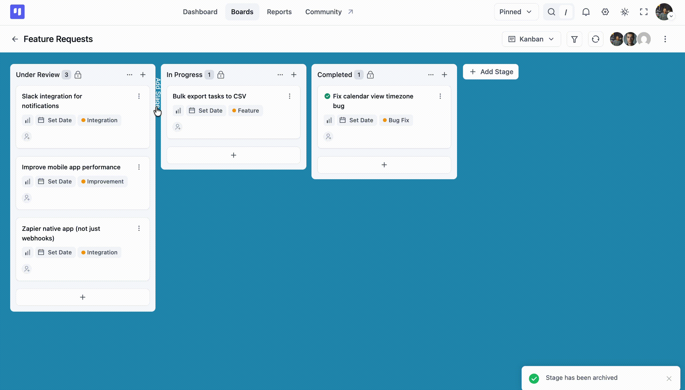

# Creating and Managing Stages

Within your boards, you have the flexibility to create as many stages as needed to streamline your projects. Adding a stage to your board is straightforward and comes with a range of features. In this guide, we'll walk you through the process of creating a stage on the board and explore the features available for the stage.

## Add New Stage

Go to the specific board where you want to add a stage. Look for the **Add Stage** button on your board, and simply click on it.

A **Create New Stage** pop-up will appear. Enter a **Stage title**, then use the **Select Type** dropdown to mark the stage as *Open* or *Closed*.

If you'd rather start from a saved stage, click **Start From Template** instead of filling in the title yourself. Once you're done, click the **Add Stage** button to add it to the board.

## Stage Actions

At the top right corner of your stage, you'll find a **Three Dot** icon button. Clicking on it will reveal several actions specific to this stage. Below, we'll detail all the available actions for your Stage.

**Copy Stage:** This action duplicates the stage, creating another identical stage.

**Set Status Closed:** This action toggles the stage status between open and closed.

**Reorder Stages:** Opens a pop-up allowing you to rearrange the stage order using drag and drop. Also, you have the option to rearrange your stages in boards using the drag and drop feature.

**Sort By:** Filters stage tasks by *Date Created (Newest First), Date Created (Oldest First),* or *Task Name (Alphabetically).*

**Move All Tasks:** Moves all tasks to any stage within the board.

**Make Template:** Converts the stage into a template for future use in other boards.

**Change Background:** Customize the background for this stage.

**Set Default:** Marks this stage as the board's default stage.

**Archive All Tasks:** Archives all tasks within the stage.

**Archive This Stage:** Archives the current stage.

> [!Note]
> Want a member automatically assigned whenever a task lands in a stage? That's a separate feature — check out the [Stage Default Assignee](/stage-default-assignee) guide.

## Create Intermediate Stage

You can instantly create a stage in FluentBoards. Simply hover between two existing stages, and you'll see an **Add Stage** button appear in the gap between them.

Click on it, and the same **Create New Stage** pop-up you saw earlier will open. Give it a title and click **Add Stage**, and your new stage will slot in right between the two you started with.

That's the process for creating and managing stages in boards. If you have any further questions, don't hesitate to reach out to [us](https://wpmanageninja.com/support-tickets/?utm_source=wpmn&utm_medium=home&utm_campaign=site#/){:target="_blank"}.