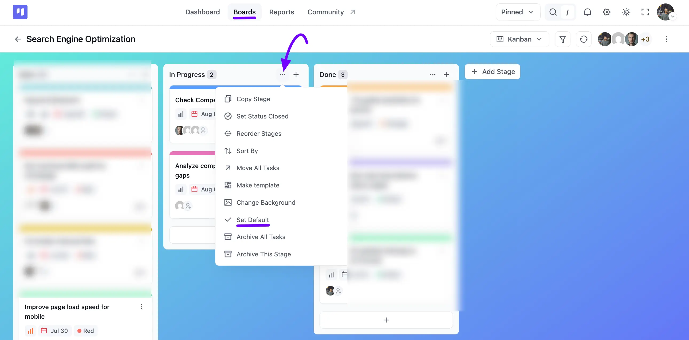
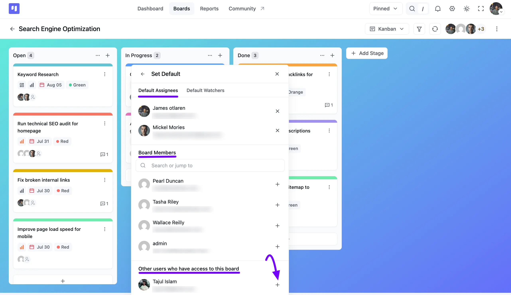
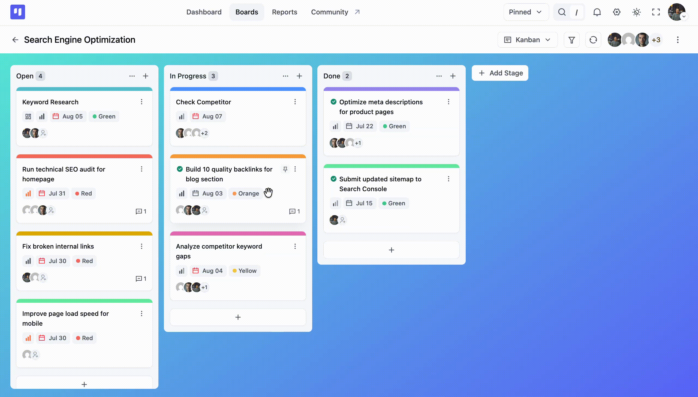

# Stage Default Assignee

FluentBoards allows you to set default assignees and watchers for specific board stages. When a task is created in or moved into that stage, those members are automatically added to the task and notified. You can add as many default members as you like to a single stage.

Here's how to set a default assignee for a stage:

Navigate to the specific stage, click the **Three Dot** icon at the top of the stage, and select **Set Default** from the menu.

A **Set Default** pop-up will appear with two tabs: **Default Assignees** and **Default Watchers**. Anyone already added shows at the top, with an **X** button to remove them.

Under **Board Members**, use the search field to find a member, then click the **Plus** icon next to their name to add them. Members who have access to the board through some other role appear further down, under **Other users who have access to this board**, with the same **Plus** icon.

Switch to the **Default Watchers** tab and repeat the same steps if you'd rather have members watch tasks in this stage instead of being assigned to them.

Once set, any task that lands in this stage automatically picks up your chosen default assignees, as shown below:

