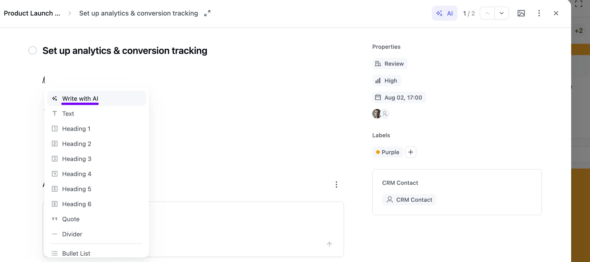
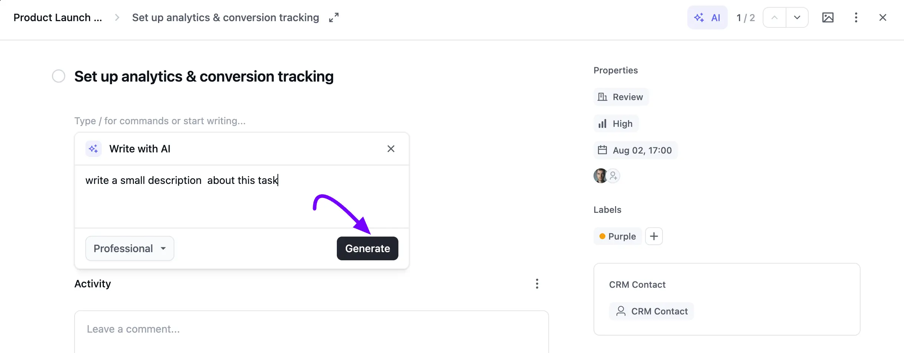
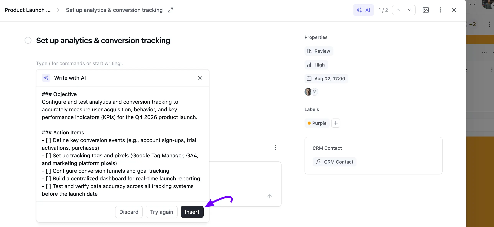
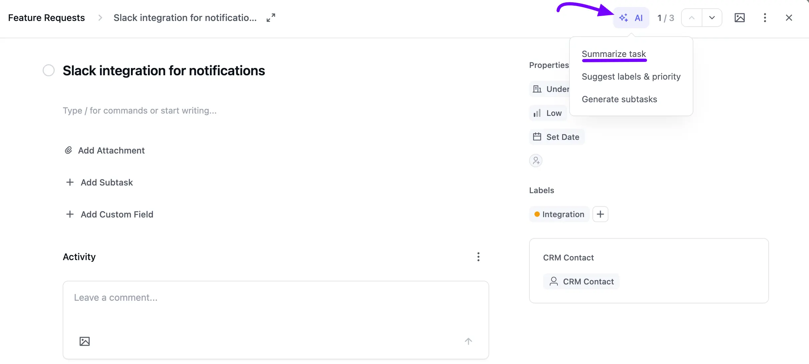
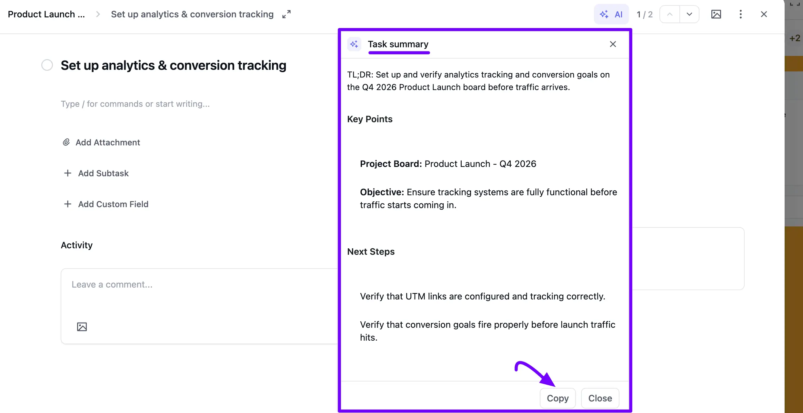
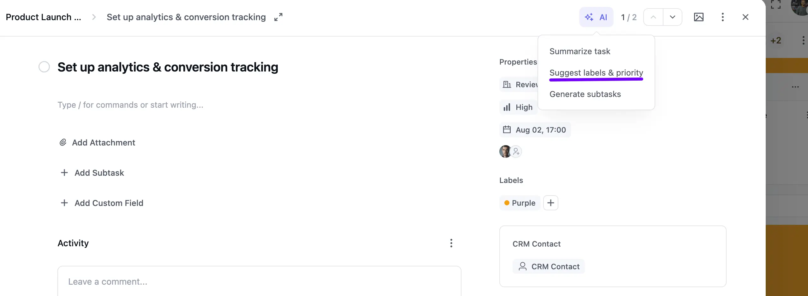
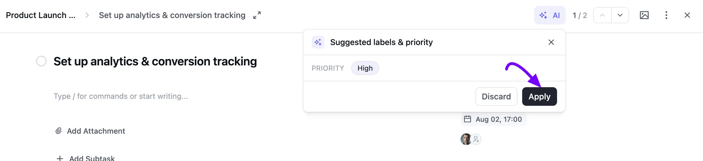
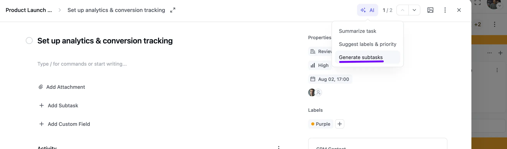
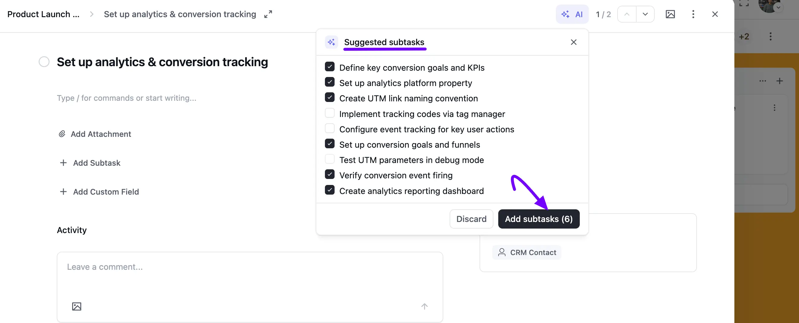

# AI Features in Task Cards

FluentBoards gives you AI-powered tools right inside your task cards, so you can draft content, summarize tasks, and organize work faster. These include the AI Writing Assistant, automatic subtask generation, task summaries, and smart label and priority suggestions.

In this guide, we'll walk you through how to use each AI feature inside your FluentBoards task cards.

> [!Note]
> These features need an AI provider connected first. Head to the [AI Model Setup](/ai-model-setup) guide to enable AI and pick a provider before using any of the features below.

## Using AI Writing Assistant in Task Descriptions

The AI Writing Assistant helps you draft, polish, or generate a detailed task description using a simple prompt.

1. Open the task card where you want to add or update the description.

2. Click on the **Description** field, or type **/** to open the block menu.

3. Select **Write with AI**.

4. Enter your prompt (e.g., *write a small description about this task*) and choose your desired writing tone (e.g., *Professional*).

5. Click the **Generate** button.

6. Review the AI-generated output. Click **Discard** to start over, **Try again** to regenerate, or **Insert** to add the text directly into your task description.

## Generating Task Summary

When you're working with a detailed task, you can instantly generate a concise summary to review its key points and next steps.

1. Open the task card.

2. Click the **AI** dropdown button at the top-right corner of the task modal.

3. Select **Summarize Task**.

4. A pop-up window will display the generated **Task Summary**, highlighting a TL;DR summary, **Key Points**, and **Next Steps**.

5. Click **Copy** to save the summary to your clipboard, or **Close** to exit.

## Getting Suggested Labels & Priority

AI can analyze your task details and automatically suggest an appropriate priority and labels for it.

1. Open the task card.

2. Click the **AI** dropdown button at the top-right corner.

3. Select **Suggest Labels & Priority**.

4. A pop-up box will display the AI-recommended priority level (such as **High**, **Medium**, or **Low**) along with relevant labels.

5. Click **Apply** to automatically set the suggested properties on your task, or **Discard** to reject them.

## Generating Subtasks with AI

You can break a complex task down into manageable action items automatically with AI subtask generation.

1. Open the task card.

2. Click the **AI** dropdown button at the top-right corner.

3. Select **Generate Subtasks**.

4. A list of **Suggested Subtasks** will appear with a checkbox next to each item.

5. Select or deselect individual subtasks based on your preference.

6. Click **Add Subtasks** to insert the selected items into your task card, or click **Discard** to dismiss them.

> [!Note]
> Want an external AI assistant like Claude or Cursor to read and manage your boards directly, instead of using these in-card tools? That's a separate integration — check out the [MCP for AI Agents](/mcp-for-ai-agents) guide.
