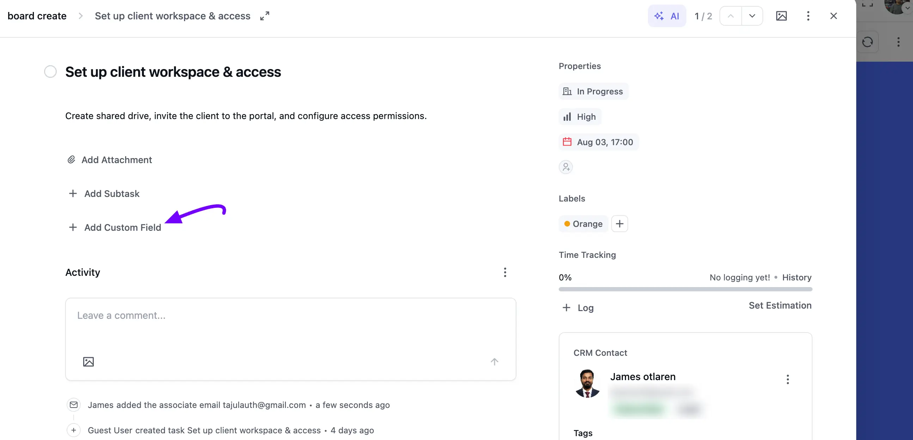
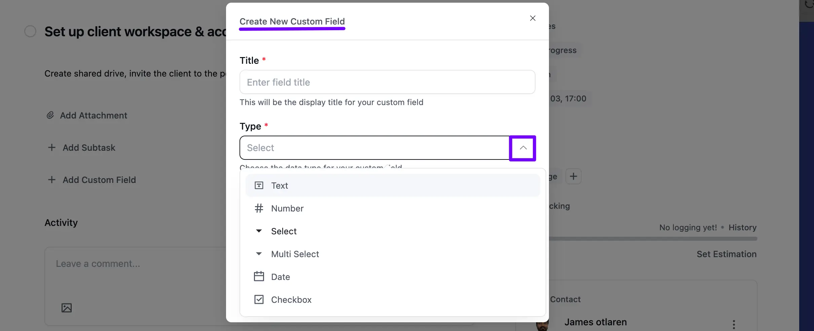
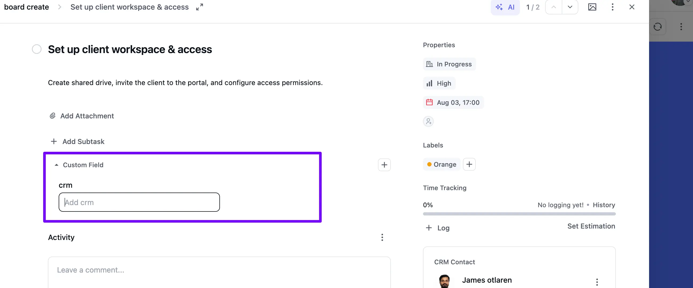
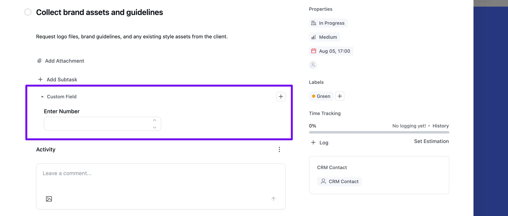
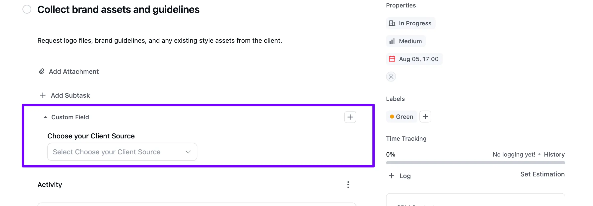
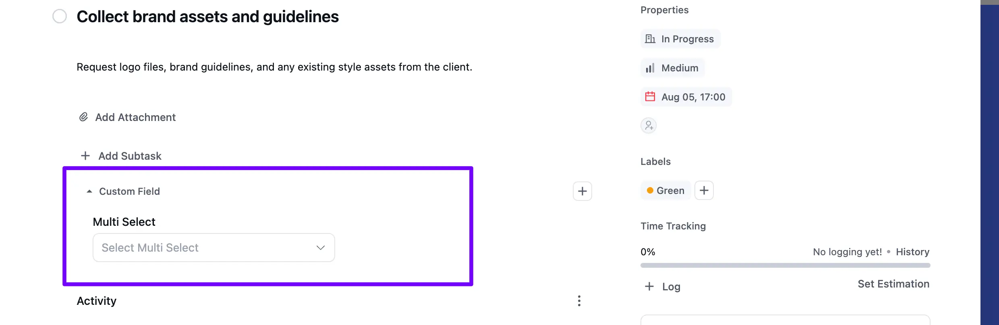
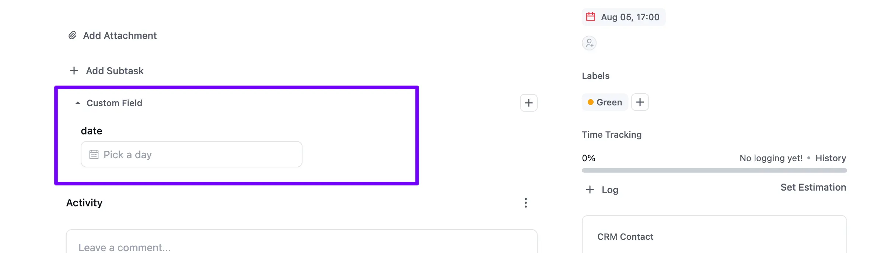
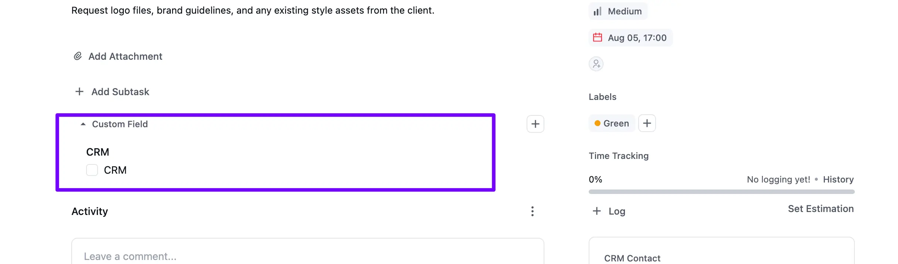
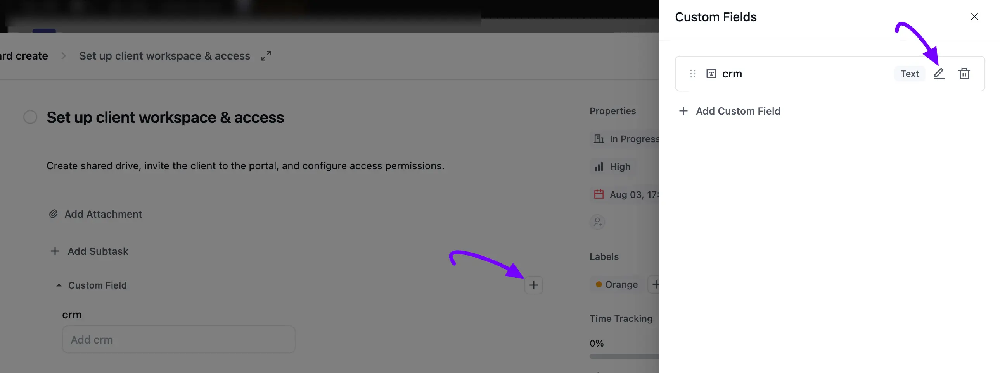
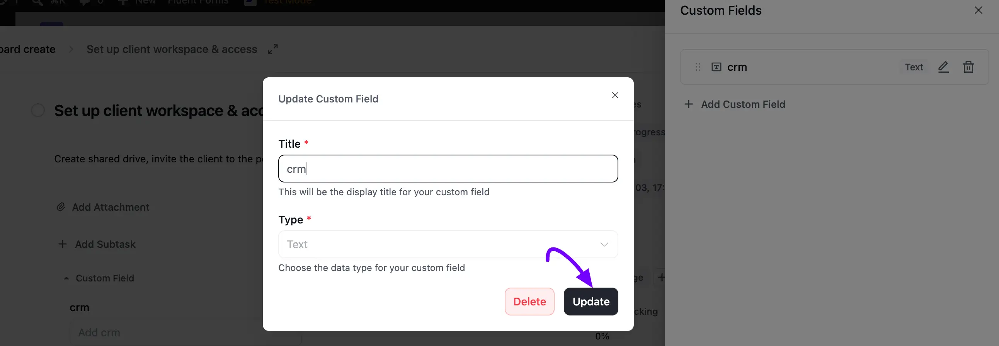

# Custom Fields

Custom Fields in FluentBoards allow you to add task-specific information tailored to your workflow. Whether it's a text note, a number, a deadline, priority level, or any other detail, Custom Fields make your Task Board more flexible and personalized.

This guide walks you through how to **create**, **manage**, and **customize** fields to suit your project needs.

## Add New Custom Field

Open the task you want to add a custom field to, then click the **+ Add Custom Field** link in the task body.

A **Create New Custom Field** pop-up will appear. Enter a **Title** for your field, then choose a **Type** from the dropdown: **Text**, **Number**, **Select**, **Multi Select**, **Date**, or **Checkbox**. Once you're done, click the **Create** button.

After saving, the field appears under a new **Custom Field** section in the task, right below **Add Subtask**.

## Field Type

FluentBoards supports several field types, each offering different ways to input and display data. Below is a detail of the available types:

**Text:** Select **Text** if you want to add simple text-based input. The field appears under **Custom Field** with a plain text box.

**Number:** Choose the **Number** type to add numerical input. The field appears with an **Enter Number** box, complete with up and down arrows to adjust the value.

**Select:** Use the **Select** type when you want to choose one option from a list. When creating the field, use the **+ Add Option** button to add each choice, and the field appears as a dropdown in the task.

**Multi Select:** Choose **Multi Select** if you need to select more than one option. Just like **Select**, add your choices with the **+ Add Option** button while creating the field.

**Date:** The **Date** type lets you assign a specific calendar date. Click **Pick a day** in the task to open a calendar picker.

**Checkbox:** If you want to add a simple yes/no option, select the **Checkbox** type. This field appears as a **single checkbox** on the task.

## Editing and Deleting a Custom Field

Once a task has at least one custom field, click the **Plus** icon next to the **Custom Field** section header to open the **Custom Fields** panel. Every field on the task is listed here with its type, along with a **Pencil** icon to edit it and a **Trash** icon to delete it. Click **+ Add Custom Field** at the bottom to add another field.

Click the **Pencil** icon to open the **Update Custom Field** pop-up, where you can change the field's **Title** or **Type**. Click **Update** to save your changes, or **Delete** to remove the field entirely.

If you have any further questions, concerns, or suggestions, please do not hesitate to contact our [support team](https://wpmanageninja.com/support-tickets/?utm_source=wpmn&utm_medium=home&utm_campaign=site#/){:target="_blank"}. Thank you.