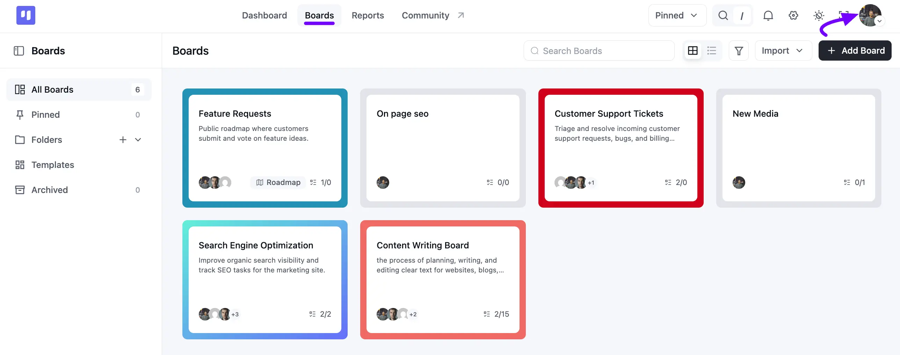
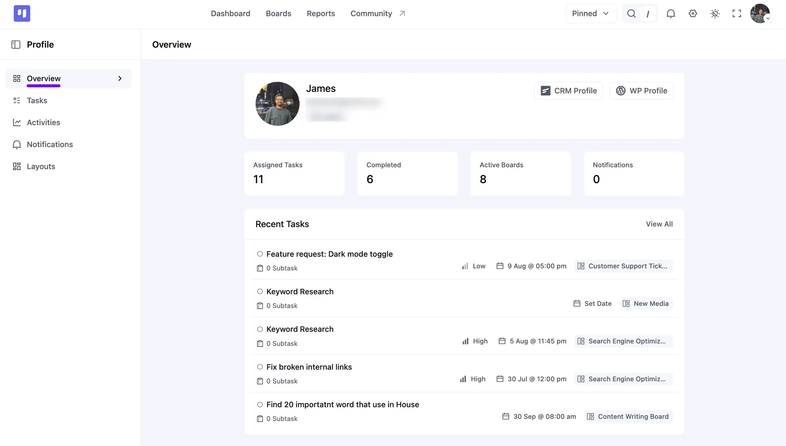
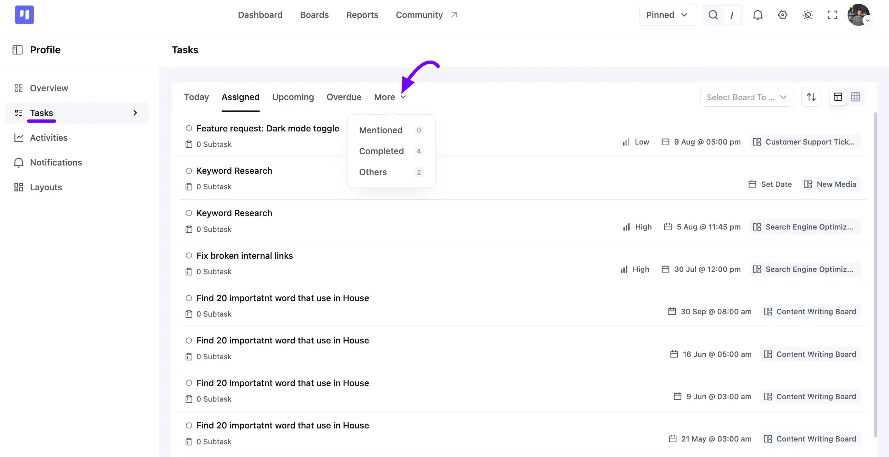
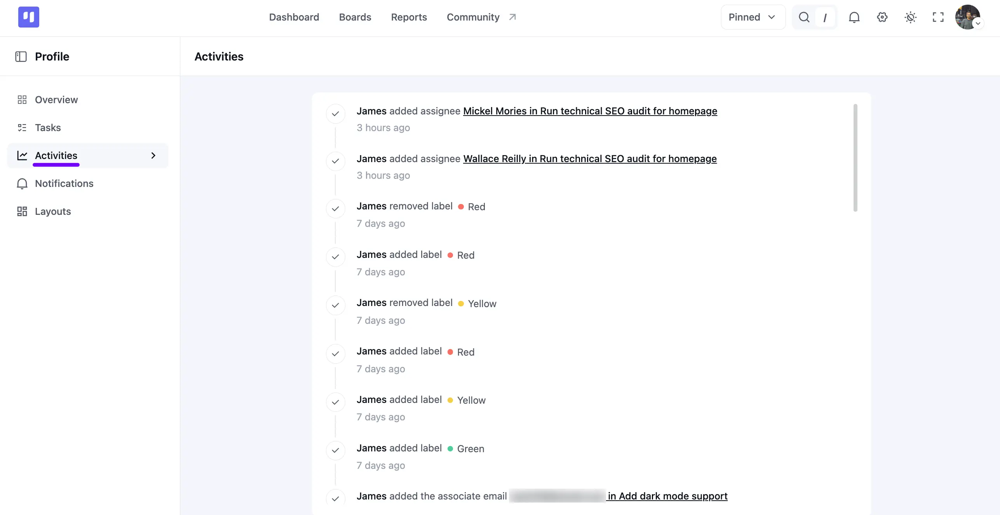
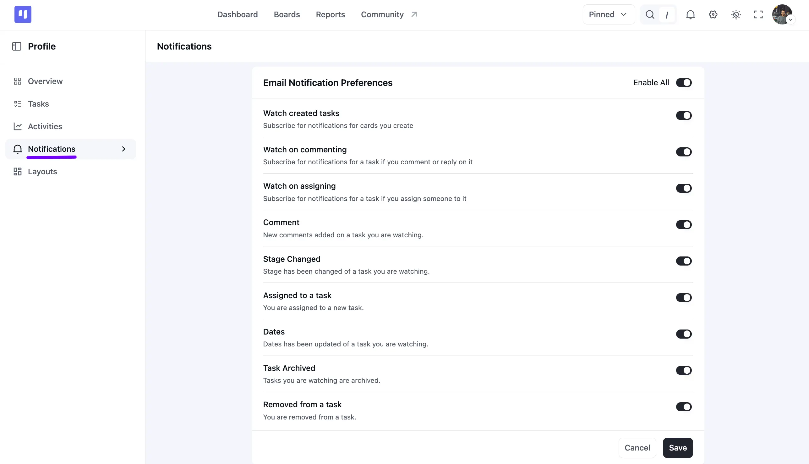

# Your Profile & Tasks

Managing your tasks and activities in FluentBoards is simple with your Profile. From one place, you can view your assigned tasks, recent activities, notifications, and layout preferences, giving you a quick overview of your work and helping you stay organized.

## Opening Your Profile

Go to your FluentBoards Dashboard and click on your **Profile** image in the top right corner of the navbar.

Your **Profile** page opens with a left sidebar showing five sections: **Overview**, **Tasks**, **Activities**, **Notifications**, and **Layouts**.

## Overview

The **Overview** tab displays your basic profile information, including your name and email address. It also provides quick access to your **CRM Profile** and **WP Profile**.

Below your profile details, you'll find four stat cards that provide a quick summary of your work:

 * **Assigned Tasks:** The total number of tasks currently assigned to you.
 * **Completed**: The number of tasks you've completed.
 * **Active Boards:** The number of boards you're actively involved in.
 * **Notifications:** The total number of unread notifications.

Further down, the **Recent Tasks** section displays your latest assigned tasks along with their **Priority**, **Due Dat**e, and **Board**. Click **View All** to open your complete task list.

## Tasks

Select **Tasks** from the left sidebar to view all tasks assigned to you.

Use the **Today, Assigned, Upcoming**, and **Overdue** tabs to quickly filter tasks based on their status or due date. Click **More** to access additional filters, including **Mentioned**, **Completed**, and **Others**.

To display tasks from a specific board, use the board dropdown on the right. You can also switch between **Card** and **Table** views or click the **Sort** icon to organize tasks in your preferred order.

## Activities

Open the **Activities** tab from the left sidebar to view a timeline of your recent actions in FluentBoards.

This timeline records activities such as assigning members, adding or removing labels, and other task-related updates. Each activity also shows when the action was performed.

## Notifications

Open the Notifications tab to manage your email notification preferences.

For detailed information about each notification option, see the [Notification Settings](/notification-settings) guide.

## Layouts

Open the Layouts tab to customize the information displayed on your task cards.

For a detailed explanation of each option, see the [Card View Preferences](/card-view-preference-settings) guide.

