# Creating and Managing Tasks

You can easily add tasks with several features to your boards. FluentBoards makes it simple to add tasks. We'll walk you through the process of adding tasks to your board in this guide.

## Adding New Task

Just head over to the board where you want to add the task. Then, you can either click on the **Plus** icon button at the top of the stage to add a task.

You can also drag and drop or paste an image directly onto the Kanban view, and FluentBoards will instantly create a new task with that image attached.

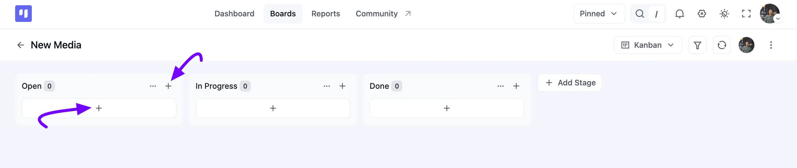

A quick-create pop-up will appear. Give a **Title** for your **Task**, and add a description if you'd like. From here, you can also set the **Stage**, **Priority**, **Labels**, **Background**, and dates right away, or click **Start From Template** to create the task from an existing template. 

Once you're done, click the **Create Task** button and your task will be added to your board stage.

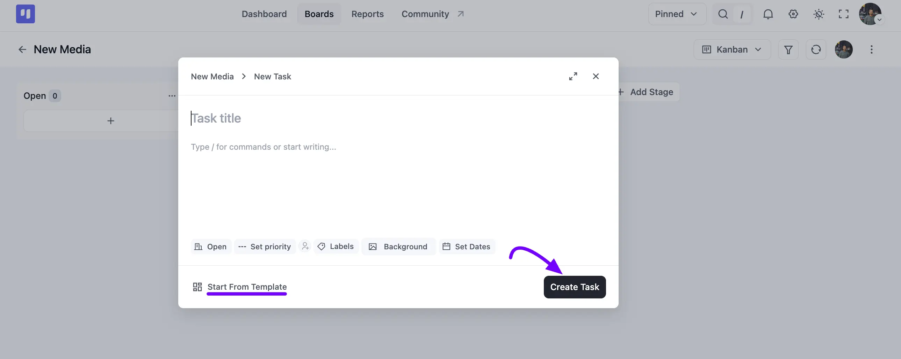

## Task Management Options

Click on the task card, and you'll find many features here to help you manage your task effectively. 

The redesigned Task Details Modal keeps all of these features in one clean view, with your task's **Properties**, **Labels**, and **CRM Contact** neatly organized on the right side. 

Below, we'll describe each of them in detail.

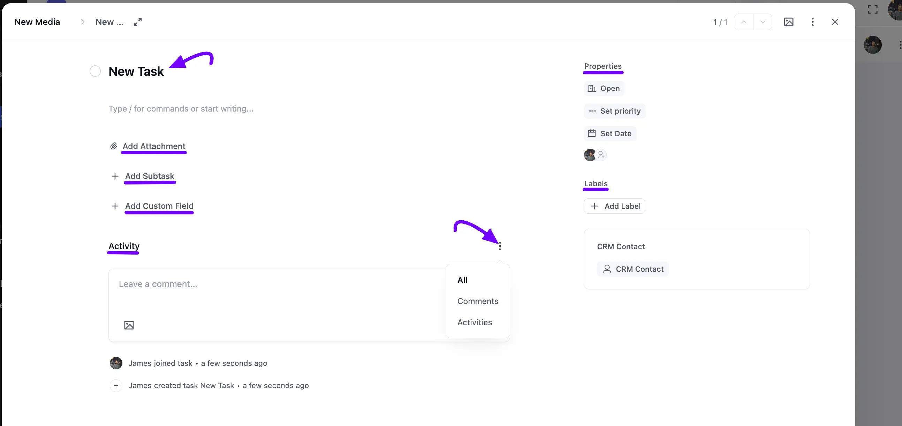

### Assignees

Under **Properties**, click on the assignee icon to open the **Assign to** search box. Here you will see your board members listed, along with any other users who have access to the board. Simply search or click on a name to add them as an assignee to your task.

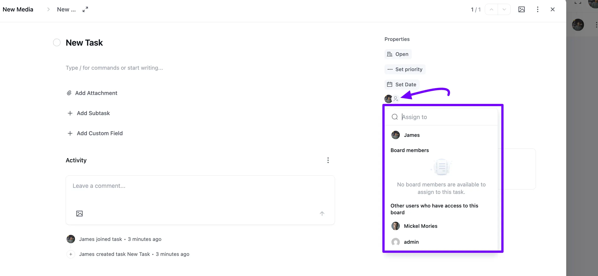

### Due Date

You have the option to add a start date and due date with time to your task. Simply click on the **Set Date** button under **Properties** to access these options.

Here you will see a calendar to pick your **Due Date**, along with a time field next to it. Check the **Start Date** box to also set a start date, and check **Set Reminder** to pick when you'd like to be notified before the due date. 

Once you're done, click the **Save** button, and your dates will be added to your task accordingly.

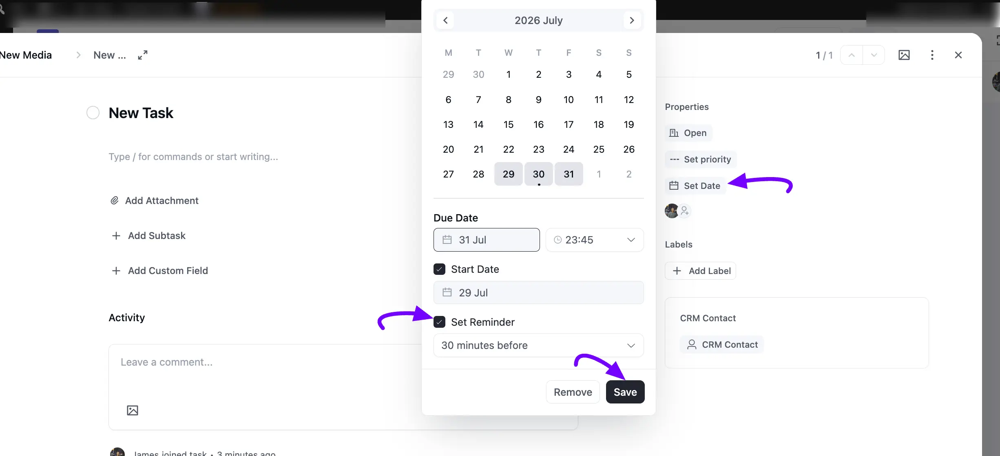

### Task and Subtask Reminders

Once you've set a due date for a task or subtask, you can also add a reminder so you're notified exactly when you need to be. Choose to be reminded before the due date, and never miss a deadline again.

### Priority

Click on the **Set Priority** button under **Properties** to designate the priority level of your task as **Urgent**, **High**, **Medium**, or **Low**, or leave it as **No Priority**. Also, you can customize task priority levels via the [filter hook](https://developers.fluentboards.com/hooks/filters/#fluent_boards_task_priorities){:target="_blank"}.

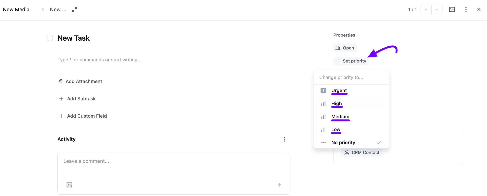

### **Labels**

You can add a **Label** to your task based on your needs. To add a label, click on the **Plus** icon button placed under **Labels**.

A **Change or add labels** pop-up will appear with your board's default color labels. Simply check the **Checkbox** next to a label to apply it, or type in the search field to find or create a new one.

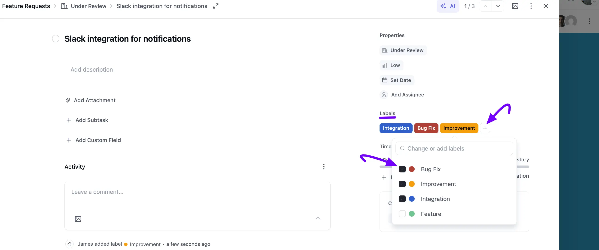

### Description

You can provide a detailed description for your task right in the **Description** field. Type **/** to open the block menu, where you can insert a **Heading**, **Quote**, **Divider**, **Bullet List**, **Ordered List**, and more, just like a Markdown editor.

Once you select or highlight your text, a formatting toolbar appears with **Bold**, **Italic**, **Strikethrough**, **Code**, **Link**, and list options, so you can format your description exactly how you'd like.

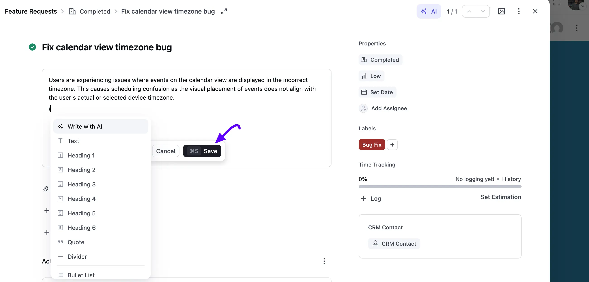

Simply click on the **AI** icon in the description toolbar to open the **AI Writing Assistant**. From here, you can ask it to write, improve, shorten, expand, format, or fix the grammar of your description, or give it a custom instruction of your own.

> Your site admin needs to connect an AI provider (OpenAI, Claude, Gemini, or the WordPress AI client) before the **AI Writing Assistant** appears.

### AI Task Assistant

FluentBoards can use AI to help you manage a task's content. Click on the **AI Assist** button in the task details panel to see the available options.

- **Summarize:** Get a short summary of the task description and its comment history.
- **Generate Subtasks:** Let AI suggest a set of Subtasks based on the task's title and description.
- **Suggest Labels & Priority:** Let AI recommend Labels and a **Priority** level for the task, based on its content.

Review the suggestions in the preview, then click the **Apply** button to add the suggested Subtasks, Labels, or Priority to your task.

### Attachments

To add an attachment to your task, click the **Add Attachment** link. A pop-up will appear where you can click **Browse File** to choose a file from your computer, or drag and drop it in directly. FluentBoards accepts images, PDFs, documents, video, and more, up to 100 MB.

You can also paste a link instead. Simply add the URL under **Paste a Link**, give it a **Display Text**, and click the **Add Link** button.

Once added, your attachments appear in a list under the **Attachments** heading, and you'll see its own upload progress for every file, so you always know how each one is doing.

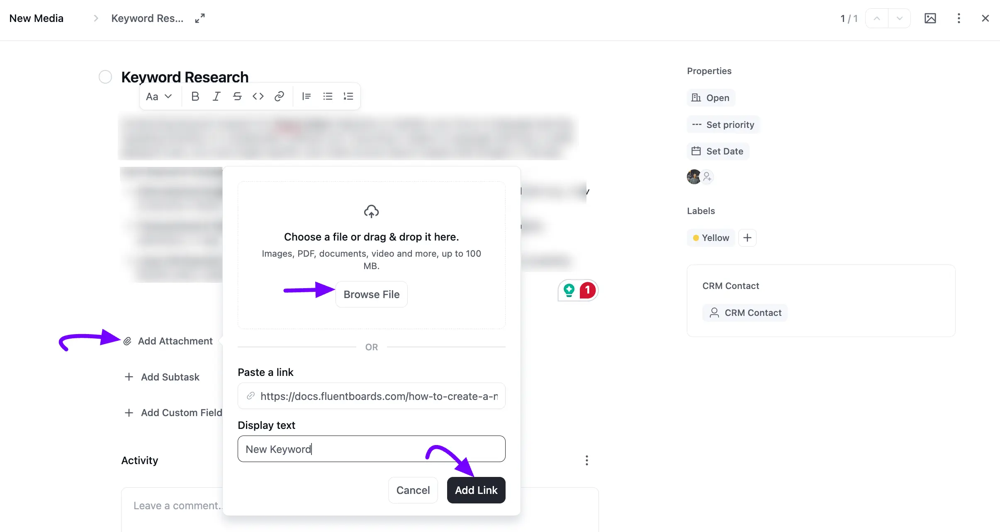

### Adding Subtasks

You can break down your tasks into smaller, more manageable parts by creating Subtasks. With Subtask Groups, you can organize these items for a clearer workflow.

Follow these steps to add Subtasks to your task:

1. Simply click on the **Add Subtask** link in your task.
2. A pop-up will appear. Enter your **Subtask Title**, and add any **Notes** for extra detail right here.
3. Choose an existing **Subtask Group** from the dropdown, or type a new name to create one.
4. From here, you can also set a **Date** and an **Assignee** for the subtask.
5. Once you're done, click the **Create Subtask** button. You can add as many subtasks and subtask groups as you need.

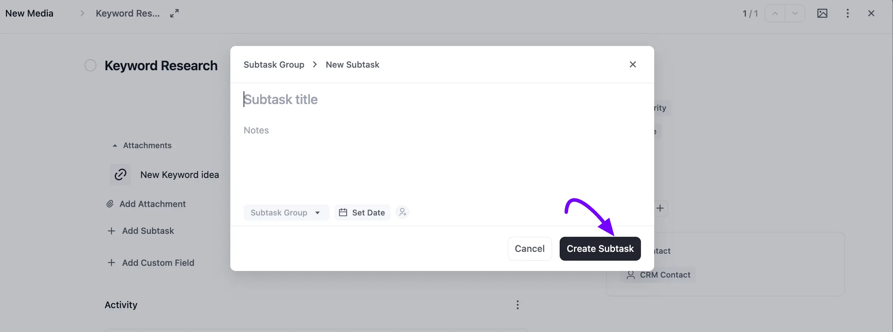

### CRM Contact

To add a CRM contact to your task, click on the **CRM Contact** button. A **Select Contact** pop-up will appear where you can search for a contact by **name or email**. 

Once you've found the right one, click the **Save** button to link it to your task.

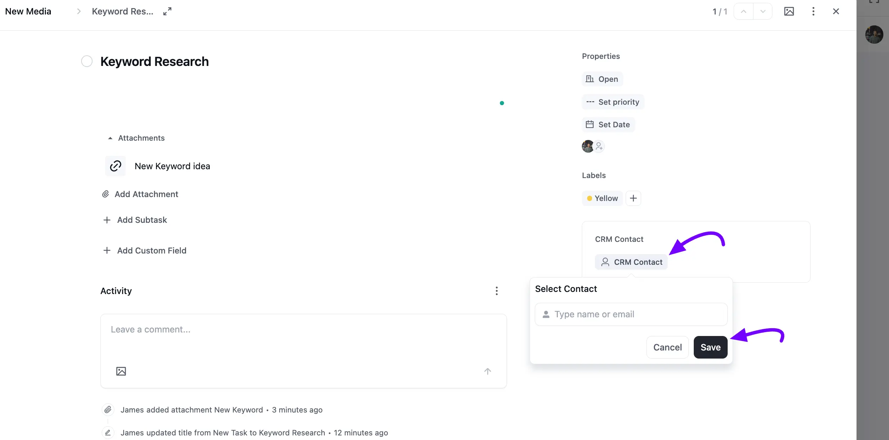

## Mark as Task Completed

Click on the **Circle** icon button next to your task title to mark your task as completed. A tooltip will remind you that this is where you can **Click to change Status**.

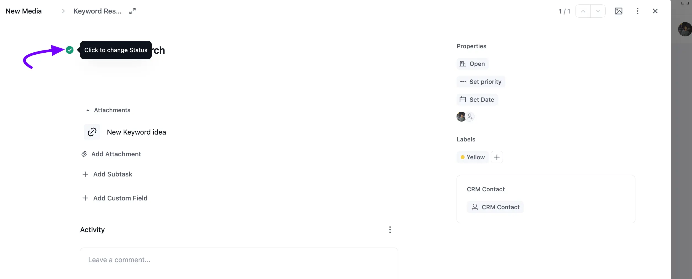

### Task Clone

To clone a task, click the three-dot menu at the top of the task details panel and select **Clone Task**. Similarly, you can clone any subtask using its own three-dot menu, and it will be duplicated within the same task. Note: Cloning is only possible for items within the same board.

This same menu also has your other task actions, like **Copy Task Link**, **Pin Task**, **Watching**, **Move**, **Make Template**, **Convert to Subtask**, **Archive Task**, and **Delete Task**. Check out the [Task Actions](/task-action) guide to learn more about these.

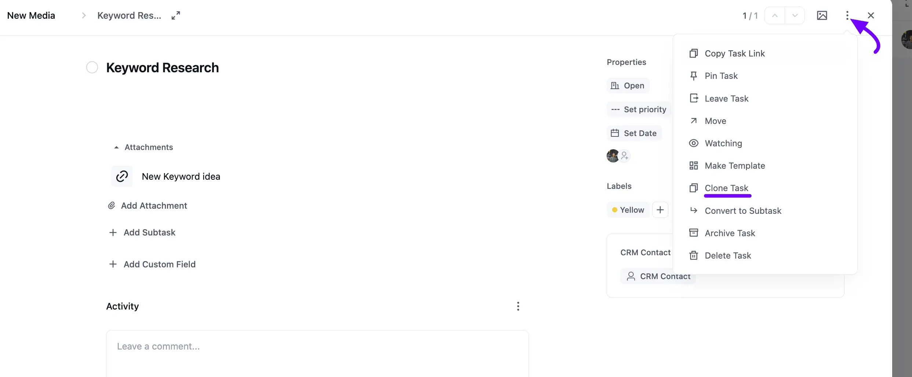

### Add Custom Field

Click on the **Add Custom Field** link in your task. A **Create New Custom Field** pop-up will appear.

Enter a **Title** for your field, then choose its **Type**: **Text**, **Number**, **Select**, **Multi Select**, **Date**, or **Checkbox**. For more details on custom fields, check out the [Custom Fields](/custom-fields-for-task) guide.

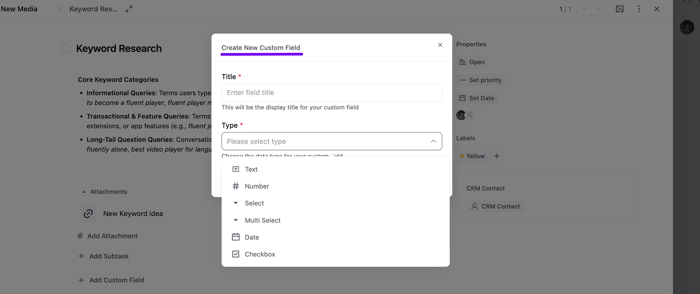

### Task Comments and Activities

Below, you'll find the **Activity** section for the task, redesigned for a cleaner look. Only board members have the ability to comment on tasks and reply to them.

Click on the **three-dot** icon next to **Activity** to filter the feed by **All**, **Comments**, or **Activities**.

Choosing **Comments** shows only the comments left on the task, and you can click **Add a Reply** under any comment to reply to it.

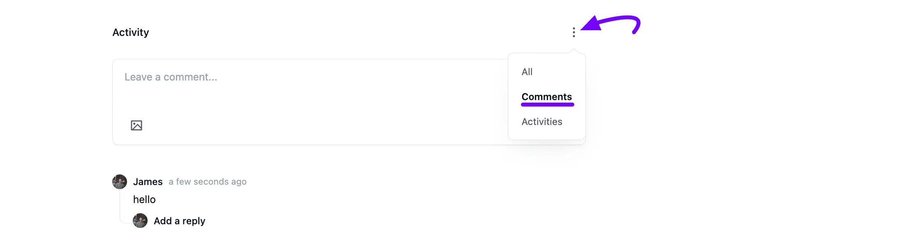

Choosing **Activities** shows a complete, timestamped history of everything that happened on the task, from creation to every label, title, or status change since.

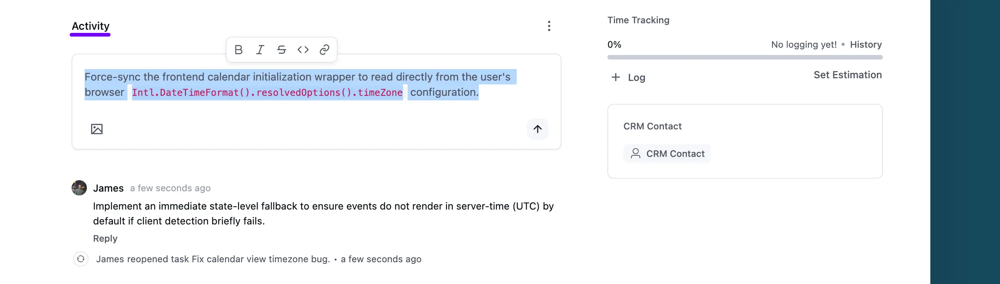

## Task Filter

You can filter your tasks based on assignees, stages, due dates, priorities, labels, CRM contacts, and task status.

Click on the **Filter** icon from the top right corner of your board.

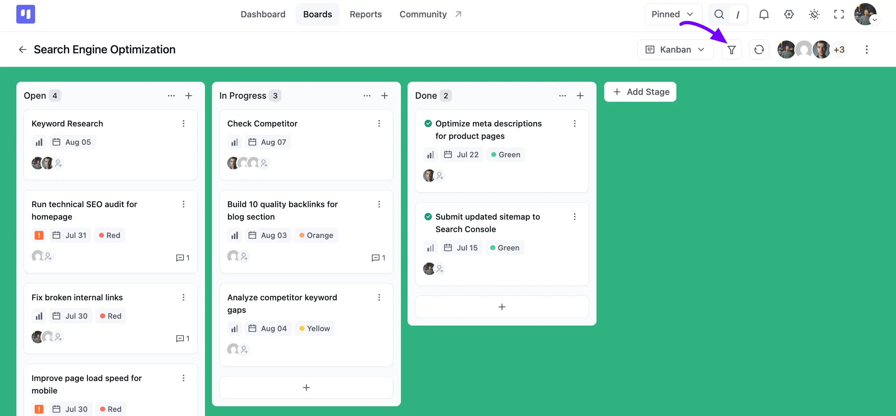

A **Filters** panel appears on the right. Now, you can filter your tasks.

**A. Assignees:** This section allows you to filter tasks based on who they are assigned to.

- Check **No Assignee** to only show tasks with no one assigned.
- Check **Tasks Assigned To Me** to view only the tasks assigned to you.
- Check **Tasks I'm Watching** to only show the tasks you've turned watching on for.
- Use **Select Assignee** to pick a specific board member and see only their assigned tasks.

**B. Stage:** Search or select a specific stage to filter tasks from your boards based on their stage.

**C. Task Status:** You can filter your board tasks based on status.

- **Open:** Shows tasks that are still open.
- **Closed:** Shows tasks that have been marked as completed.
- **Archived:** Shows tasks that have been archived.

**D. Due Date:** This section enables filtering based on task due dates.

- **No Dates:** Shows tasks that have no due date set.
- **Overdue:** Shows tasks that have passed their due date.
- **Task Due in This Week:** Shows tasks due sometime this week.
- **Task Due Today:** Shows tasks due today.
- **Task Due in Next Week:** Shows tasks due next week.
- **Task Due in This Month:** Shows tasks due sometime this month.
- **All Upcoming Task:** Shows every task with an upcoming due date.

**E. Priority:** This filter allows you to view tasks based on their **Urgent**, **High**, **Medium**, **Low**, or **No Priority** levels.

**F. CRM Contacts:** Search or select a contact to only see tasks linked to that CRM contact.

**G. Labels:** Check one or more **Labels** to only see tasks that have those labels applied.

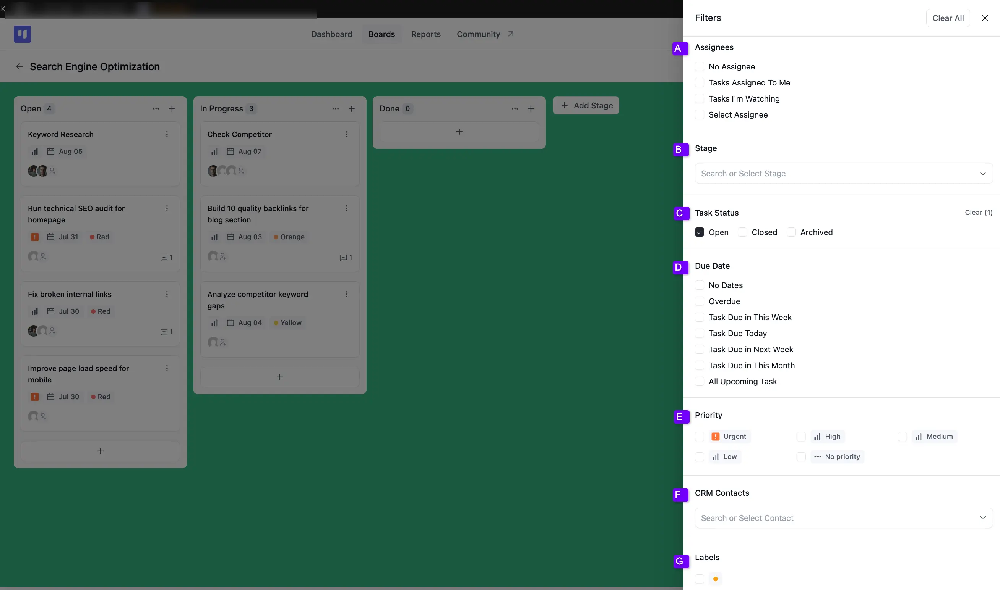

If you have any further queries, please do not hesitate to contact our [support team](https://wpmanageninja.com/support-tickets/?utm_source=wpmn&utm_medium=home&utm_campaign=site#/){:target="_blank"}.
