# Creating and Managing Tasks

You can easily add tasks with several features to your boards. FluentBoards makes it simple to add tasks. We'll walk you through the process of adding tasks to your board in this guide.

## Adding New Task

Just head over to the board where you want to add the task. Then, you can either click on the **Add Task** button within the stages or click on the **Plus** icon button at the top of the stage to add a task.

You can also drag and drop or paste an image directly onto the Kanban view, and FluentBoards will instantly create a new task with that image attached.

Give a **Title** for your **Task** and click on the **Save** button then your task will be added to your board stage.

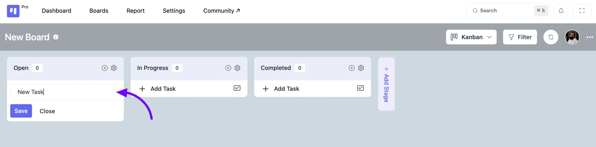

## Task Management Options

Click on the task card, and you'll find many features here to help you manage your task effectively. Below, we'll describe each of them in detail.

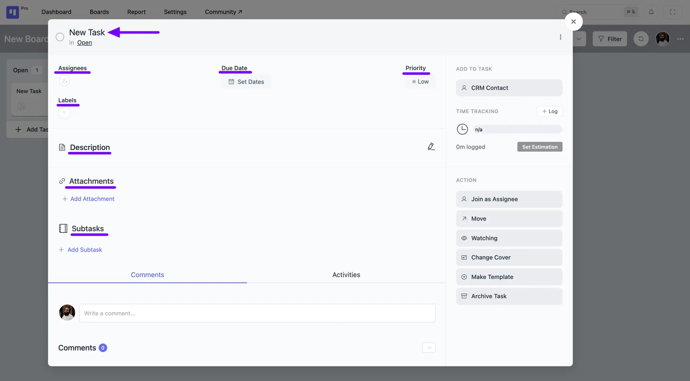

### Assignees

Click on the **Assignee Add** button to see all the board members listed. Click on the **Plus** icon next to the members' names to add them as assignees to your task.

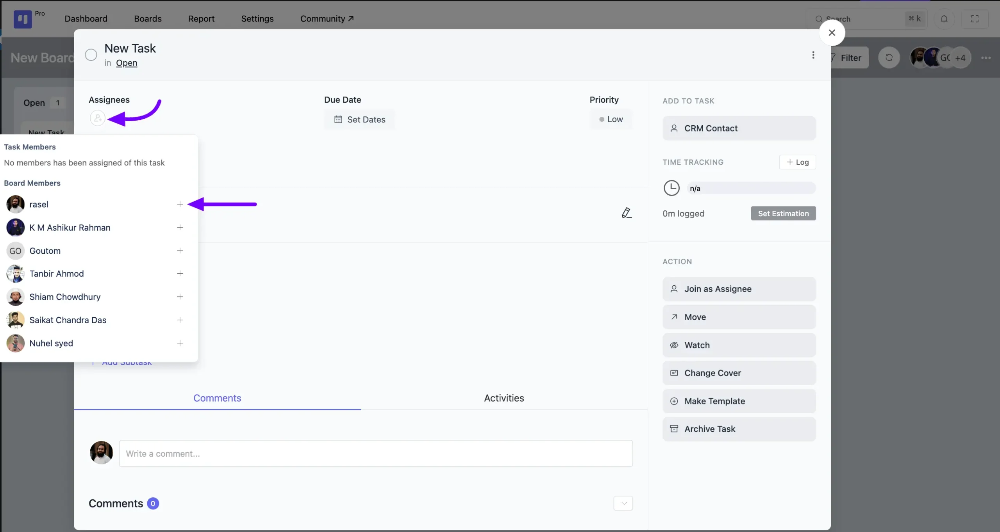

## Due Date

You have the option to add a start date and due date with time to your task. Simply click on the **Set Dates** button to access these options, input your desired dates, and then click **Save**. Your dates will be added to your task with time accordingly.

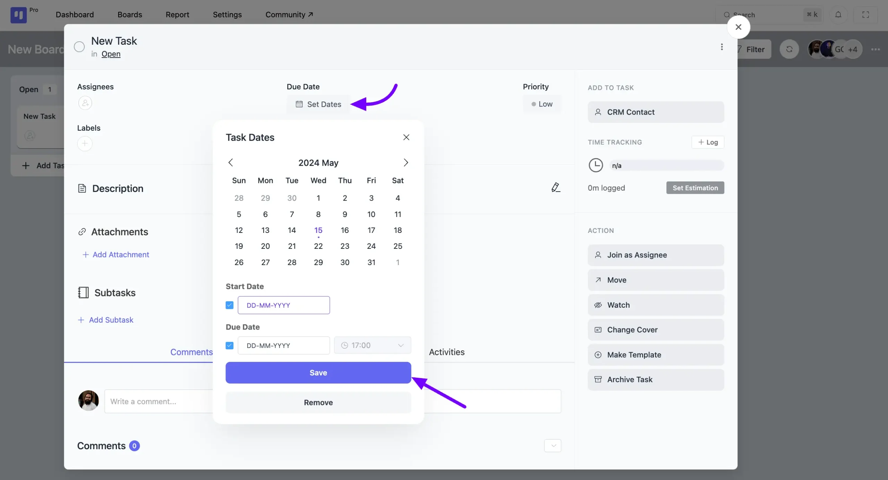

### Task and Subtask Reminders

Once you've set a due date for a task or subtask, you can also add a reminder so you're notified exactly when you need to be. Choose to be reminded 30 minutes, 1 hour, 1 day, or 1 week before the due date, and never miss a deadline again.

### Priority

Click on the **Priority** button to designate the priority level of your task as **High**, **Medium**, or **Low**. Also, you can customize task priority levels via the [filter hook](https://developers.fluentboards.com/hooks/filters/#fluent_boards_task_priorities){:target="_blank"}.

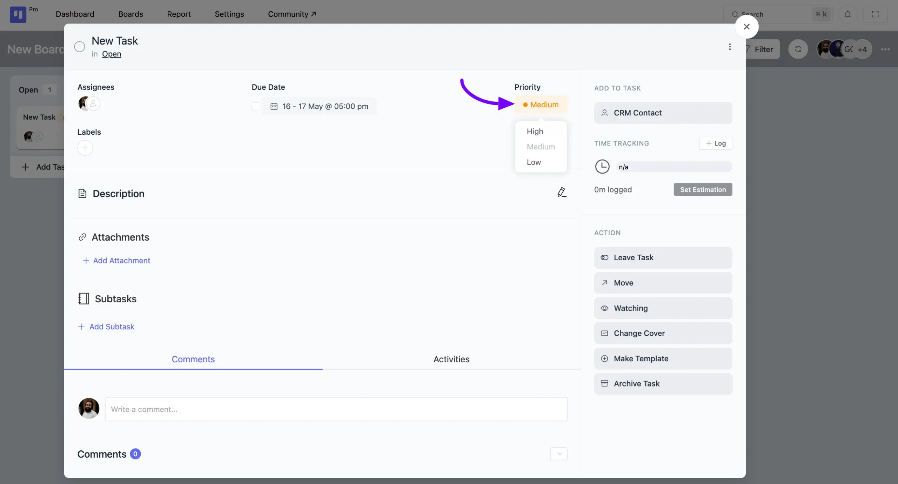

### **Labels**

You can add a **Label** to your task based on your needs. To add or create a label, click on the **Plus** icon button placed under **Label**.

A pop-up will appear where you need to click on the **Add New Label** button or **Pencil** icon button and enter a **name** for your label. You can also choose a **color** for your label from the default options or select a **custom color** of your choice.

Once you're done, click the **Save** button. If you want to remove a label, simply click the **Delete** button.

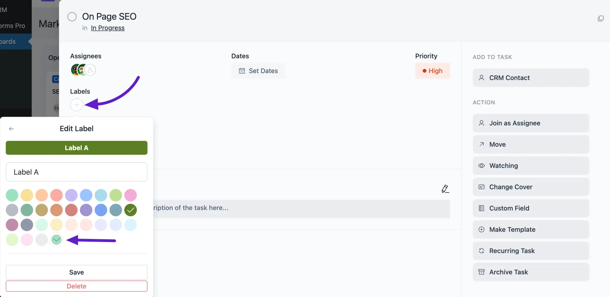

### Description

You can provide a detailed description using the **Add Media** and various options in the **Description** field. Once you've added your description, click on the **Save** button.

You can expand the task description to a large mode by clicking the **Fullscreen Icon.**

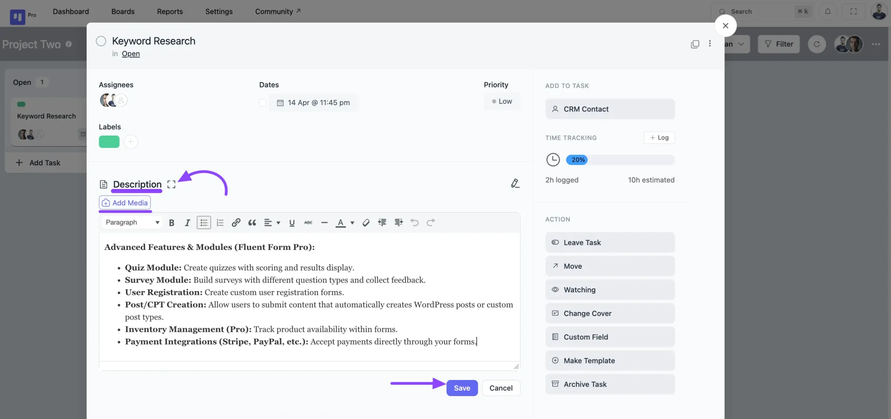

After that, the description option expands tasks to full screen. Then click the **Save** button to save description.

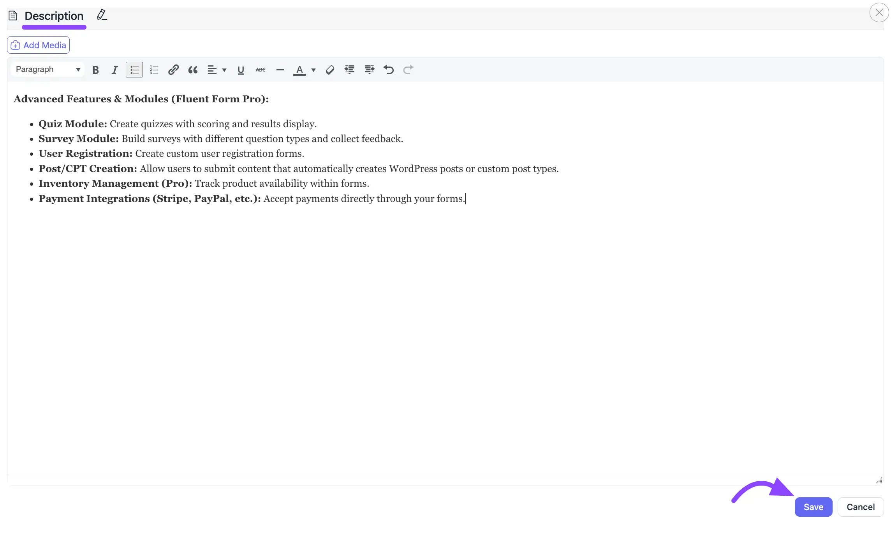

### Attachments

To add an attachment to your task, click the **Add Attachment** button. A pop-up will appear with options to attach a file, link, or text.

After adding your attachment details, click the **Add Link** button to save it to the task.

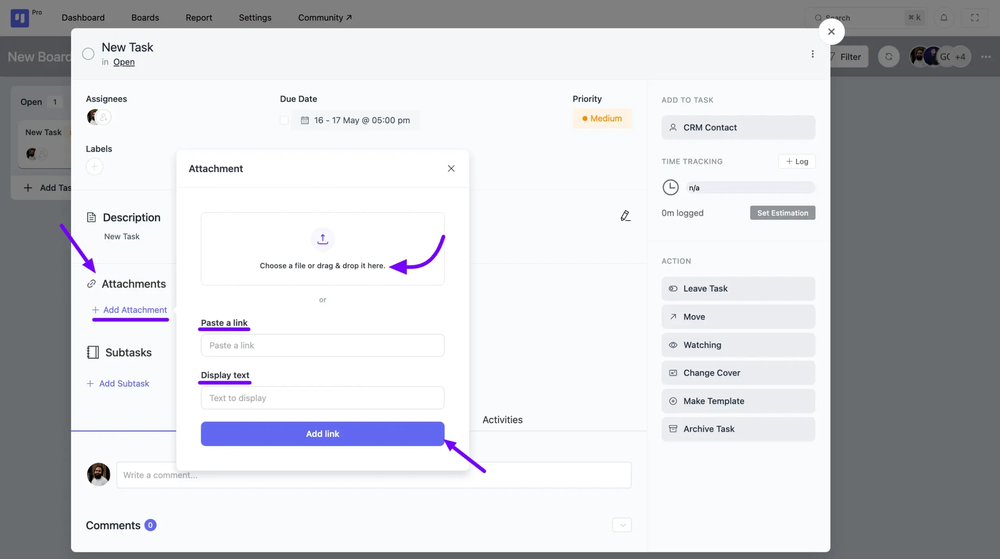

### Adding Subtasks

You can break down your tasks into smaller, more manageable parts by creating Subtasks. With the addition of Subtask Groups, you can now organize these items for a clearer workflow.

Follow these steps to add Subtask Groups and Subtasks to your tasks:

1. To get started, simply click on a task to open the task details panel. From the actions menu on the right, click the **Subtask** button.
2. A pop-up will appear prompting you to **Create Subtask Group**. Give your group a title and click the **Save** button.
3. Once the group is created, you will see it listed within your task.
4. Simply type the subtask title and click the **Save** button. You can create multiple subtask groups and add as many subtasks as you need.

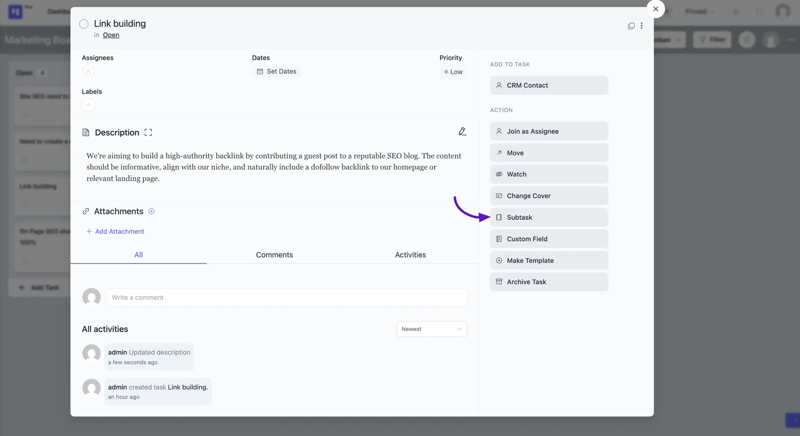

#### **Adding a Note to a Subtask**

For subtasks that require more detail, you can add a descriptive note to provide clearer instructions for the assignee.

1. After a subtask has been created, locate it within its Subtask Group.
2. Along with the subtask's title, click the **Add Note** icon.
3. A **Simple Notes (Optional)** pop-up will appear. Enter your detailed description or instructions in the text area.
4. Click the **Save** button to attach the note to that specific subtask.

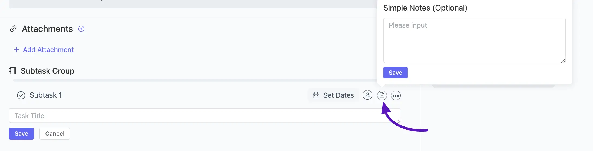

### CRM Contact

Add a CRM contact to your task, click on the **CRM Contact** button, and choose the CRM Contact you want to associate with your task.

If needed, you can also remove the CRM contact from your task by clicking on the **Delete** button along with the CRM contact.

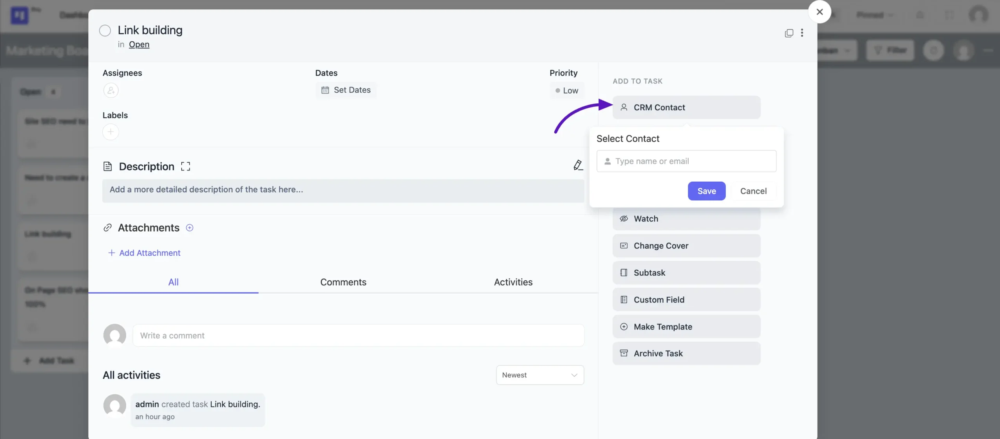

## Mark as Task Completed

Click on the **Circle** icon button to mark your task as completed.

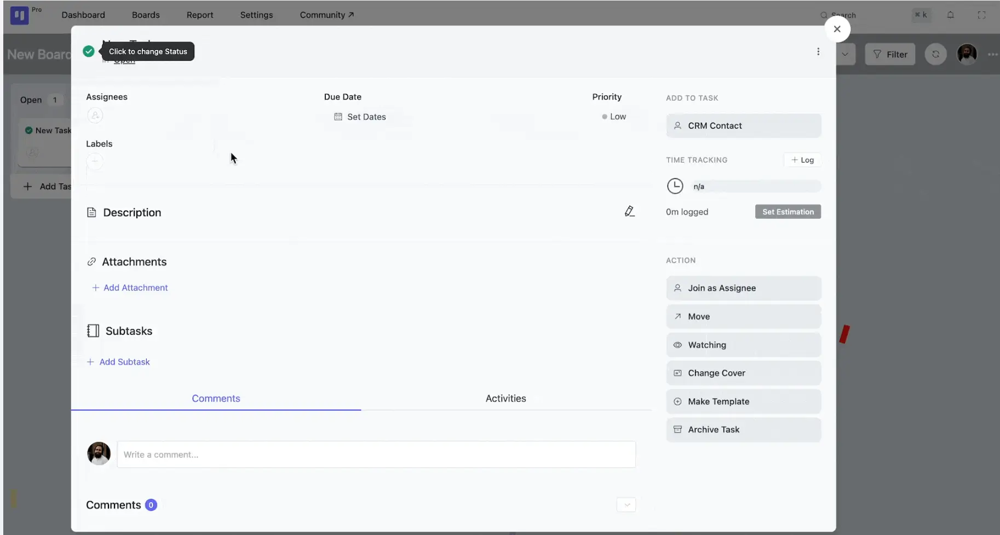

### Task Clone

To clone a task, click the three-dot menu on the task card and select **Clone Task**. A pop-up will ask you to choose a stage for the new task. Similarly, you can clone any subtask using its own three-dot menu, and it will be duplicated within the same task. Note: Cloning is only possible for items within the same board.

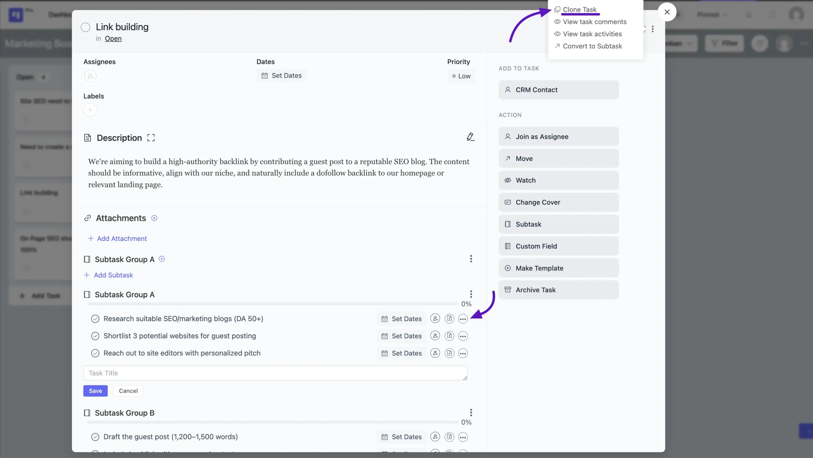

### Task Comments and Activities

Below, you'll find the **Comments** and **Activities** section for the task. Only board members have the ability to comment on tasks and reply to them.

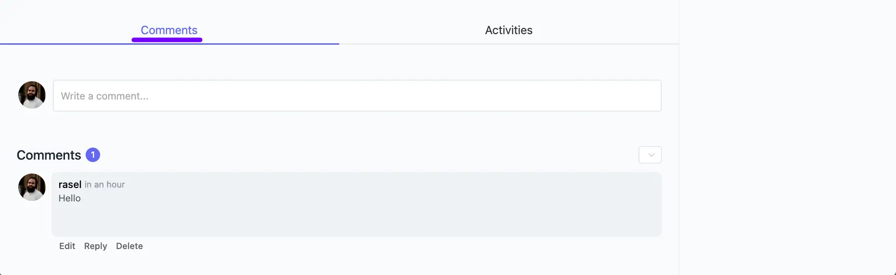

Click on the **Activities** button and you will see all the Activities related to the Task.

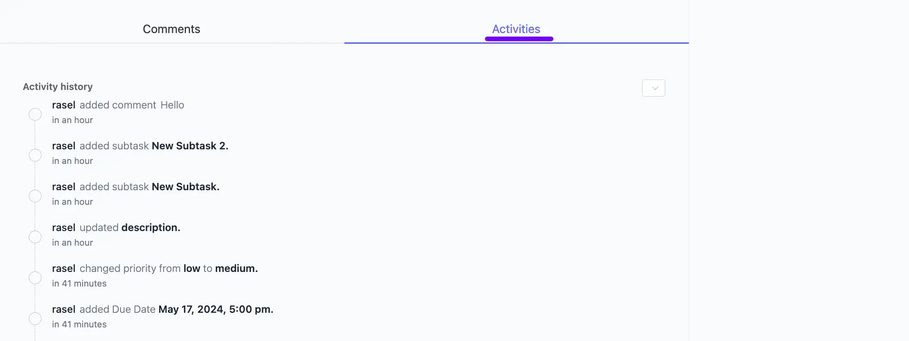

## Task Filter

You can filter your tasks based on assignees, stages, due dates, priorities, labels, custom fields, task status, etc.

Click on the **Filter** option from the top right corner of your board.

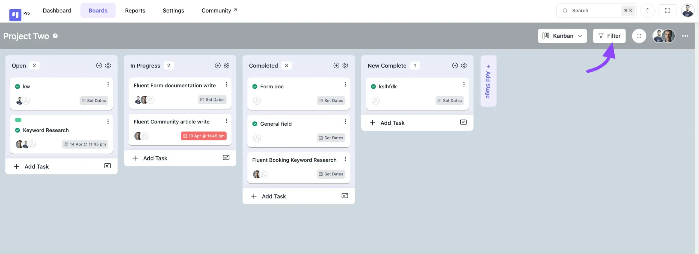

Here appears a pop-up. Now, you can filter your tasks.

**A. Assignee:** This section allows you to filter tasks based on who they are assigned to.

- If you check the **No Assignee**, only show the no-assign task in your board task.
- To view only the tasks that are assigned to you, set the assignee filter to 'Task Assigned to Me'.
- Task I am watching on will only show you the tasks that you have turned the watching mode on.
- If you select an assignee person from the dropdown field, it only shows this person's assigned tasks.

**B. Stages:** This filter lets you filter tasks from your boards based on their selected task stages.

**C. Task Status:** You can filter your board tasks based on status.

- **Open:** If you check the **Open** option, the board's task shows which are open.

- **Marked as closed:** If you check the **Marked as closed** option, then tasks on your board that are closed will show up.

**D. Due Date:** This section enables filtering based on task due dates.

- **No dates:** When you check the **No dates** option, you will see your boards' tasks that are created without dates.

- **Overdue:** When you check the **Overdue** option, you will see the tasks that your board has not completed.

- **Task due today**: If you check these **Task due today** options, you will see your boards' tasks that have not been completed today.
- **Task due this week:** If you check **the Task due this week** option, you will see your board's tasks that have not been completed this week.
- **Task due next week:** If you check these **Task due next week** options, you will see your boards' tasks that will not be completed in the next week.
- **Task due this month:** If you check these **Task due this month** options, you will see the tasks that your boards will not complete.
- **All upcoming tasks:** If you check these **options,** you will see your boards' upcoming tasks.

**E. Priority:** This filter allows you to view tasks based on their **High**, **Medium**, and **Low** priority levels.

**F. CRM Contacts:** If you filter your tasks using this option, you'll only see tasks linked to the CRM contacts you select from the dropdown.

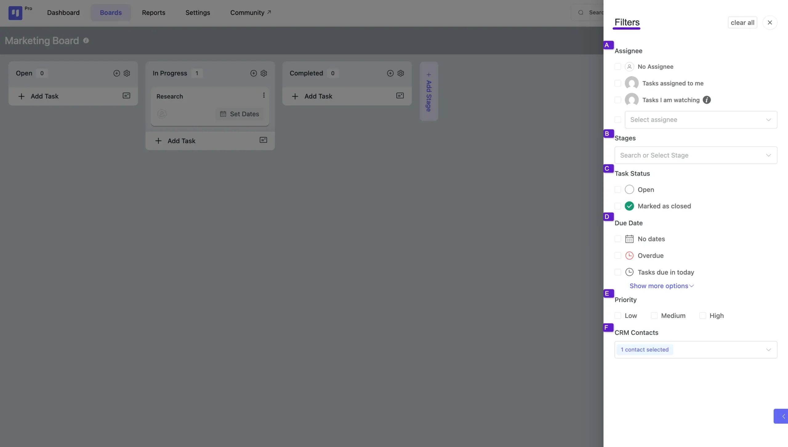

If you have any further queries, please do not hesitate to contact our [@support team](https://wpmanageninja.com/support-tickets/?utm_source=wpmn&utm_medium=home&utm_campaign=site#/){:target="_blank"}.