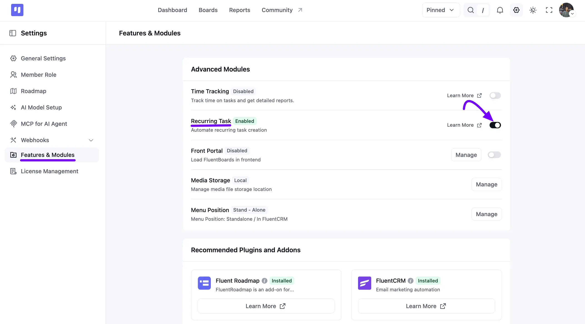
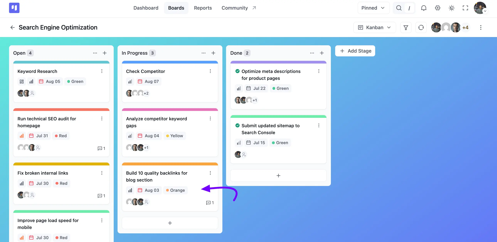
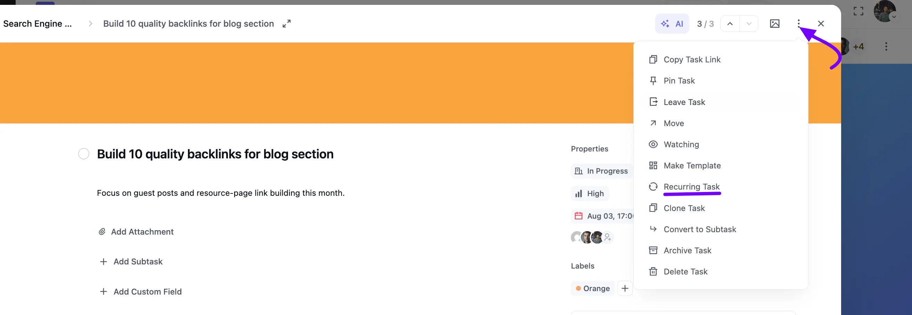
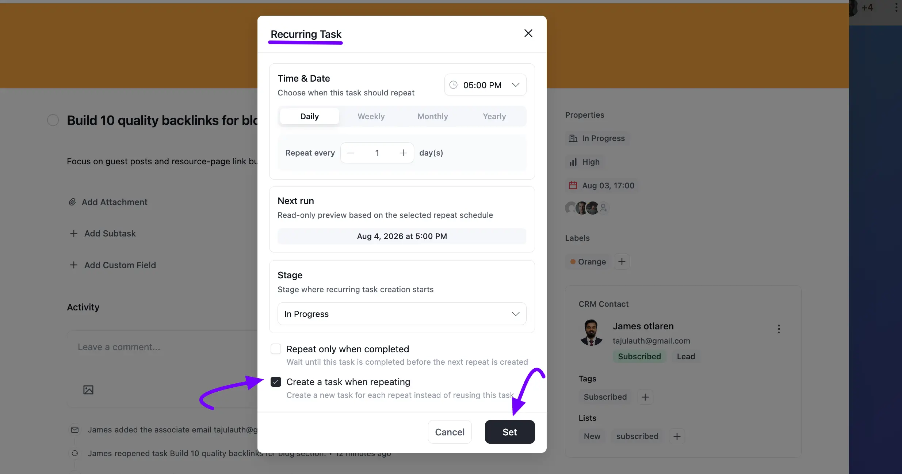

# Recurring Tasks

A **Recurring Task** is a task that repeats at regular intervals (daily, weekly, monthly, and yearly.). Once the set interval is reached, FluentBoards will automatically recreate the task for you. No more manual task creation for recurring work!

In this guideline, we will show you how you can enable and set a Recurring Task.

## Enable Recurring Task

To enable the recurring task module for your board tasks, go to your FluentBoards **Settings** and select **Features & Modules** from the left sidebar.

Under **Advanced Modules**, you will see the **Recurring Task** option. Click the **Toggle** button to enable it. Once enabled, the Recurring Task feature becomes active for your tasks.

## Setting Up a Recurring Task

Start by creating a new task or choosing an existing task that you want to set to repeat.

Open the task, click the **Three Dot** icon in the top right corner to bring up the [Task Actions](/task-action) menu, then select **Recurring Task**.

## Set the Frequency

A **Recurring Task** pop-up will appear. Under **Time & Date**, pick the time you'd like the task to repeat at, then choose how often:

- **Daily**: The task repeats every set number of days.
- **Weekly**: The task repeats every set number of weeks.
- **Monthly**: The task repeats every set number of months.
- **Yearly**: The task repeats every set number of years.

Use the **Repeat every** field to set the interval, for example, every **1 day(s)** or every **2 week(s)**. The **Next run** box below shows a read-only preview of exactly when the next repeat will happen, based on your settings.

Under **Stage**, choose which stage the recreated task should start in.

Finally, choose how the repeat should behave:

- **Repeat only when completed**: Waits until this task is completed before the next repeat is created.
- **Create a task when repeating**: Creates a new task for each repeat, instead of reusing this one.

Once you're done, click the **Set** button to save your recurring schedule.

### Examples & Use Cases

**Weekly Meetings:** Set up a recurring task for your weekly team meeting, including an agenda and assigned members.

**Monthly Reports:** Automate your monthly reporting tasks so they’re created at the start of each month without needing manual input.

**Follow-up Reminders:** Need to follow up with a client every few days? Set it as a recurring task to never forget.

If you have any further questions please don’t hesitate to [contact us](https://wpmanageninja.com/account/dashboard/){:target="_blank"}.