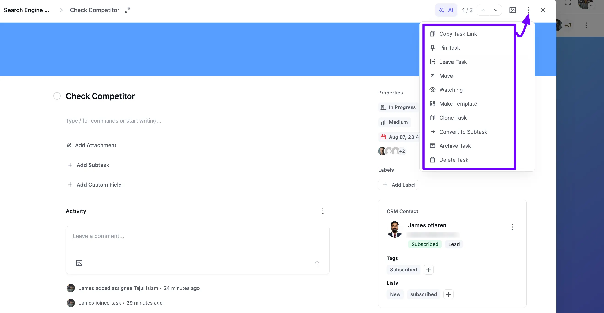

# Task Actions

Open any task, then click the **Three Dot** icon in the top right corner of the task pop-up to reveal the **Task Actions** menu. These actions give you extra options for organizing and managing that task:

- **Copy Task Link**: Copies a shareable link to this task, so you can send it to someone directly.
- **Pin Task**: Pin your most critical tasks so they stay at the top of your board, easy to find on busy boards.
- **Join as Assignee / Leave Task**: If you're not assigned to the task yet, this shows as **Join as Assignee**, letting you add yourself with one click. Once you've joined, the same spot shows **Leave Task**, so you can remove yourself as an assignee just as easily.
- **Move**: Allows you to move the task to any board and stage. This experience has been redesigned to make changing a task's stage or board quicker and clearer.
- **Watching**: The **Watching** option lets you stay updated on changes and activities for this specific task.
- **Make Template**: This enables you to create a template from the task.
- **Recurring Task**: Sets this task to repeat on a schedule you choose. For the full walkthrough, see the [Recurring Tasks](/recurring-task) guide.
- **Clone Task**: Creates an exact copy of this task, right in the same stage.
- **Convert to Subtask**: Turns this task into a subtask under another task on the board.
- **Archive Task**: Archives the task.
- **Delete Task**: Permanently deletes the task.

> [!Note]
> A couple of actions have moved out of this menu. Click the **Image** icon next to the Three Dot icon to change the task's cover, and use the **Add Custom Field** option inside the task body to add a custom field — read the [Custom Fields](/custom-fields-for-task) guide to learn more.

If you have any further questions please don't hesitate to [contact us](https://wpmanageninja.com/account/dashboard/){:target="_blank"}.