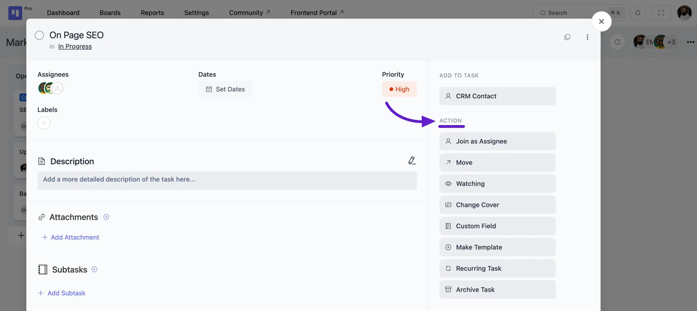

# Task Actions

The task creation pop-up includes several task actions that provide additional options for better task organization. These actions make task management easier and more effective:

- **Join as Assignee**: Assign the task to yourself.
- **Move**: Allows you to move the task to any board and stage.
- **Watching**: The **Watching** option lets users stay updated on changes and activities for a specific task.
- **Change Cover**: Let you change the task card's cover color. Also, you can **Upload an Image** as a Task Cover.
- **Custom Field**: If you need a custom field for your task to add extra information based on your use case, you can easily do that in FluentBoards. To know more about **Custom Fields** read the [Custom Fields](/custom-fields-for-task) guide.
- **Make Template**: This enables you to create a template from the task.
- **Recurring Task:** To create a recurring task for your board, you can set it up here. For more details on recurring tasks, check out the [Recurring Tasks](/recurring-task) guide.
- **Archive Task**: Archives the task.

If you have any further questions please don’t hesitate to [contact us](https://wpmanageninja.com/account/dashboard/){:target="_blank"}.